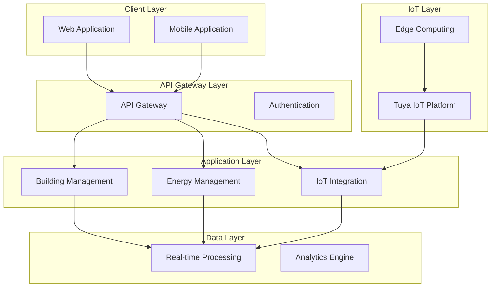
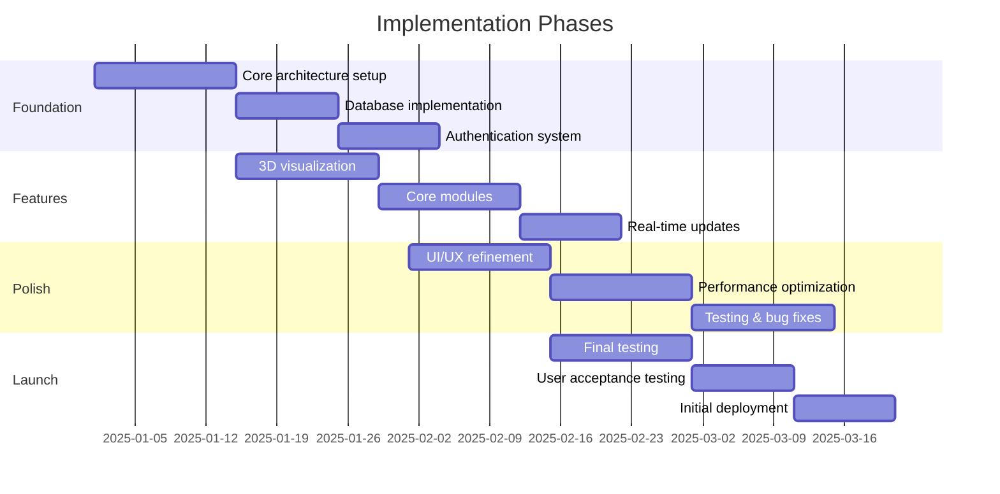

<div align="center">
  
# HeyZack Documentation Wiki


*Enterprise-grade building intelligence for commercial and residential applications*

[🏢 B2B Solutions](./heyzack-wiki/public/docs/B2b/1_Executive_Overview.md) | 
[📊 Strategy](./heyzack-wiki/public/docs/Strategy/product-market-fit.md) | 
[🎨 Branding](./heyzack-wiki/public/docs/Branding/brandstory.md) | 
[🚀 Run Wiki Locally](#running-the-wiki-locally)

</div>

## 📑 Documentation Wiki

This repository contains the HeyZack Documentation Wiki, a comprehensive knowledge base for the HeyZack Building Management Solution and related business strategies. The documentation is organized into a Next.js-powered wiki with a user-friendly interface for easy navigation and search.

### 📚 Documentation Structure

```
heyzack-wiki/public/docs/
├── B2b/                  # Building Management Solution (BMS) documentation
│   ├── 1_Executive_Overview.md
│   ├── 2_System_Architecture.md
│   └── ...
├── Strategy/             # Business and product strategy documentation
│   ├── product-market-fit.md
│   ├── total-addressable-market.md
│   └── ...
└── Branding/             # Brand identity and marketing guidelines
    ├── brand-voice-guide.md
    ├── brandstory.md
    └── ...
```

### 🌟 Wiki Features

- **📱 Responsive Design**: Optimized for all devices
- **🔍 Full-Text Search**: Find documents quickly
- **🗂️ Category Organization**: Browse by B2B, Strategy, or Branding
- **🔄 Related Documents**: Discover connected information
- **🗺️ Document Map**: Visualize documentation relationships
- **🌓 Dark Mode Support**: Comfortable reading in any environment

## 🏢 HeyZack Building Management Solution

HeyZack BMS is a comprehensive IoT-integrated Building Management Solution designed specifically for the French market. Our platform revolutionizes how commercial buildings are managed, delivering:

- **30% Energy Savings** through AI-driven optimization
- **45% Faster** anomaly detection than traditional systems
- **93% Accuracy** in maintenance prediction
- **40% Higher** CEE credits through AI optimization
- **25% Reduction** in operational costs

### 🏆 Key Market Differentiators

| Feature | HeyZack BMS | Traditional Solutions |
|---------|-------------|----------------------|
| Anomaly Detection | 45% faster | Industry standard |
| Maintenance Prediction | 93% accuracy | 76% accuracy |
| False Alert Reduction | 87% reduction | Manual filtering |
| Energy Savings | 30% average | 15-20% average |
| CEE Credit Optimization | 40% increase | Manual processing |
| Integration Time | 15 minutes | Days to weeks |
| ROI Timeline | 40% faster payback | Standard payback |

## 🎯 Decision-Making Framework

<div align="center">



</div>

```mermaid
graph TD
    A[ROI Acceleration] --> A1[40% faster payback]
    A --> A2[25% reduction in costs]
    A --> A3[15% increase in property value]
    
    B[Compliance Excellence] --> B1[NF EN ISO 52120-1:2022]
    B --> B2[BAT TH 116 compliance]
    B --> B3[CEE credit optimization]
    
    C[Operational Excellence] --> C1[75% reduction in learning curve]
    C --> C2[Role-optimized dashboards]
    C --> C3[Mobile-first design]
    
    D[Enterprise-Grade Security] --> D1[Blockchain-verified audit]
    D --> D2[Military-grade encryption]
    D --> D3[Real-time threat detection]
```

## 🔧 System Architecture

<div align="center">



</div>

## 💻 Technology Stack

<div align="center">
  <table>
    <tr>
      <th>Frontend</th>
      <th>Backend</th>
      <th>IoT & Edge</th>
    </tr>
    <tr>
      <td>
        <ul>
          <li>React.js with TypeScript</li>
          <li>Three.js for Digital Twin</li>
          <li>WebSocket for real-time updates</li>
          <li>Progressive Web App capabilities</li>
        </ul>
      </td>
      <td>
        <ul>
          <li>Node.js microservices</li>
          <li>MongoDB database</li>
          <li>Redis caching</li>
          <li>RESTful APIs</li>
        </ul>
      </td>
      <td>
        <ul>
          <li>Tuya IoT Platform integration</li>
          <li>Edge Computing Gateway</li>
          <li>Real-time Data Processing</li>
          <li>Device Management</li>
        </ul>
      </td>
    </tr>
  </table>
</div>

## 📅 Implementation Timeline

<div align="center">



</div>

## 🔐 Standards & Certifications

<div align="center">
  
  
  
</div>

- NF EN ISO 52120-1:2022 Class A Automation
- BAT TH 116 Compliance
- CEE (Certificats d'Économie d'Énergie) Optimization
- BREEAM/HQE Certification Support
- Military-grade Security (AES-256)
- GDPR Compliance

## 🚀 Running the Wiki Locally

To run the documentation wiki locally:

1. Clone this repository
2. Navigate to the wiki directory:
   ```bash
   cd heyzack-wiki
   ```
3. Install dependencies:
   ```bash
   npm install
   ```
4. Start the development server:
   ```bash
   npm run dev
   ```
5. Open [http://localhost:3000](http://localhost:3000) in your browser

## 📖 Core Documentation

For detailed information, explore our comprehensive documentation:

- [Executive Overview](./heyzack-wiki/public/docs/B2b/1_Executive_Overview.md)
- [System Architecture](./heyzack-wiki/public/docs/B2b/2_System_Architecture.md)
- [Core Features & Modules](./heyzack-wiki/public/docs/B2b/3_Core_Features_Modules.md)
- [Compliance & Regulations](./heyzack-wiki/public/docs/B2b/4_Compliance_Regulations.md)
- [User Interface Design](./heyzack-wiki/public/docs/B2b/5_User_Interface_Design.md)
- [Data Management](./heyzack-wiki/public/docs/B2b/6_Data_Management.md)
- [Integration & APIs](./heyzack-wiki/public/docs/B2b/7_Integration_APIs.md)
- [Performance & Scalability](./heyzack-wiki/public/docs/B2b/8_Performance_Scalability.md)
- [Security & Privacy](./heyzack-wiki/public/docs/B2b/9_Security_Privacy.md)
- [Implementation & Deployment](./heyzack-wiki/public/docs/B2b/10_Implementation_Deployment.md)
- [Operations & Support](./heyzack-wiki/public/docs/B2b/11_Operations_Support.md)
- [Future Roadmap](./heyzack-wiki/public/docs/B2b/12_Future_Roadmap.md)

## 📊 Business Strategy Resources

- [Product-Market Fit](./heyzack-wiki/public/docs/Strategy/product-market-fit.md)
- [Total Addressable Market](./heyzack-wiki/public/docs/Strategy/total-addressable-market.md)
- [Customer Acquisition Cost](./heyzack-wiki/public/docs/Strategy/customer-acquisition-cost.md)
- [Lifetime Value](./heyzack-wiki/public/docs/Strategy/lifetime-value.md)
- [B2C Brand Strategy](./heyzack-wiki/public/docs/Strategy/b2c-brand-strategy.md)

## 🎨 Branding Resources

- [Brand Story](./heyzack-wiki/public/docs/Branding/brandstory.md)
- [Brand Voice Guide](./heyzack-wiki/public/docs/Branding/brand-voice-guide.md)
- [Digital Presence Framework](./heyzack-wiki/public/docs/Branding/digital-presence-framework.md)
