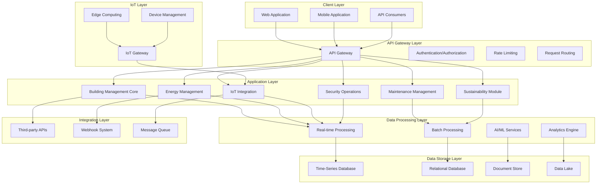
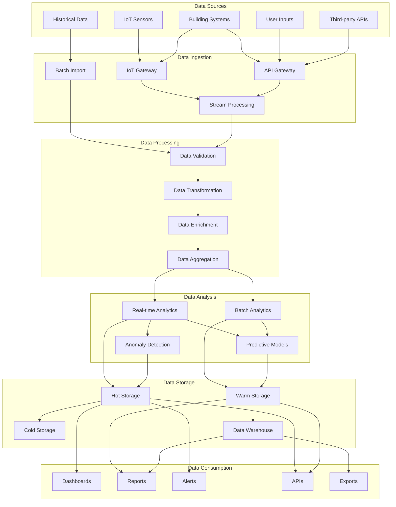

# 2. System Architecture

## 2.1. High-Level Architecture

The HeyZack B2B Building Management Solution follows a modern, cloud-native architecture designed for scalability, reliability, and security. The system is structured in layers to ensure separation of concerns and facilitate maintenance and updates.

### Key Architectural Components:

1. **Client Layer**: Provides user interfaces and API access points for different user types.
2. **API Gateway Layer**: Manages API traffic, authentication, and request routing.
3. **Application Layer**: Contains the core business logic modules.
4. **Data Processing Layer**: Handles real-time and batch data processing, including AI/ML services.
5. **Data Storage Layer**: Manages different types of data with appropriate storage solutions.
6. **IoT Layer**: Connects and manages IoT devices and edge computing.
7. **Integration Layer**: Facilitates integration with third-party systems and services.

### Architectural Principles:

- **Microservices-based**: Modular services that can be developed, deployed, and scaled independently.
- **Event-driven**: Asynchronous communication between services for better scalability and resilience.
- **Cloud-native**: Designed to leverage cloud services for scalability, reliability, and global reach.
- **API-first**: All functionality exposed through well-defined APIs for integration and extensibility.
- **Security by design**: Security considerations integrated at every layer of the architecture.
- **Scalability**: Horizontal scaling capabilities to handle growing numbers of buildings and devices.
- **Resilience**: Fault tolerance and graceful degradation in case of component failures.

## 2.2. Technology Stack

The HeyZack B2B Building Management Solution leverages modern technologies to deliver a robust, scalable, and secure platform:

### Frontend Technologies
- **Framework**: React.js with TypeScript
- **State Management**: Redux or Context API
- **UI Components**: Material-UI or custom component library
- **Data Visualization**: D3.js, Chart.js, and Three.js (for Digital Twin)
- **Mobile**: React Native for cross-platform mobile applications
- **PWA Support**: Service workers for offline capabilities

### Backend Technologies
- **API Framework**: Node.js with Express or NestJS
- **Real-time Communication**: WebSockets, Socket.io
- **Authentication**: OAuth 2.0, JWT, SAML for enterprise integration
- **API Documentation**: OpenAPI (Swagger)

### Data Processing & AI
- **Stream Processing**: Apache Kafka, Apache Flink
- **Batch Processing**: Apache Spark
- **Machine Learning**: TensorFlow, PyTorch, scikit-learn
- **AI Model Serving**: TensorFlow Serving, ONNX Runtime

### Data Storage
- **Time-Series Database**: InfluxDB or TimescaleDB (for sensor data)
- **Relational Database**: PostgreSQL (for structured data)
- **Document Store**: MongoDB (for flexible schema data)
- **Data Lake**: Amazon S3 or Google Cloud Storage
- **Caching**: Redis or Memcached

### IoT & Edge Computing
- **IoT Protocols**: MQTT, CoAP, HTTP/2
- **Edge Computing**: AWS Greengrass, Azure IoT Edge
- **Device Management**: TUYA IoT Core API for smart device integration
- **IoT Backend**: Go-based backend technology for IoT processing
- **Mobile Integration**: React mini-apps on TUYA's Android and iOS platforms

### DevOps & Infrastructure
- **Containerization**: Docker
- **Orchestration**: Kubernetes
- **CI/CD**: Jenkins, GitHub Actions, or GitLab CI
- **Infrastructure as Code**: Terraform, CloudFormation
- **Monitoring**: Prometheus, Grafana
- **Logging**: ELK Stack (Elasticsearch, Logstash, Kibana)

### Security Tools
- **Vulnerability Scanning**: OWASP ZAP, SonarQube
- **Secret Management**: HashiCorp Vault
- **Identity Management**: Keycloak or Auth0
- **Encryption**: TLS, AES-256

## 2.3. Integration Points

The HeyZack B2B Building Management Solution is designed to integrate with various external systems and services to provide a comprehensive building management experience:

### Building Systems Integration
- **Building Automation Systems (BAS)**: Integration with existing BAS from vendors like Schneider Electric, Siemens, Johnson Controls
- **HVAC Systems**: Direct integration with HVAC controllers and systems
- **Lighting Systems**: Integration with smart lighting systems and controllers
- **Access Control Systems**: Integration with electronic access control systems
- **Elevator Systems**: Integration with elevator management systems
- **Fire Safety Systems**: Integration with fire detection and suppression systems

### IoT Device Integration
- **Tuya IoT Platform Integration**: 
  * Cloud Development: Integration with Tuya IoT Cloud for device management and control
  * Edge Computing: Local processing via Tuya Edge Gateway for reduced latency
  * Device Networks: Support for Wi-Fi, Bluetooth, Zigbee, and other protocols
  * Real-time Data: Sub-second latency for device state updates
  * Development Tools: Tuya IoT Development Platform for custom device integration
  * Security: End-to-end encryption and device authentication
- **Sensors**: Temperature, humidity, occupancy, air quality, water flow, energy consumption
- **Actuators**: HVAC controls, lighting controls, valve controls
- **Smart Meters**: Electricity, water, gas meters
- **Cameras**: Security cameras, thermal cameras
- **Wearables**: Staff and visitor tracking devices
- **Tuya-certified Devices**:
  * Smart HVAC Controllers: Precise temperature and climate control
  * Intelligent Lighting Systems: Advanced scheduling and scene management
  * Environmental Sensors: Multi-parameter monitoring
  * Energy Monitoring Devices: Real-time consumption tracking
  * Access Control Systems: Secure entry management

### Third-Party Service Integration
- **Weather Services**: Integration with weather forecasting services for predictive HVAC
- **Energy Markets**: Integration with energy market data for optimal energy usage
- **Utility Providers**: Integration with utility company APIs for billing and usage data
- **Maintenance Service Providers**: Integration with service provider systems for work orders
- **Emergency Services**: Integration with emergency notification systems

### Enterprise System Integration
- **ERP Systems**: Integration with enterprise resource planning systems
- **CMMS**: Integration with computerized maintenance management systems
- **Accounting Systems**: Integration with financial and accounting systems
- **HR Systems**: Integration with human resources systems for access control
- **CRM Systems**: Integration with customer relationship management systems

### Regulatory and Compliance Integration
- **CEE Reporting**: Integration with French CEE reporting systems
- **Energy Performance Databases**: Integration with energy performance certificate databases
- **Carbon Reporting**: Integration with carbon reporting and trading platforms
- **Building Certification Systems**: Integration with LEED, BREEAM, HQE certification systems

### Integration Methods
- **REST APIs**: For synchronous, request-response interactions
- **GraphQL**: For flexible data querying
- **Webhooks**: For event-based notifications
- **Message Queues**: For asynchronous communication
- **File-based Integration**: For batch processing and reporting
- **IoT Protocols**: MQTT, CoAP for device communication

## 2.4. Security Framework

Security is a fundamental aspect of the HeyZack B2B Building Management Solution, protecting sensitive building data, ensuring operational integrity, and maintaining user privacy:

### Security Architecture

```mermaid
graph TD
    A[Security Governance] --> B[Identity & Access Management]
    A --> C[Data Protection]
    A --> D[Network Security]
    A --> E[Application Security]
    A --> F[IoT Security]
    A --> G[Compliance & Audit]
    
    B --> B1[Authentication]
    B --> B2[Authorization]
    B --> B3[User Management]
    
    C --> C1[Encryption]
    C --> C2[Data Classification]
    C --> C3[Data Retention]
    
    D --> D1[Firewalls]
    D --> D2[Intrusion Detection]
    D --> D3[Network Segmentation]
    
    E --> E1[Secure Development]
    E --> E2[Vulnerability Management]
    E --> E3[API Security]
    
    F --> F1[Device Authentication]
    F --> F2[Secure Communication]
    F --> F3[Firmware Management]
    
    G --> G1[Audit Logging]
    G --> G2[Compliance Monitoring]
    G --> G3[Incident Response]
```

### Identity and Access Management
- **Multi-factor Authentication**: Requiring multiple forms of verification
- **Role-Based Access Control (RBAC)**: Granular permissions based on user roles
- **Single Sign-On (SSO)**: Integration with enterprise identity providers
- **Privileged Access Management**: Special controls for administrative access
- **User Lifecycle Management**: Automated provisioning and deprovisioning

### Data Protection
- **Encryption at Rest**: All sensitive data encrypted in storage
- **Encryption in Transit**: TLS for all data transmission
- **Data Masking**: Hiding sensitive data from unauthorized users
- **Data Classification**: Categorizing data based on sensitivity
- **Data Retention Policies**: Automated data lifecycle management

### Network Security
- **Segmentation**: Isolating different parts of the network
- **Firewalls**: Controlling traffic between network segments
- **Intrusion Detection/Prevention**: Monitoring for and blocking attacks
- **DDoS Protection**: Mitigating distributed denial of service attacks
- **VPN Access**: Secure remote access for administrators

### Application Security
- **Secure Development Lifecycle**: Security integrated into development process
- **Vulnerability Management**: Regular scanning and patching
- **API Security**: Rate limiting, input validation, output encoding
- **Web Application Firewall**: Protection against common web attacks
- **Dependency Management**: Monitoring and updating third-party libraries

### IoT Security
- **Device Authentication**: Ensuring only authorized devices can connect
- **Secure Boot**: Verifying firmware integrity at startup
- **Secure Communication**: Encrypted device-to-cloud communication
- **Device Monitoring**: Detecting unusual behavior or tampering
- **Firmware Updates**: Secure over-the-air updates

### Compliance and Audit
- **Audit Logging**: Comprehensive logging of security events
- **Compliance Monitoring**: Continuous checking against security policies
- **Penetration Testing**: Regular security assessments
- **Incident Response**: Procedures for handling security incidents
- **Security Awareness**: Training for all system users

### Privacy Considerations
- **GDPR Compliance**: Meeting European data protection requirements
- **Data Minimization**: Collecting only necessary data
- **Consent Management**: Tracking user consent for data processing
- **Privacy by Design**: Privacy considerations in all features
- **Data Subject Rights**: Supporting access, rectification, deletion requests

## 2.5. Data Flow Architecture

The data flow architecture of the HeyZack B2B Building Management Solution illustrates how data moves through the system, from collection to processing to presentation:

### Data Flow Components:

#### Data Sources
- **IoT Sensors**: Physical sensors deployed throughout buildings
- **Building Systems**: Existing BMS, HVAC, lighting, and security systems
- **User Inputs**: Data entered by users through interfaces
- **Third-party APIs**: External data sources like weather, energy markets
- **Historical Data**: Previously collected and stored data

#### Data Ingestion
- **IoT Gateway**: Collects data from IoT devices and sensors
- **API Gateway**: Receives data from applications and third-party systems
- **Batch Import**: Processes large volumes of historical or offline data
- **Stream Processing**: Handles real-time data streams

#### Data Processing
- **Data Validation**: Ensures data quality and integrity
- **Data Transformation**: Converts data to standardized formats
- **Data Enrichment**: Adds context and metadata to raw data
- **Data Aggregation**: Combines data from multiple sources

#### Data Analysis
- **Real-time Analytics**: Immediate processing of streaming data
- **Batch Analytics**: Scheduled processing of accumulated data
- **Predictive Models**: AI/ML models for forecasting and optimization
- **Anomaly Detection**: Identifying unusual patterns or outliers

#### Data Storage
- **Hot Storage**: High-performance storage for frequently accessed data
- **Warm Storage**: Medium-performance storage for less frequently accessed data
- **Cold Storage**: Low-cost storage for archival data
- **Data Warehouse**: Structured storage for analytics and reporting

#### Data Consumption
- **Dashboards**: Visual interfaces for real-time monitoring
- **Reports**: Structured presentations of analyzed data
- **Alerts**: Notifications based on predefined conditions
- **APIs**: Programmatic access to data for integration
- **Exports**: Data extraction for external use

### Data Flow Patterns:

1. **Real-time Monitoring Flow**: Sensor data → IoT Gateway → Stream Processing → Real-time Analytics → Hot Storage → Dashboards/Alerts
2. **Predictive Maintenance Flow**: Sensor data → Data Processing → Historical Data Analysis → Predictive Models → Maintenance Recommendations
3. **Energy Optimization Flow**: Energy usage data → Data Aggregation → AI Analysis → Optimization Algorithms → Control Recommendations
4. **Compliance Reporting Flow**: Building performance data → Data Warehouse → Regulatory Calculations → Compliance Reports
5. **Anomaly Detection Flow**: Sensor data → Stream Processing → Anomaly Detection → Alerts → Investigation Workflow

### Data Governance:

- **Data Ownership**: Clear definition of who owns and is responsible for data
- **Data Quality**: Processes to ensure accuracy, completeness, and timeliness
- **Data Lineage**: Tracking of data from source to consumption
- **Metadata Management**: Documentation of data meaning and relationships
- **Data Lifecycle**: Policies for retention, archiving, and deletion
