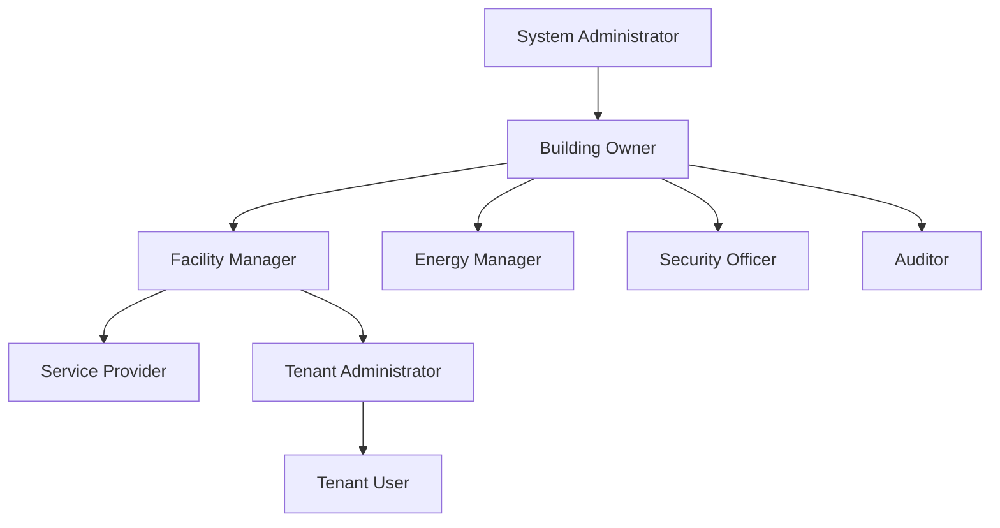
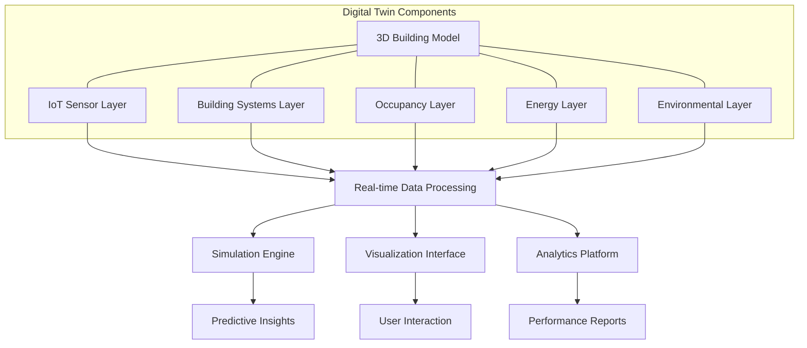
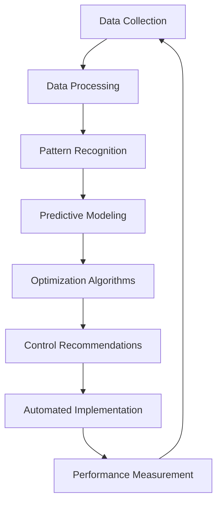
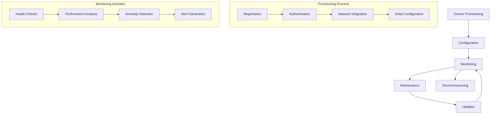
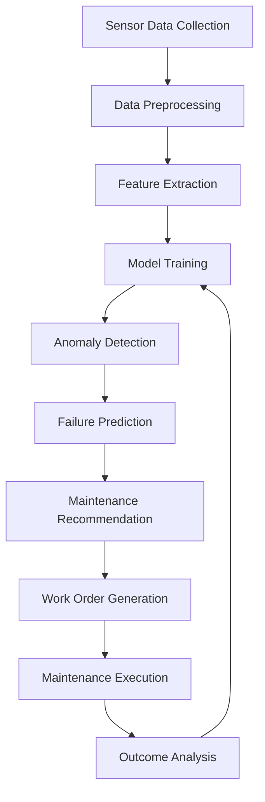
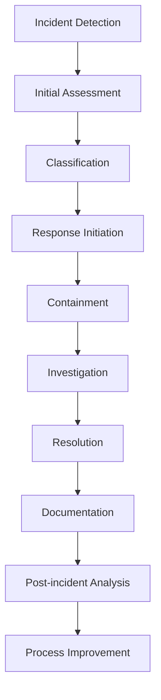
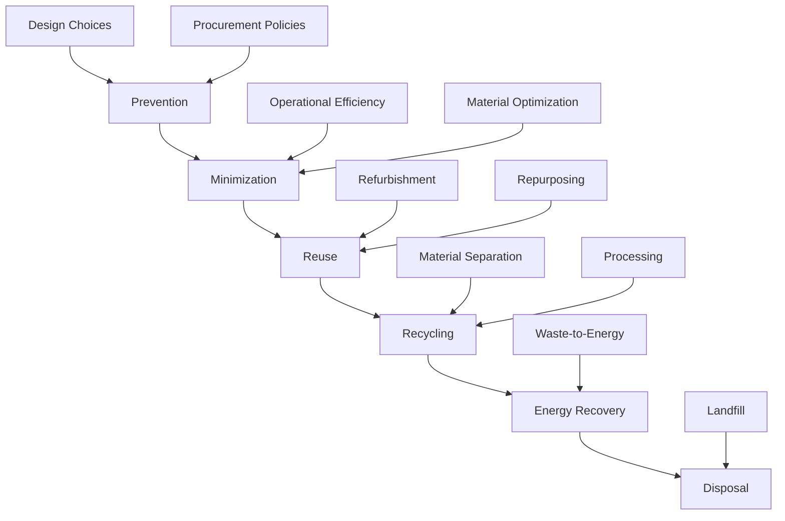

# 3. Core Features & Modules

## 3.1. Authentication & Access Control System

The Authentication & Access Control System provides secure, role-based access to the HeyZack B2B Building Management Solution, ensuring that users can only access the features and data appropriate for their role.

### Role-based Access Management

The system implements a comprehensive role-based access control (RBAC) model that defines access permissions based on user roles:

| Role | Description | Access Level |
|------|-------------|--------------|
| System Administrator | Technical administrator with full system access | Full access to all features and configuration |
| Building Owner | Property owner or representative | Access to all buildings in their portfolio, financial data, and high-level reports |
| Facility Manager | Professional responsible for building operations | Operational control of assigned buildings, maintenance management, and reporting |
| Energy Manager | Specialist focused on energy efficiency | Detailed access to energy data, optimization tools, and compliance reporting |
| Security Officer | Responsible for building security | Access to security systems, access logs, and incident management |
| Tenant Administrator | Representative for building tenants | Limited access to comfort controls, consumption data, and service requests for their space |
| Tenant User | Regular tenant or occupant | Basic access to personal comfort controls and consumption data |
| Service Provider | External maintenance or service company | Limited access to service tickets, maintenance schedules, and relevant building systems |
| Auditor | Compliance or certification reviewer | Read-only access to compliance data, logs, and reports |

Each role has customizable permissions that can be further refined based on:
- Building or location access
- Time-based restrictions
- Feature-specific permissions
- Data access levels

### Security Protocols

The authentication system implements multiple security protocols to ensure secure access:

1. **Multi-factor Authentication (MFA)**
   - Username/password authentication
   - Mobile app verification
   - Email verification codes
   - Hardware security keys (optional)
   - Biometric authentication (optional)

2. **Session Management**
   - Configurable session timeouts
   - Concurrent session limitations
   - IP-based restrictions
   - Device fingerprinting
   - Suspicious activity detection

3. **Authentication Methods**
   - Local authentication
   - OAuth 2.0 integration
   - SAML for enterprise SSO
   - OpenID Connect support
   - Active Directory/LDAP integration

4. **Blockchain-based Authentication** (Advanced Feature)
   - Decentralized identity verification
   - Immutable access logs
   - Smart contract-based access rules
   - Enhanced protection against tampering

### User Hierarchy

The system implements a hierarchical user structure that reflects organizational relationships:

This hierarchy enables:
- Delegated administration
- Inherited access permissions
- Organizational visibility controls
- Approval workflows
- Audit trails for permission changes

### Key Features

- **Self-service Portal**: User registration, password reset, and profile management
- **Administrative Dashboard**: User management, role assignment, and access control
- **Access Policies**: Customizable policies based on time, location, and device
- **Audit Logging**: Comprehensive logging of authentication and access events
- **Compliance Reporting**: Reports on access patterns and security events
- **Integration API**: Authentication services for third-party applications
- **Emergency Access**: Break-glass procedures for emergency situations

## 3.2. Building Management Core

The Building Management Core is the central module of the HeyZack solution, providing comprehensive management capabilities for building operations, monitoring, and control.

### Multi-building Management

The multi-building management feature enables users to manage multiple properties from a single interface:

- **Portfolio Dashboard**: Overview of all buildings with key performance indicators
- **Comparative Analytics**: Side-by-side comparison of building performance
- **Batch Operations**: Apply changes or settings across multiple buildings
- **Hierarchical Organization**: Group buildings by region, type, or custom categories
- **Cross-building Reporting**: Aggregate reports across the building portfolio
- **Resource Allocation**: Optimize resource distribution across multiple properties
- **Portfolio Benchmarking**: Compare performance against internal and external benchmarks

### Digital Twin Implementation

The digital twin feature creates virtual replicas of physical buildings for advanced visualization and simulation:

- **3D Building Models**: Detailed 3D representations of building structures
- **Real-time Data Overlay**: Live sensor data displayed on the 3D model
- **System Visualization**: Visual representation of HVAC, electrical, and plumbing systems
- **Simulation Capabilities**: Test scenarios and changes before implementation
- **Predictive Analysis**: Forecast outcomes based on historical data and physics models
- **Space Utilization**: Analyze and optimize space usage patterns
- **What-if Scenarios**: Evaluate potential modifications or operational changes

Example digital twin visualization:

### Real-time Monitoring System

The real-time monitoring system provides continuous visibility into building operations:

- **Customizable Dashboards**: User-specific views of relevant metrics
- **Real-time Sensor Data**: Live feeds from IoT sensors throughout the building
- **System Status Monitoring**: Current state of all building systems
- **Threshold Monitoring**: Automatic detection of values outside normal ranges
- **Trend Analysis**: Real-time visualization of data trends
- **Occupancy Monitoring**: Current and historical occupancy patterns
- **Environmental Conditions**: Temperature, humidity, air quality, and light levels
- **Energy Consumption**: Real-time power, water, and gas usage

### Alert & Notification Framework

The alert and notification framework ensures timely awareness of important events:

- **Multi-channel Notifications**: Email, SMS, push notifications, and in-app alerts
- **Customizable Alert Rules**: User-defined conditions for generating alerts
- **Priority Levels**: Classification of alerts by severity and urgency
- **Escalation Paths**: Automatic escalation of unacknowledged alerts
- **Alert History**: Searchable record of past alerts and responses
- **Notification Groups**: Team-based alert routing and responsibility assignment
- **Scheduled Reports**: Automated delivery of regular performance reports
- **Maintenance Notifications**: Advance notice of scheduled maintenance activities

## 3.3. Energy Management Suite

The Energy Management Suite provides comprehensive tools for monitoring, analyzing, and optimizing energy usage across building systems, with a focus on efficiency, cost reduction, and regulatory compliance.

### Energy Consumption Tracking

The energy consumption tracking feature provides detailed visibility into energy usage patterns:

- **Multi-source Monitoring**: Electricity, gas, water, and other energy sources
- **Granular Measurement**: Building-level, floor-level, zone-level, and device-level tracking
- **Real-time Visualization**: Live energy usage dashboards and graphs
- **Historical Analysis**: Trend analysis and pattern recognition
- **Consumption Breakdown**: Usage by system type (HVAC, lighting, equipment)
- **Cost Calculation**: Real-time and projected energy costs
- **Benchmarking**: Comparison against historical usage and industry standards
- **Anomaly Detection**: Identification of unusual consumption patterns

### Smart Grid Integration

The smart grid integration feature connects buildings with the broader energy ecosystem:

- **Demand Response**: Participation in utility demand response programs
- **Time-of-Use Optimization**: Shifting consumption to lower-cost periods
- **Peak Shaving**: Reducing demand during peak periods
- **Grid Stability Support**: Providing services to support grid stability
- **Renewable Integration**: Optimizing use of on-site renewable generation
- **Energy Storage Management**: Intelligent control of battery systems
- **Microgrid Capabilities**: Supporting islanded operation when needed
- **Energy Market Participation**: Trading energy in applicable markets

### GTB & CEE Compliance System

The GTB (Gestion Technique du Bâtiment) and CEE (Certificats d'Économie d'Énergie) compliance system ensures adherence to French energy regulations and maximizes financial benefits:

- **NF EN ISO 52120-1:2022 Compliance**: Tracking and reporting for standard requirements with Class A performance achievement
- **BAT TH 116 Certification**: Comprehensive documentation and verification for CEE credits
- **GTB Implementation Excellence**: Specialized features to meet and exceed GTB requirements:
  - Advanced heating and domestic hot water control systems
  - Intelligent cooling and lighting management
  - Climate zone-specific optimizations (H1, H2, H3, and overseas territories)
  - Professional installation documentation and verification
- **Automated Compliance Checks**: Continuous monitoring of compliance status with real-time alerts
- **Documentation Management**: Secure storage and organization of compliance documents
- **Certification Tracking**: Management of energy performance certificates with expiration alerts
- **Audit Support**: Comprehensive tools and reports to facilitate regulatory audits
- **Compliance Forecasting**: Predictive analysis of future compliance status based on regulatory trends
- **Regulatory Updates**: Automatic notifications of changes to relevant regulations
- **CEE Value Optimization**: Tools to maximize the financial benefits from CEE credits

### Energy Optimization AI

The energy optimization AI leverages artificial intelligence to maximize energy efficiency:

- **Predictive HVAC Control**: AI-driven heating and cooling optimization
- **Lighting Optimization**: Intelligent control based on occupancy and natural light
- **Equipment Scheduling**: Optimal scheduling of energy-intensive equipment
- **Occupancy-based Adjustments**: Dynamic settings based on actual usage patterns
- **Weather-responsive Control**: Adjustments based on current and forecast weather
- **Learning Algorithms**: Systems that improve over time based on performance data
- **Scenario Modeling**: AI-generated scenarios for energy reduction
- **Recommendation Engine**: Actionable suggestions for energy savings

Energy optimization workflow:

## 3.4. IoT Integration Framework

The IoT Integration Framework, powered by Tuya IoT Platform, provides the foundation for connecting, managing, and leveraging data from a wide range of Internet of Things devices throughout the building environment. The framework leverages Tuya's comprehensive development platform and device ecosystem to ensure reliable, secure, and scalable IoT operations.

### Development Platform Features

- **Cloud Development**:
  * Tuya IoT Cloud Integration: Seamless connection to Tuya's global cloud infrastructure
  * API Gateway: RESTful APIs for device control and data access
  * WebSocket Support: Real-time device state updates and control
  * Development SDKs: Support for multiple programming languages
  * Custom Functions: Cloud-based business logic implementation
  * Data Storage: Secure storage for device and user data

- **Edge Computing Capabilities**:
  * Local Processing: Reduced latency for critical operations
  * Offline Operation: Continued functionality during cloud disconnection
  * Data Aggregation: Local data processing and filtering
  * Protocol Translation: Bridge between different device protocols
  * Rule Engine: Local execution of automation rules

- **Development Tools**:
  * IoT Studio: Visual development environment
  * Device Simulator: Testing without physical hardware
  * Debug Console: Real-time monitoring and troubleshooting
  * Log Management: Comprehensive logging and analysis
  * Version Control: Management of firmware and software versions

### Sensor Network Architecture

The sensor network architecture, built on Tuya's IoT platform, defines the structure and organization of IoT devices:

- **Sensor Topology**: 
  * Hierarchical organization of sensors by location and function
  * Tuya-certified device integration
  * Multi-protocol gateway support
  * Scalable device management
- **Network Protocols**: 
  * Wi-Fi: 2.4GHz and 5GHz support
  * Bluetooth: BLE 4.2 and above
  * Zigbee: 3.0 protocol support
  * Matter: Future-proof connectivity
  * Custom protocols through Tuya gateway
- **Mesh Networking**: 
  * Self-healing mesh networks
  * Bluetooth mesh for extended range
  * Zigbee mesh for low-power devices
  * Automatic network optimization
- **Edge Computing**: 
  * Tuya Edge Gateway integration
  * Local processing capabilities
  * Real-time data analysis
  * Offline operation support
- **Gateway Management**: 
  * Centralized gateway control
  * Remote configuration
  * Firmware updates
  * Health monitoring
- **Network Monitoring**: 
  * Real-time performance tracking
  * Network diagnostics
  * Quality of Service monitoring
  * Automatic issue detection
- **Bandwidth Optimization**: 
  * Data compression
  * Priority-based transmission
  * Batch processing options
  * Adaptive sampling rates
- **Redundancy Planning**: 
  * Failover mechanisms
  * Data backup
  * Alternative communication paths
  * Critical device prioritization

Sensor deployment considerations:

| Sensor Type | Typical Locations | Data Frequency | Network Requirements |
|-------------|-------------------|----------------|----------------------|
| Temperature | Rooms, ducts, equipment | 1-5 minutes | Low bandwidth, high reliability |
| Occupancy | Entrances, rooms, common areas | Real-time | Medium bandwidth, low latency |
| Energy | Distribution panels, major equipment | 1-15 minutes | Medium bandwidth, high reliability |
| Air Quality | HVAC returns, common areas | 5-15 minutes | Low bandwidth, medium reliability |
| Water Flow | Supply lines, fixtures | 1-15 minutes | Low bandwidth, medium reliability |
| Security | Entrances, sensitive areas | Real-time | High bandwidth, low latency, high reliability |

### Data Collection Systems

The data collection systems, powered by Tuya's IoT platform, manage the acquisition, validation, and initial processing of IoT data:

- **Multi-protocol Support**: 
  * Native support for Tuya-certified devices
  * Protocol adaptation layer for third-party devices
  * Standardized data formats across protocols
  * Real-time protocol conversion
  * Custom protocol implementation support

- **Data Processing Pipeline**:
  * Edge preprocessing on Tuya gateways
  * Cloud-based data aggregation
  * Machine learning model integration
  * Custom data transformation rules
  * Real-time analytics processing

- **Data Quality Management**:
  * Automated data validation
  * Data integrity checks
  * Anomaly detection
  * Data cleansing rules
  * Quality metrics tracking

- **Collection Optimization**:
  * Adaptive sampling rates
  * Conditional data collection
  * Priority-based scheduling
  * Resource usage optimization
  * Network condition adaptation

- **Reliability Features**:
  * Local data buffering
  * Automatic retry mechanisms
  * Data recovery procedures
  * Conflict resolution
  * Synchronization management

- **Performance Monitoring**:
  * Collection latency tracking
  * Throughput monitoring
  * Resource utilization metrics
  * System health indicators
  * Performance optimization tools

### Real-time Processing

The real-time processing capabilities, powered by Tuya's IoT platform, enable immediate analysis and action on IoT data:

- **Stream Processing Engine**:
  * Real-time data stream analysis
  * Sub-second processing latency
  * Scalable processing architecture
  * Multi-tenant data isolation
  * Load balancing and failover
  * Stream aggregation and filtering

- **Event Processing System**:
  * Complex event pattern detection
  * Multi-source event correlation
  * Event sequence recognition
  * Temporal pattern matching
  * Spatial event processing
  * Custom event rules

- **Automation Engine**:
  * Scene-based automation
  * Condition-triggered actions
  * Schedule-based control
  * Device linkage rules
  * Multi-device orchestration
  * Custom automation scripts

- **Analytics Processing**:
  * Real-time data analytics
  * Predictive modeling
  * Trend analysis
  * Pattern recognition
  * Statistical calculations
  * Custom analytics pipelines

- **Alert Processing**:
  * Real-time threshold monitoring
  * Multi-condition alerts
  * Alert prioritization
  * Alert correlation
  * Notification routing
  * Alert lifecycle management

- **Data Integration**:
  * Real-time data synchronization
  * Third-party system integration
  * API-based data exchange
  * Custom data transformations
  * Data routing and filtering
  * Integration monitoring

### Device Management

The device management features leverage Tuya's IoT platform capabilities to provide comprehensive control over the IoT ecosystem:

- **Device Lifecycle Management**:
  * Automated device discovery and registration
  * Secure device authentication
  * Configuration management
  * Firmware version control
  * Device retirement handling
  * Asset tracking integration

- **Remote Device Operations**:
  * Real-time device control
  * Batch configuration updates
  * Schedule-based operations
  * Group management
  * Scene automation
  * Emergency override capabilities

- **Firmware Management**:
  * Secure OTA updates
  * Version rollback support
  * Update scheduling
  * Staged deployment
  * Success rate monitoring
  * Automatic retry handling

- **Device Health Monitoring**:
  * Real-time status tracking
  * Performance metrics
  * Diagnostic tools
  * Predictive maintenance
  * Alert management
  * Historical analysis

- **Security Management**:
  * Device authentication
  * Encryption key management
  * Access control
  * Security patch deployment
  * Vulnerability scanning
  * Security event monitoring

- **Energy Management**:
  * Power consumption tracking
  * Battery life optimization
  * Energy efficiency analysis
  * Power mode management
  * Charging cycle optimization
  * Energy usage reporting

Device management workflow:

## 3.5. Maintenance Management

The Maintenance Management module provides comprehensive tools for maintaining building systems, predicting failures, managing work orders, and tracking assets throughout their lifecycle.

### Predictive Maintenance AI

The predictive maintenance AI uses artificial intelligence to anticipate equipment failures before they occur:

- **Failure Prediction**: AI models that identify potential failures days or weeks in advance
- **Condition Monitoring**: Continuous assessment of equipment health
- **Anomaly Detection**: Identification of unusual operating patterns
- **Remaining Useful Life**: Estimates of component and system lifespan
- **Maintenance Scheduling**: AI-optimized maintenance timing
- **Root Cause Analysis**: Automated identification of failure causes
- **Maintenance Optimization**: Balancing reliability and maintenance costs
- **Learning Algorithms**: Models that improve with operational experience

Predictive maintenance process:

### Work Order System

The work order system manages the full lifecycle of maintenance activities:

- **Work Order Creation**: Manual and automated generation of maintenance tasks
- **Priority Assignment**: Classification by urgency and impact
- **Resource Allocation**: Assignment of personnel, tools, and materials
- **Scheduling**: Optimal timing based on urgency and resource availability
- **Mobile Access**: Field access to work order details and documentation
- **Progress Tracking**: Real-time visibility into work order status
- **Documentation**: Capture of completion notes, photos, and measurements
- **Quality Control**: Verification of work quality and completeness
- **Historical Records**: Searchable archive of past maintenance activities

### Asset Management

The asset management features provide comprehensive tracking and optimization of building assets:

- **Asset Registry**: Complete inventory of all building systems and equipment
- **Hierarchical Organization**: Parent-child relationships between systems and components
- **Technical Documentation**: Storage of manuals, specifications, and drawings
- **Warranty Tracking**: Management of warranty terms and coverage
- **Cost Tracking**: Monitoring of maintenance and operation costs
- **Performance Metrics**: Key performance indicators for each asset
- **Lifecycle Tracking**: Management from acquisition to disposal
- **Replacement Planning**: Forecasting and budgeting for asset replacement

Asset information model:

| Asset Attribute | Description | Example |
|-----------------|-------------|---------|
| Identifier | Unique ID for the asset | HVAC-AHU-01 |
| Category | Type of equipment | Air Handling Unit |
| Location | Physical location | Mechanical Room 3, Floor 2 |
| Manufacturer | Equipment maker | Carrier |
| Model | Specific model | 39L |
| Installation Date | When installed | 2023-06-15 |
| Expected Lifespan | Anticipated service life | 20 years |
| Maintenance Schedule | Required maintenance | Quarterly filter change, Annual inspection |
| Critical Rating | Importance to operations | High |
| Connected Systems | Related systems | VAV boxes 2-1 through 2-10 |

### Maintenance Scheduling

The maintenance scheduling features optimize the planning and execution of maintenance activities:

- **Preventive Maintenance**: Regular activities based on time or usage
- **Condition-based Maintenance**: Activities triggered by equipment condition
- **Compliance Maintenance**: Activities required by regulations or warranties
- **Resource Optimization**: Efficient allocation of maintenance personnel
- **Route Planning**: Optimized sequences for maintenance tasks
- **Downtime Coordination**: Scheduling to minimize operational impact
- **Seasonal Planning**: Adjustments based on seasonal requirements
- **Long-term Planning**: Multi-year maintenance forecasting

## 3.6. Security Operations Center

The Security Operations Center provides comprehensive protection for building assets, occupants, and systems through integrated physical and cyber security capabilities.

### Access Control Systems

The access control systems manage and monitor physical access to buildings and secure areas:

- **Multi-factor Authentication**: Combination of credentials (cards, biometrics, PINs)
- **Zone-based Access**: Granular control over access to different areas
- **Temporal Restrictions**: Time-based access permissions
- **Visitor Management**: Registration, credentialing, and tracking of visitors
- **Emergency Protocols**: Special access rules during emergencies
- **Anti-passback**: Prevention of credential sharing
- **Integration with HR**: Automated provisioning based on employment status
- **Mobile Credentials**: Smartphone-based access capabilities

### Surveillance Integration

The surveillance integration features connect video monitoring systems with the broader security framework:

- **Camera Management**: Centralized control of surveillance cameras
- **Video Analytics**: AI-powered analysis of video feeds
- **Motion Detection**: Automated alerts for movement in restricted areas
- **Object Recognition**: Identification of people, vehicles, and items
- **Unusual Behavior Detection**: AI recognition of suspicious activities
- **Video Storage**: Secure archiving of footage with retention policies
- **Live Monitoring**: Real-time observation capabilities
- **PTZ Control**: Remote pan, tilt, and zoom functionality

### Incident Management

The incident management features provide structured processes for handling security events:

- **Incident Detection**: Automated and manual identification of security events
- **Severity Classification**: Categorization of incidents by impact and urgency
- **Response Workflows**: Predefined procedures for different incident types
- **Notification System**: Alerts to security personnel and stakeholders
- **Documentation**: Structured recording of incident details
- **Evidence Collection**: Tools for gathering and preserving evidence
- **Resolution Tracking**: Monitoring of incident response progress
- **Post-incident Analysis**: Review and learning from security events

Incident response workflow:

### Threat Detection AI

The threat detection AI leverages artificial intelligence to identify potential security threats:

- **Pattern Recognition**: Identification of suspicious behavior patterns
- **Anomaly Detection**: Recognition of unusual activities or access
- **Predictive Analysis**: Forecasting of potential security issues
- **Multi-source Correlation**: Connecting data from different security systems
- **Behavioral Biometrics**: Analysis of unique behavioral patterns
- **Threat Intelligence**: Integration with external security information
- **False Positive Reduction**: AI filtering of security alerts
- **Continuous Learning**: Improvement based on operational experience

## 3.7. Sustainability Module

The Sustainability Module provides comprehensive tools for monitoring, analyzing, and improving the environmental performance of buildings, with a focus on carbon footprint, water management, waste reduction, and environmental compliance.

### Carbon Footprint Tracking

The carbon footprint tracking feature provides detailed visibility into greenhouse gas emissions:

- **Emissions Calculation**: Conversion of energy usage to CO2 equivalent
- **Scope Classification**: Categorization by Scope 1, 2, and 3 emissions
- **Source Breakdown**: Emissions by energy source and building system
- **Real-time Monitoring**: Live tracking of carbon footprint
- **Reduction Targets**: Setting and tracking of emission reduction goals
- **Carbon Offsetting**: Integration with carbon offset programs
- **Reporting Tools**: Comprehensive carbon reporting for stakeholders
- **Benchmarking**: Comparison against industry standards and best practices

Carbon tracking dashboard elements:

| Metric | Description | Visualization |
|--------|-------------|---------------|
| Total Emissions | Overall carbon footprint | Trend line with reduction targets |
| Emissions by Source | Breakdown by energy type | Pie chart |
| Emissions Intensity | CO2e per square meter | Comparative bar chart |
| Historical Comparison | Year-over-year change | Percentage indicators |
| Reduction Progress | Movement toward targets | Progress bars |
| Benchmark Comparison | Performance vs. peers | Radar chart |
| Offset Status | Carbon offset progress | Balance visualization |

### Water Management System

The water management system provides tools for monitoring and optimizing water usage:

- **Consumption Monitoring**: Real-time tracking of water usage
- **Leak Detection**: Automated identification of potential water leaks
- **Usage Breakdown**: Water consumption by purpose and location
- **Rainwater Harvesting**: Management of rainwater collection systems
- **Greywater Recycling**: Monitoring of water reuse systems
- **Irrigation Optimization**: Smart control of landscape watering
- **Fixture Efficiency**: Tracking performance of water fixtures
- **Conservation Planning**: Tools for water reduction initiatives

### Waste Management

The waste management features provide tools for tracking and reducing waste generation:

- **Waste Tracking**: Monitoring of waste volumes by type
- **Recycling Rates**: Measurement of material recovery
- **Waste Reduction Goals**: Setting and tracking waste minimization targets
- **Circular Economy Metrics**: Tracking of material reuse and recycling
- **Waste Service Management**: Scheduling and verification of waste collection
- **Hazardous Waste Compliance**: Special handling for regulated materials
- **Waste Cost Analysis**: Financial impact of waste management
- **Zero Waste Planning**: Tools for achieving zero waste goals

Waste management hierarchy:

### Environmental Compliance

The environmental compliance features ensure adherence to environmental regulations and standards:

- **Regulatory Tracking**: Monitoring of applicable environmental regulations
- **Compliance Verification**: Checking of operations against requirements
- **Certification Management**: Tracking of environmental certifications
- **Audit Support**: Tools and documentation for environmental audits
- **Permit Management**: Tracking of environmental permits and renewals
- **Reporting Automation**: Generation of required environmental reports
- **Non-compliance Alerts**: Notifications of potential compliance issues
- **Improvement Planning**: Tools for addressing compliance gaps

Environmental certification tracking:

| Certification | Scope | Requirements | Renewal |
|---------------|-------|--------------|---------|
| HQE (France) | Building environmental performance | Energy efficiency, indoor air quality, water management | 5 years |
| BREEAM | Comprehensive sustainability | Energy, materials, waste, ecology, management | 3 years |
| LEED | Green building certification | Site selection, water, energy, materials, indoor quality | 5 years |
| ISO 14001 | Environmental management system | Policy, planning, implementation, checking, review | 3 years |
| E+C- | Energy positive & carbon reduction | Energy performance, carbon footprint | Project-based |
