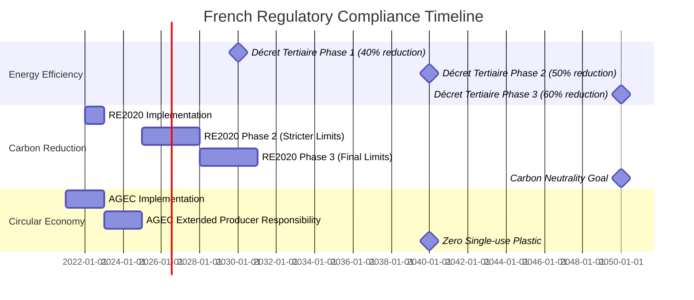

# 4. Compliance & Regulations

## 4.1. French Regulatory Framework

The HeyZack B2B Building Management Solution is designed to comply with and support the complex regulatory landscape governing building management, energy efficiency, and sustainability in France. Understanding this framework is essential for ensuring that the solution meets all legal requirements and helps clients achieve compliance.

### Key French Building Regulations

| Regulation | Description | Relevance to BMS |
|------------|-------------|------------------|
| **RE2020** | Environmental regulation for new buildings, replacing RT2012, focusing on energy efficiency, carbon footprint reduction, and summer comfort. | BMS must support energy consumption monitoring, carbon tracking, and thermal comfort optimization. |
| **Décret Tertiaire / Eco-énergie Tertiaire** | Requires commercial buildings to reduce energy consumption by 40% by 2030, 50% by 2040, and 60% by 2050 (compared to 2010). | BMS must provide energy monitoring, reduction planning, and regulatory reporting capabilities. |
| **Loi ELAN** | Housing, Planning and Digital Law that includes provisions for energy efficiency in buildings. | BMS must support digital building management and energy performance tracking. |
| **Loi Énergie-Climat** | Sets goals for carbon neutrality by 2050 and reduction of fossil fuel consumption. | BMS must support carbon tracking and renewable energy integration. |
| **Loi AGEC** | Anti-waste law for a circular economy, promoting resource efficiency and waste reduction. | BMS must support waste management tracking and circular economy principles. |
| **Plan Bâtiment Durable** | National plan for sustainable building, coordinating various initiatives. | BMS must align with sustainable building objectives and reporting requirements. |

### Energy Performance Regulations: NF EN ISO 52120-1:2022

The NF EN ISO 52120-1:2022 standard (replacing NF EN 15232-1:2017) is central to the regulatory framework for building automation and control systems in France and across Europe. This standard is referenced in the European Union Energy Performance of Buildings Directive (EPBD) and is a key component of France's energy efficiency strategy.

#### Performance Classification System

The standard defines four performance classes for building automation and control systems:

- **Class A (High Energy Performance)**: 
  - Advanced automation with optimized control strategies
  - Comprehensive energy monitoring and management
  - Predictive and adaptive capabilities
  - Continuous commissioning and optimization
  - Detailed reporting and analytics
  - Integration across all building systems

- **Class B (Advanced Energy Performance)**:
  - Automated control of major building systems
  - Building management system with centralized control
  - Some optimization capabilities
  - Basic energy monitoring and reporting
  - Good integration between primary systems

- **Class C (Standard Energy Performance)**:
  - Basic automated control of separate systems
  - Minimum level for new buildings under current regulations
  - Limited integration between systems
  - Basic scheduling and setpoint management
  - Manual optimization and adjustments

- **Class D (Non-Energy Efficient)**:
  - Manual control of building systems
  - No or minimal automation
  - No system integration
  - Not compliant with new building regulations
  - Significant energy waste potential

#### Energy Savings Potential

The standard provides methodologies for estimating energy savings from automation:

| Building Type | Class A vs. D Savings | Class B vs. D Savings | Class C vs. D Savings |
|---------------|----------------------|----------------------|----------------------|
| Offices | 30-40% | 20-30% | 10-15% |
| Hospitals | 25-35% | 15-25% | 8-12% |
| Hotels | 25-35% | 15-25% | 7-10% |
| Educational | 20-30% | 12-20% | 5-8% |
| Retail | 25-35% | 15-25% | 7-10% |

#### Key Control Functions

The standard specifies control functions across several domains:

1. **Heating and Cooling Control**:
   - Room temperature control
   - Supply temperature control
   - Distribution network control
   - Generator control and sequencing

2. **Ventilation and Air Conditioning**:
   - Air flow control
   - Air temperature control
   - Free cooling control
   - Humidity control

3. **Lighting**:
   - Occupancy detection control
   - Daylight harvesting
   - Dimming capabilities
   - Load shedding

4. **Shading**:
   - Solar radiation management
   - Glare prevention
   - Thermal optimization
   - Integration with lighting systems

5. **Energy Management**:
   - Load monitoring
   - Predictive load management
   - Energy storage management
   - Renewable energy integration

The HeyZack solution is designed to achieve Class A performance across all domains, providing:
- Advanced automation and control functions
- Comprehensive energy monitoring and management
- Predictive and optimization capabilities
- Integration with all building systems
- Continuous commissioning and performance verification
- Detailed analytics and reporting for compliance documentation

### Certification and Incentive Programs

Several certification and incentive programs influence building management in France:

1. **CEE (Certificats d'Économie d'Énergie)**
   - Energy savings certificate program
   - Obligates energy suppliers to achieve energy savings
   - Building owners can implement efficiency measures to generate certificates
   - Certificates can be sold to energy suppliers

2. **HQE (Haute Qualité Environnementale)**
   - French green building standard
   - Evaluates environmental performance across 14 criteria
   - Includes energy efficiency, water management, and indoor environment

3. **E+C- (Énergie Positive & Réduction Carbone)**
   - Label for energy-positive and low-carbon buildings
   - Precursor to RE2020 regulation
   - Evaluates both energy performance and carbon footprint

4. **BBC (Bâtiment Basse Consommation)**
   - Low-energy building certification
   - Sets maximum energy consumption thresholds
   - Varies by climate zone within France

### Compliance Timeline

### Regulatory Reporting Requirements

The HeyZack solution supports the following regulatory reporting requirements:

- **OPERAT Platform Reporting**: Annual energy consumption data submission for Décret Tertiaire compliance
- **DPE (Diagnostic de Performance Énergétique)**: Energy performance diagnostics for buildings
- **Carbon Reporting**: Greenhouse gas emissions reporting for climate regulations
- **Waste Management Reporting**: Documentation of waste handling for AGEC compliance
- **Water Usage Reporting**: Water consumption tracking for environmental regulations

## 4.2. CEE Requirements

The Certificats d'Économie d'Énergie (CEE) program is a key component of France's energy efficiency strategy, creating a market-based incentive for energy savings. The HeyZack B2B Building Management Solution is designed to help building owners and managers maximize their benefits from this program.

### CEE Program Overview

- **Objective**: Encourage energy efficiency improvements through market-based incentives
- **Mechanism**: Energy suppliers (obligated parties) must achieve energy savings targets or purchase certificates
- **Beneficiaries**: Building owners can implement efficiency measures to generate certificates
- **Value**: Certificates have monetary value and can be traded
- **Administration**: Managed by the French Ministry of Ecological Transition

### BAT TH 116 Standard

The BAT TH 116 standard is particularly relevant for building management systems, as it defines the requirements for GTB (Gestion Technique du Bâtiment) systems to qualify for CEE credits:

- **Scope**: Applies to tertiary (commercial) buildings in France
- **Requirement**: GTB system must achieve Class B or A performance according to NF EN ISO 52120-1:2022
- **Functions**: Must control heating, domestic hot water, and potentially cooling and lighting (especially in overseas regions)
- **Installation**: Must be performed by a qualified professional
- **Documentation**: Requires certification of compliance and performance
- **Climate Zone Adjustments**: Energy savings calculations are adjusted based on France's climate zones:
  - Zone H1 (Northern and Eastern France): Coefficient 1.1
  - Zone H2 (Western and Central France): Coefficient 0.9
  - Zone H3 (Mediterranean France): Coefficient 0.6
  - Overseas territories: Coefficient 0.5

The HeyZack solution is specifically designed to meet and exceed BAT TH 116 requirements, achieving Class A performance for maximum CEE benefits. Our system provides comprehensive documentation and certification support to streamline the CEE application process.

### CEE Calculation Methodology

The HeyZack system includes tools to calculate potential CEE benefits:

1. **Energy Baseline Establishment**
   - Historical consumption analysis
   - Building type and usage profiling
   - Climate zone adjustment

2. **Savings Potential Calculation**
   - Simulation of energy savings from BMS implementation
   - Application of standard coefficients based on building type and climate zone
   - Calculation of kWh cumac (cumulative and discounted over lifetime)

3. **Certificate Value Estimation**
   - Current market price monitoring
   - ROI calculation for efficiency measures
   - Payback period estimation

### Climate Zone Coefficients

CEE calculations are adjusted based on France's climate zones:

| Climate Zone | Coefficient | Regions |
|--------------|-------------|---------|
| H1 | 1.1 | Northern and Eastern France |
| H2 | 0.9 | Western and Central France |
| H3 | 0.6 | Mediterranean France |
| Overseas | 0.5 | French overseas territories |

### CEE Documentation Management

The HeyZack solution includes comprehensive tools for managing CEE documentation:

- **Document Repository**: Secure storage for all CEE-related documentation
- **Compliance Certificates**: Generation of required compliance statements
- **Technical Documentation**: Storage of system specifications and performance data
- **Installation Verification**: Documentation of professional installation
- **Audit Trail**: Records of system performance for verification purposes
- **Application Assistance**: Guidance for CEE application submission
- **Certificate Tracking**: Management of issued certificates

### CEE Program Integration

The system integrates with the CEE program through:

- **Standardized Calculations**: Implementation of official calculation methodologies
- **Approved Measure Library**: Database of CEE-eligible efficiency measures
- **Documentation Templates**: Pre-formatted documents for CEE applications
- **Regulatory Updates**: Automatic updates to reflect program changes
- **Expert Guidance**: Built-in assistance for maximizing CEE benefits

## 4.3. Data Protection & GDPR

The HeyZack B2B Building Management Solution handles various types of data, including potentially sensitive information about building operations, energy usage, and in some cases, occupant behavior. Ensuring compliance with data protection regulations, particularly the General Data Protection Regulation (GDPR), is essential for legal operation in France and the broader European Union.

### GDPR Compliance Framework

The solution implements a comprehensive GDPR compliance framework:

1. **Data Mapping & Inventory**
   - Identification of all personal data processed
   - Classification by sensitivity and purpose
   - Documentation of data flows and storage locations
   - Regular updates to the data inventory

2. **Legal Basis for Processing**
   - Identification of appropriate legal basis for each processing activity
   - Implementation of consent management where required
   - Documentation of legitimate interests assessments
   - Contract-based processing for service delivery

3. **Data Subject Rights Management**
   - Processes for handling access requests
   - Data portability capabilities
   - Rectification and correction procedures
   - Erasure (right to be forgotten) mechanisms
   - Restriction of processing capabilities
   - Objection handling procedures

4. **Privacy by Design & Default**
   - Privacy considerations integrated into development processes
   - Data minimization principles
   - Purpose limitation controls
   - Storage limitation policies
   - Default privacy-protective settings

### Personal Data Considerations in BMS

The system addresses specific personal data considerations in building management:

| Data Category | GDPR Relevance | Protection Measures |
|---------------|----------------|---------------------|
| **Access Control Data** | Personal data including identifiers and movement patterns | Pseudonymization, access controls, retention limits |
| **Occupancy Data** | May reveal presence and movement patterns | Aggregation, anonymization where possible |
| **Energy Usage Data** | May reveal occupancy patterns and behaviors | Aggregation at appropriate levels, purpose limitation |
| **Comfort Preferences** | Personal preferences linked to individuals | Consent-based collection, access controls |
| **Surveillance Footage** | Highly sensitive personal data | Strict access controls, appropriate retention, clear signage |
| **Maintenance Records** | May include personnel information | Data minimization, access restrictions |

### Data Protection Impact Assessment

For processing activities that may present high risks to individuals' rights and freedoms, the system supports Data Protection Impact Assessments (DPIAs):

- **Risk Assessment**: Evaluation of potential privacy risks
- **Necessity Analysis**: Justification for data collection and processing
- **Mitigation Measures**: Controls to reduce identified risks
- **Consultation Process**: Engagement with stakeholders and authorities
- **Documentation**: Comprehensive recording of the assessment process
- **Review Cycle**: Regular reassessment as systems or processes change

### Data Security Measures

The solution implements technical and organizational measures to protect personal data:

- **Encryption**: Data encrypted both in transit and at rest
- **Access Controls**: Role-based access with principle of least privilege
- **Authentication**: Multi-factor authentication for sensitive functions
- **Audit Logging**: Comprehensive logging of data access and processing
- **Data Segregation**: Separation of personal data from other data types
- **Anonymization**: Techniques to remove personal identifiers where possible
- **Pseudonymization**: Replacement of identifiers with pseudonyms
- **Backup & Recovery**: Secure backup procedures with integrity verification

### International Data Transfers

For organizations operating beyond France, the system addresses international data transfer requirements:

- **Transfer Mechanism Identification**: Selection of appropriate legal mechanisms
- **Standard Contractual Clauses**: Implementation where applicable
- **Transfer Impact Assessment**: Evaluation of destination country protections
- **Data Localization Options**: Capabilities to keep data within specific territories
- **Transparency**: Clear information about where data is processed

### Data Breach Management

The solution includes a comprehensive data breach management process:

- **Detection Capabilities**: Systems to identify potential breaches
- **Assessment Procedures**: Evaluation of breach severity and impact
- **Containment Measures**: Actions to limit breach effects
- **Notification Workflow**: Processes for timely authority notification
- **Communication Templates**: Pre-prepared communications for affected individuals
- **Documentation**: Comprehensive breach recording
- **Post-breach Analysis**: Learning and improvement processes

## 4.4. Environmental Standards

The HeyZack B2B Building Management Solution is designed to support compliance with a wide range of environmental standards and certifications relevant to the French and European building sectors. These standards go beyond regulatory requirements to promote sustainable building practices and environmental leadership.

### Building Environmental Certifications

The system supports the documentation, monitoring, and reporting requirements for major environmental certifications:

#### HQE (Haute Qualité Environnementale)

The primary French environmental certification for buildings:

- **Structure**: 14 targets across 4 categories (Eco-construction, Eco-management, Comfort, Health)
- **Levels**: Pass, Good, Very Good, Excellent, Exceptional
- **BMS Relevance**: The HeyZack solution directly supports 7 of the 14 targets, including energy management, water management, waste management, maintenance, hygrothermal comfort, air quality, and visual comfort
- **Documentation**: Automated data collection for certification documentation
- **Monitoring**: Continuous tracking of performance against HQE criteria

#### BREEAM (Building Research Establishment Environmental Assessment Method)

Widely used international certification with French adaptation:

- **Categories**: Energy, Health & Wellbeing, Innovation, Land Use, Materials, Management, Pollution, Transport, Waste, Water
- **Ratings**: Pass, Good, Very Good, Excellent, Outstanding
- **BMS Relevance**: The system supports monitoring and optimization for multiple BREEAM categories, particularly Energy, Health & Wellbeing, Management, Pollution, Waste, and Water
- **Performance Tracking**: Real-time monitoring of BREEAM-relevant metrics

#### LEED (Leadership in Energy and Environmental Design)

International certification used for some premium projects in France:

- **Categories**: Location & Transportation, Sustainable Sites, Water Efficiency, Energy & Atmosphere, Materials & Resources, Indoor Environmental Quality, Innovation
- **Levels**: Certified, Silver, Gold, Platinum
- **BMS Relevance**: The solution supports LEED requirements for energy performance, water efficiency, indoor environmental quality monitoring, and ongoing commissioning
- **Certification Support**: Tools for LEED documentation and submission

#### E+C- (Énergie Positive & Réduction Carbone)

French experimental label for positive-energy and low-carbon buildings:

- **Energy Levels**: E1, E2, E3, E4 (from basic compliance to energy-positive)
- **Carbon Levels**: C1, C2 (from basic to ambitious carbon reduction)
- **BMS Relevance**: Comprehensive energy monitoring and carbon tracking aligned with E+C- methodology
- **Simulation**: Predictive tools to evaluate E+C- performance

### ISO Environmental Standards

The solution supports compliance with key ISO environmental standards:

#### ISO 50001 - Energy Management

- **Requirements**: Energy policy, planning, implementation, performance evaluation, improvement
- **BMS Support**: Energy baseline establishment, performance indicators, monitoring, analysis, action planning
- **Documentation**: Automated generation of required documentation
- **Audit Support**: Evidence collection and reporting for certification audits

#### ISO 14001 - Environmental Management

- **Framework**: Plan-Do-Check-Act methodology for environmental management
- **BMS Support**: Environmental aspect monitoring, performance tracking, compliance management
- **Integration**: Alignment with broader environmental management systems
- **Continuous Improvement**: Tools for identifying and implementing improvements

### Environmental Performance Indicators

The system tracks and reports on key environmental performance indicators:

| Category | Indicators | Measurement Approach |
|----------|------------|----------------------|
| **Energy** | Energy Use Intensity (kWh/m²/year), Primary Energy Consumption, Renewable Energy Percentage | Real-time monitoring, automated calculations, benchmarking |
| **Carbon** | Operational Carbon (kgCO₂e/m²/year), Carbon Intensity of Energy, Emissions by Scope | Conversion from energy data, supply chain integration, reporting tools |
| **Water** | Water Use Intensity (m³/m²/year), Potable vs. Non-potable Usage, Recycled Water Percentage | Flow monitoring, usage categorization, efficiency analysis |
| **Waste** | Waste Generation (kg/m²/year), Recycling Rate, Landfill Diversion Rate | Waste tracking, category analysis, circular economy metrics |
| **Materials** | Sustainable Materials Percentage, VOC Levels, Hazardous Materials Tracking | Inventory management, air quality monitoring, compliance checking |
| **Biodiversity** | Green Space Ratio, Habitat Creation, Species Diversity | Site monitoring, integration with landscape management |

### Environmental Reporting Capabilities

The HeyZack solution provides comprehensive environmental reporting capabilities:

- **Customizable Dashboards**: User-specific views of environmental performance
- **Regulatory Reports**: Automated generation of required environmental reports
- **Certification Documentation**: Preparation of documentation for certification submissions
- **Stakeholder Reports**: Tailored reporting for different stakeholder groups
- **Benchmarking**: Comparison against industry standards and best practices
- **Improvement Tracking**: Monitoring of progress toward environmental goals
- **Scenario Analysis**: Evaluation of potential environmental improvements

## 4.5. Building Codes & Standards

The HeyZack B2B Building Management Solution is designed to support compliance with French building codes and technical standards that govern building systems, safety, and performance. Understanding and adhering to these codes is essential for legal operation and optimal building performance.

### French Building Code Framework

The French building code framework consists of several layers of regulations and standards:

1. **Code de la Construction et de l'Habitation (CCH)**
   - Primary legislative framework for construction and housing
   - Establishes fundamental requirements for building safety, accessibility, and performance
   - Provides legal basis for more detailed technical regulations

2. **Réglementation Thermique (RT) / Réglementation Environnementale (RE)**
   - Thermal and environmental regulations for buildings
   - RT2012 (being replaced by RE2020)
   - Sets requirements for energy efficiency, thermal comfort, and environmental impact

3. **Normes Françaises (NF)**
   - French national standards
   - Often harmonized with European (EN) and international (ISO) standards
   - Cover specific technical aspects of building systems and components

4. **Documents Techniques Unifiés (DTU)**
   - Unified technical documents
   - Define standard practices for construction work
   - Serve as reference for contractual obligations

5. **Avis Techniques**
   - Technical opinions for innovative products and systems
   - Issued by specialized committees
   - Provide guidance when standard regulations don't apply

### Key Technical Standards for BMS

The HeyZack solution is designed to comply with and support the following key technical standards:

#### Building Automation and Control

- **NF EN ISO 52120-1:2022**: Energy performance of buildings - Contribution of Building Automation, Controls and Building Management
  - Replaces NF EN 15232-1:2017
  - Defines performance classes for building automation systems
  - Specifies methods for estimating energy savings from automation

- **NF EN 14908**: Open Data Communication in Building Automation
  - Standards for communication protocols in building automation
  - Ensures interoperability between different systems and components

- **NF EN 50491**: General requirements for Home and Building Electronic Systems (HBES) and Building Automation and Control Systems (BACS)
  - Covers safety, functional safety, EMC, and environmental requirements
  - Applies to all electronic systems in buildings

#### Energy Management

- **NF EN ISO 50001**: Energy Management Systems
  - Requirements for establishing, implementing, and improving energy management
  - Framework for monitoring and optimizing energy performance

- **NF EN 15232**: Energy Performance of Buildings - Impact of Building Automation, Controls and Building Management
  - Methodology for calculating energy savings from automation
  - Classification of automation functions by impact on energy efficiency

#### HVAC Systems

- **NF EN 15500**: Control for Heating, Ventilating and Air Conditioning Applications
  - Requirements for electronic control equipment in HVAC systems
  - Performance criteria for control accuracy and stability

- **NF EN 12098**: Controls for Heating Systems
  - Requirements for electronic control equipment in heating systems
  - Specifications for weather-compensated control systems

#### Lighting Control

- **NF EN 15193**: Energy Performance of Buildings - Energy Requirements for Lighting
  - Methodology for calculating energy consumption of lighting systems
  - Specifications for lighting control systems to reduce energy use

- **NF EN 60929**: AC and/or DC-supplied electronic control gear for tubular fluorescent lamps - Performance requirements
  - Requirements for dimming interfaces and performance

#### Safety and Security

- **NF EN 50130**: Alarm Systems
  - Requirements for various types of alarm systems
  - Covers intrusion, access control, video surveillance, and emergency systems

- **NF EN 54**: Fire Detection and Fire Alarm Systems
  - Requirements for components of fire detection systems
  - Specifications for integration with building management systems

### Compliance Verification Process

The HeyZack solution includes a structured process for verifying compliance with building codes and standards:

1. **Requirement Identification**
   - Determination of applicable codes and standards
   - Analysis of specific requirements relevant to the building
   - Documentation of compliance obligations

2. **System Configuration**
   - Implementation of required control functions
   - Configuration of monitoring and reporting capabilities
   - Integration with relevant building systems

3. **Performance Verification**
   - Testing of system performance against standard requirements
   - Measurement of key parameters and indicators
   - Documentation of compliance evidence

4. **Ongoing Monitoring**
   - Continuous tracking of compliance-related parameters
   - Automated alerts for potential compliance issues
   - Regular verification of continued compliance

5. **Documentation Management**
   - Maintenance of compliance documentation
   - Organization of test results and certifications
   - Preparation for inspections and audits

### Technical Compliance Features

The system includes specific features to support technical compliance:

- **Standard-specific Configurations**: Pre-configured settings aligned with technical standards
- **Compliance Checklists**: Interactive tools for verifying compliance with specific standards
- **Test Procedures**: Guided workflows for conducting required tests
- **Performance Monitoring**: Continuous tracking of parameters related to technical standards
- **Documentation Templates**: Pre-formatted documents for compliance reporting
- **Regulatory Updates**: Automatic notifications of changes to relevant standards
- **Certification Management**: Tracking of required certifications and their renewal dates

### Interoperability Standards

The HeyZack solution supports key interoperability standards to ensure seamless integration with building systems:

| Protocol | Application | Supported Standards |
|----------|-------------|---------------------|
| **BACnet** | Building automation and control | ISO 16484-5, ASHRAE 135 |
| **Modbus** | Industrial control and building automation | Modbus TCP, Modbus RTU |
| **KNX** | Home and building control | ISO/IEC 14543-3 |
| **LonWorks** | Control networking | ISO/IEC 14908 |
| **MQTT** | IoT messaging | OASIS MQTT v3.1.1, v5.0 |
| **OPC UA** | Industrial communication | IEC 62541 |
| **Web Services** | Enterprise integration | REST, SOAP, JSON |
| **Tuya IoT** | Smart device integration | Tuya IoT Core API, Matter, Zigbee 3.0, BLE 4.2+ |

### IoT Device Certifications

The solution's IoT integration, powered by Tuya IoT Platform, maintains compliance with key device certifications:

#### Tuya Device Certifications
- **Matter Certification**: Ensures interoperability with Matter-enabled devices
- **Zigbee 3.0 Certification**: Compliance with latest Zigbee standards
- **Bluetooth Certification**: Qualified for BLE 4.2 and above
- **CE Marking**: European conformity for IoT devices
- **FCC Certification**: US compliance for wireless devices
- **RoHS Compliance**: Restriction of hazardous substances
- **REACH Compliance**: EU chemical substance regulations

#### Security Certifications
- **ISO 27001**: Information security management
- **ISO 27017**: Cloud security controls
- **ISO 27018**: Protection of personal data in cloud
- **SOC 2 Type II**: Security, availability, and confidentiality
- **CSA STAR**: Cloud security assurance
- **GDPR Compliance**: EU data protection requirements

#### IoT Security Standards
- **IoT Security Foundation Framework**: Security best practices
- **ETSI EN 303 645**: Cyber security for consumer IoT
- **IEC 62443**: Industrial communication networks security
- **NIST IoT Security**: US IoT security guidelines
