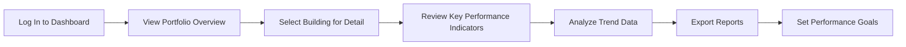

# 5. User Interface Design

## 5.1. Design Philosophy

The HeyZack B2B Building Management Solution's user interface is designed with a clear philosophy that prioritizes usability, efficiency, and accessibility while maintaining a professional and modern aesthetic. This philosophy guides all design decisions and ensures a consistent user experience across the platform.

### Core Design Principles

#### 1. User-Centered Design

The interface is designed around the needs, workflows, and mental models of the primary user personas:

- **Facility Managers**: Need quick access to operational controls and alerts
- **Building Owners**: Focus on performance metrics and financial indicators
- **Energy Managers**: Require detailed energy data and optimization tools
- **Maintenance Staff**: Need mobile-friendly work order management
- **Tenants**: Desire simple comfort controls and service requests
- **Security Personnel**: Require clear security monitoring and alerts

Each interface element is evaluated based on how it serves these users' specific needs and contexts.

#### 2. Task-Oriented Organization

The interface is structured around common tasks rather than system features:

- Information architecture based on user workflows
- Critical tasks accessible within minimal clicks/taps
- Related functions grouped logically
- Progressive disclosure of complex options
- Context-sensitive tools and information

#### 3. Visual Clarity

The visual design emphasizes clarity and reduces cognitive load:

- Clean, uncluttered layouts with appropriate white space
- Visual hierarchy that guides attention to important elements
- Consistent use of color, typography, and iconography
- Meaningful use of visualization for complex data
- Reduction of unnecessary decorative elements

#### 4. Efficiency Through Consistency

Consistency across the interface reduces learning curves and improves efficiency:

- Standardized interaction patterns
- Consistent terminology and labeling
- Predictable location of common elements
- Uniform feedback mechanisms
- Coherent visual language

#### 5. Adaptability

The interface adapts to different contexts while maintaining usability:

- Responsive design for various devices and screen sizes
- Customizable dashboards for different user roles
- Adjustable information density based on user preference
- Support for different operational contexts (routine vs. emergency)
- Accommodation of varying technical expertise levels

### Design Language

The HeyZack solution employs a cohesive design language that communicates the brand values while supporting functionality:

#### Visual Identity

- **Color Palette**: 
  - Primary: Deep blue (#0B3D91) representing reliability and professionalism
  - Secondary: Teal (#00A3A1) representing sustainability and innovation
  - Accent: Amber (#FFC107) for alerts and calls to action
  - Neutral tones for backgrounds and supporting elements
  - Semantic colors for status indication (green for normal, yellow for warning, red for critical)

- **Typography**:
  - Primary font: Roboto for clean readability across devices
  - Headings: Roboto Medium for clear hierarchy
  - Body text: Roboto Regular for optimal readability
  - Monospace: Roboto Mono for technical data and code
  - Consistent type scale with 1.2 ratio progression

- **Iconography**:
  - Custom icon set designed for building management context
  - Consistent stroke weight and style
  - Semantic meaning reinforced through color and position
  - Simple, recognizable forms that work at various sizes

#### Interaction Design

- **Feedback Principles**:
  - Immediate visual feedback for all user actions
  - Clear system status indicators
  - Meaningful transitions and animations
  - Progressive loading indicators for longer operations
  - Error prevention through validation and confirmation

- **Input Methods**:
  - Optimization for mouse/keyboard and touch interfaces
  - Support for keyboard shortcuts for power users
  - Voice input capabilities for hands-free operation
  - Gesture support on touch devices
  - Accessibility accommodations for alternative input methods

### Design System Implementation

The design system is implemented as a comprehensive component library that ensures consistency and efficiency in development:

- **Component Library**: Reusable UI components with defined behaviors and styles
- **Design Tokens**: Centralized variables for colors, spacing, typography, etc.
- **Pattern Library**: Documented interaction patterns for common tasks
- **Style Guide**: Comprehensive documentation of design standards
- **Design-to-Code Workflow**: Streamlined process from design to implementation

## 5.2. User Experience Guidelines

The HeyZack B2B Building Management Solution follows comprehensive user experience guidelines to ensure that all interactions are intuitive, efficient, and satisfying for users across different roles and contexts.

### User Journeys

Key user journeys have been mapped to ensure smooth experiences for common tasks:

#### Facility Manager Journey: Responding to an Alert

1. **Receive Alert Notification**: Multi-channel alerts with priority indication
2. **View Alert Details**: Contextual information about the alert condition
3. **Access Affected System Data**: One-click access to relevant system information
4. **Analyze Historical Patterns**: Quick access to historical data for context
5. **Implement Response**: Direct system control or work order generation
6. **Document Resolution**: Simple documentation of actions taken
7. **Review Performance Metrics**: Confirmation of system recovery

#### Building Owner Journey: Reviewing Performance

1. **Log In to Dashboard**: Streamlined authentication with remembered preferences
2. **View Portfolio Overview**: At-a-glance view of all properties
3. **Select Building for Detail**: Intuitive navigation to specific building data
4. **Review Key Performance Indicators**: Clear visualization of critical metrics
5. **Analyze Trend Data**: Interactive tools for exploring performance over time
6. **Export Reports**: Simple generation of shareable reports
7. **Set Performance Goals**: Intuitive tools for establishing targets

### Interaction Guidelines

#### Navigation Principles

- **Global Navigation**: Persistent access to main sections
- **Contextual Navigation**: Related functions based on current context
- **Breadcrumbs**: Clear indication of location within the system
- **Search**: Universal search with filtered results by category
- **Recent Items**: Quick access to recently used functions and views
- **Favorites**: User-defined shortcuts to frequently used items
- **Back Button Support**: Predictable navigation history

#### Information Hierarchy

- **Progressive Disclosure**: Information revealed as needed
- **Three-Click Rule**: Critical functions accessible within three clicks
- **F-Pattern Layout**: Important information positioned along F-pattern eye movement
- **Scannable Content**: Headings, bullets, and formatting for quick comprehension
- **Above-the-Fold Priority**: Critical information visible without scrolling
- **Grouping**: Logical grouping of related information
- **Emphasis**: Visual techniques to highlight important elements

#### Feedback & Affordances

- **Loading States**: Clear indication of system processing
- **Success Confirmation**: Positive feedback for completed actions
- **Error Handling**: Constructive error messages with recovery options
- **Hover States**: Visual indication of interactive elements
- **Selected States**: Clear indication of current selection
- **Disabled States**: Visual indication of unavailable options
- **Tooltips**: Contextual help for interface elements

#### Form Design

- **Input Validation**: Real-time validation with clear error messages
- **Smart Defaults**: Context-appropriate default values
- **Field Grouping**: Logical organization of related fields
- **Progressive Forms**: Multi-step forms for complex processes
- **Inline Help**: Contextual guidance within forms
- **Autosave**: Automatic saving of form progress
- **Responsive Inputs**: Appropriate input methods for different data types

### Usability Heuristics

The interface adheres to Nielsen's usability heuristics:

1. **Visibility of System Status**: 
   - Real-time status indicators for all building systems
   - Clear feedback for user actions
   - Prominent display of system mode (normal, maintenance, emergency)

2. **Match Between System and Real World**: 
   - Building terminology familiar to facilities professionals
   - Intuitive metaphors for building systems
   - Visual representations that match physical reality

3. **User Control and Freedom**: 
   - Undo/redo capabilities for critical actions
   - Confirmation for irreversible operations
   - Easy exit points from workflows
   - Ability to save and resume complex tasks

4. **Consistency and Standards**: 
   - Adherence to platform conventions
   - Consistent terminology across the system
   - Standardized interaction patterns
   - Uniform layout and visual design

5. **Error Prevention**: 
   - Validation before submission
   - Confirmation of critical actions
   - Clear distinction between similar actions
   - Prevention of impossible or dangerous settings

6. **Recognition Rather Than Recall**: 
   - Visible options rather than memorized commands
   - Persistent context information
   - Suggestions based on previous actions
   - Visual cues for available functions

7. **Flexibility and Efficiency**: 
   - Customizable dashboards for different user needs
   - Shortcuts for experienced users
   - Batch operations for efficiency
   - Templates for common tasks

8. **Aesthetic and Minimalist Design**: 
   - Focus on essential information
   - Reduction of visual clutter
   - Purposeful use of color and typography
   - Clean, professional visual style

9. **Help Users Recognize, Diagnose, and Recover from Errors**: 
   - Clear error messages in plain language
   - Specific guidance on resolving issues
   - Contextual help for error recovery
   - Logging of errors for support

10. **Help and Documentation**: 
    - Contextual help throughout the interface
    - Searchable knowledge base
    - Interactive tutorials for complex features
    - Workflow guidance for new users

### User Testing & Validation

The user experience is continuously refined through a structured testing program:

- **Usability Testing**: Regular sessions with representative users
- **A/B Testing**: Comparative testing of alternative designs
- **Analytics**: Behavioral data collection and analysis
- **Heatmapping**: Visual analysis of user interaction patterns
- **Feedback Collection**: In-app mechanisms for user feedback
- **Accessibility Testing**: Regular evaluation with assistive technologies
- **Performance Testing**: Measurement of response times and user efficiency

## 5.3. Interface Components

The HeyZack B2B Building Management Solution utilizes a comprehensive set of interface components that form the building blocks of the user interface. These components are designed for consistency, usability, and flexibility across different contexts and devices.

### Core Components

#### Navigation Components

- **Global Navigation Bar**:
  - Persistent access to main sections
  - User account and settings access
  - Notification center
  - Search functionality
  - Help and support access

- **Sidebar Navigation**:
  - Context-specific navigation options
  - Collapsible for space efficiency
  - Visual indicators for current location
  - Quick access to frequently used functions

- **Breadcrumb Trail**:
  - Hierarchical location indicator
  - Clickable path components
  - Responsive design for different screen sizes

- **Tab Navigation**:
  - Content organization within sections
  - Visual indication of active tab
  - Responsive adaptation to screen width

#### Content Containers

- **Dashboard Cards**:
  - Modular content containers
  - Consistent header, body, and footer structure
  - Draggable for dashboard customization
  - Resizable for different information density
  - Collapsible for space management

- **Data Tables**:
  - Sortable columns
  - Filterable content
  - Pagination controls
  - Row selection capabilities
  - Responsive behavior for different screen sizes
  - Export functionality

- **Panels**:
  - Collapsible content sections
  - Consistent header with status indicators
  - Nesting capability for hierarchical information

- **Modal Dialogs**:
  - Focused interaction for specific tasks
  - Consistent header, body, and action areas
  - Keyboard navigation support
  - Focus management for accessibility

#### Input Controls

- **Form Fields**:
  - Text inputs with validation
  - Dropdown selectors
  - Multi-select components
  - Date and time pickers
  - Numeric inputs with units
  - Toggle switches
  - Radio buttons and checkboxes
  - Sliders for range selection

- **Search Components**:
  - Global search with categorized results
  - Filtered search for specific content types
  - Advanced search with multiple criteria
  - Search suggestions and autocomplete
  - Recent searches history

- **Action Buttons**:
  - Primary, secondary, and tertiary button styles
  - Icon buttons for common actions
  - Button groups for related actions
  - Loading states for asynchronous operations
  - Disabled states for unavailable actions

#### Data Visualization

- **Charts and Graphs**:
  - Line charts for time-series data
  - Bar charts for comparative data
  - Pie/donut charts for proportional data
  - Heat maps for density visualization
  - Scatter plots for correlation analysis
  - Gauge charts for performance indicators

- **Maps and Floor Plans**:
  - Interactive building maps
  - Zoomable floor plans
  - Data overlay capabilities
  - Location-based filtering
  - Sensor and device positioning

- **Status Indicators**:
  - Traffic light indicators (red, yellow, green)
  - Progress bars and completion indicators
  - Trend indicators (up/down arrows)
  - Threshold markers
  - Comparative indicators (actual vs. target)

### Specialized Components

#### Building Management Components

- **System Control Panels**:
  - HVAC control interfaces
  - Lighting control panels
  - Security system controls
  - Access management interfaces
  - Energy management controls

- **Tuya IoT Device Controls**:
  * Device Discovery Panel:
    - Automated device scanning
    - QR code scanning support
    - Device type identification
    - Network configuration
    - Pairing status indicators

  * Device Management Interface:
    - Device status overview
    - Real-time control panels
    - Device grouping tools
    - Firmware update interface
    - Device sharing controls

  * Scene Automation Builder:
    - Visual automation editor
    - Condition configuration
    - Action sequencing
    - Schedule management
    - Trigger setup interface

  * Device Data Visualization:
    - Real-time data displays
    - Historical data charts
    - Performance analytics
    - Energy consumption graphs
    - Status trend analysis

#### Mobile Integration Components

- **Tuya Mobile SDK Integration**:
  * Authentication Components:
    - User registration forms
    - Login interfaces
    - Account management
    - Permission controls
    - Profile settings

  * Device Control Widgets:
    - Touch-optimized controls
    - Gesture support
    - Quick action buttons
    - Status indicators
    - Device type icons

  * Push Notification System:
    - Alert configuration
    - Notification preferences
    - Message center
    - Action buttons
    - Status updates

  * Mobile Dashboard:
    - Device overview
    - Quick controls
    - Recent activities
    - Favorites section
    - Scene shortcuts

- **Digital Twin Viewer**:
  - 3D building visualization
  - Interactive navigation
  - System overlay selection
  - Real-time data visualization
  - Simulation controls

- **Alert Management**:
  - Alert lists with priority indication
  - Alert detail views
  - Response workflow interfaces
  - Alert history and analysis tools
  - Alert configuration panels

#### Maintenance Components

- **Work Order Management**:
  - Work order creation forms
  - Assignment and scheduling interfaces
  - Status tracking boards
  - Completion documentation forms
  - Work order history views

- **Asset Management**:
  - Asset inventory browsers
  - Detailed asset information cards
  - Maintenance history timelines
  - Warranty and lifecycle tracking
  - Replacement planning tools

#### Energy Management Components

- **Energy Dashboards**:
  - Real-time consumption displays
  - Historical usage comparisons
  - Cost analysis tools
  - Carbon footprint calculators
  - Efficiency recommendation panels

- **Compliance Tracking**:
  - Regulatory requirement checklists
  - Compliance status indicators
  - Documentation management interfaces
  - Certification tracking boards
  - Audit preparation tools

### Component States and Variations

Each component is designed with multiple states to communicate system status and interaction possibilities:

- **Default State**: Normal appearance when no special conditions apply
- **Hover State**: Visual feedback when the user hovers over interactive elements
- **Active/Selected State**: Indication of current selection or active status
- **Disabled State**: Visual indication that an element is currently unavailable
- **Error State**: Clear indication of validation or processing errors
- **Loading State**: Visual feedback during asynchronous operations
- **Empty State**: Meaningful display when no data is available
- **Expanded/Collapsed State**: For components that can change their display size

### Component Library Implementation

The component library is implemented using a modular architecture:

- **Base Components**: Fundamental building blocks (buttons, inputs, etc.)
- **Composite Components**: Combinations of base components for specific functions
- **Patterns**: Standardized arrangements of components for common tasks
- **Templates**: Pre-configured layouts for specific page types
- **Theming System**: Customization capabilities for visual appearance

The component library includes comprehensive documentation:

- **Usage Guidelines**: When and how to use each component
- **Code Examples**: Implementation samples for developers
- **Accessibility Information**: ARIA roles, states, and properties
- **Responsive Behavior**: How components adapt to different screen sizes
- **State Variations**: Visual examples of all component states

## 5.4. Responsive Design Specifications

The HeyZack B2B Building Management Solution employs a comprehensive responsive design approach to ensure optimal usability across a wide range of devices, from large control room displays to mobile devices used in the field.

### Device Spectrum Support

The interface is designed to function effectively across the full spectrum of devices used in building management:

| Device Category | Screen Size | Typical Use Cases | Design Considerations |
|-----------------|-------------|-------------------|------------------------|
| **Large Displays** | 1920px+ | Control rooms, Operations centers, Executive dashboards | Information density, Multi-panel layouts, Data visualization focus |
| **Desktop Computers** | 1366-1920px | Office-based management, Detailed analysis, Configuration tasks | Standard workflows, Comprehensive tools, Keyboard/mouse optimization |
| **Laptops** | 1024-1366px | Mobile management, Field supervision, Presentations | Adaptable layouts, Essential functions, Consideration for trackpads |
| **Tablets** | 768-1024px | On-site inspections, Tenant interactions, Mobile dashboards | Touch optimization, Simplified workflows, Portrait/landscape adaptability |
| **Smartphones** | 320-480px | Emergency access, Notifications, Basic controls, Work orders | Critical functions only, Simplified views, One-handed operation |

### Responsive Design Framework

The system uses a flexible grid system with the following characteristics:

- **12-Column Grid**: Adaptable to different screen sizes
- **Fluid Containers**: Percentage-based widths for flexibility
- **Breakpoints**:
  - Extra Small: < 576px (mobile phones)
  - Small: 576px - 767px (large phones, small tablets)
  - Medium: 768px - 991px (tablets)
  - Large: 992px - 1199px (laptops, small desktops)
  - Extra Large: 1200px - 1599px (desktops)
  - Ultra Large: ≥ 1600px (large displays)
- **Content-based Breakpoints**: Additional breakpoints based on content needs

### Responsive Behavior Patterns

The interface employs several responsive patterns to adapt to different screen sizes:

#### Layout Adaptation

- **Mostly Fluid**: Multi-column layouts that reflow to fewer columns on smaller screens
- **Column Drop**: Columns that stack vertically as screen width decreases
- **Layout Shifter**: Components that change position based on available space
- **Off-Canvas Navigation**: Navigation that moves off-screen on smaller devices
- **Priority Content**: Critical content remains visible while secondary content adapts

#### Component Adaptation

- **Responsive Tables**: Tables that adapt through various techniques:
  - Horizontal scrolling for complex tables
  - Card view transformation for smaller screens
  - Column prioritization and progressive disclosure
  - Collapsible rows for detailed information

- **Responsive Charts**: Visualizations that adapt to available space:
  - Simplified versions for smaller screens
  - Interactive elements sized for touch targets
  - Legend positioning adaptation
  - Alternative visualization types when appropriate

- **Responsive Forms**: Input methods that adapt to device capabilities:
  - Touch-optimized inputs on mobile devices
  - Specialized input types (date, number, etc.)
  - Contextual keyboards on mobile
  - Simplified validation for smaller screens

### Responsive Images and Media

The system implements advanced techniques for responsive media:

- **Responsive Images**: 
  - Multiple resolution versions using srcset
  - Art direction for different screen sizes
  - Lazy loading for performance
  - Appropriate compression for different network conditions

- **Responsive Video**:
  - Fluid video containers that maintain aspect ratio
  - Adaptive streaming based on connection quality
  - Thumbnail previews on mobile to conserve bandwidth
  - Alternative content for low-bandwidth situations

### Touch Optimization

For touch-enabled devices, the interface includes specific optimizations:

- **Touch Targets**: Minimum 44x44px touch targets for interactive elements
- **Touch Feedback**: Visual feedback for touch interactions
- **Gesture Support**: Swipe, pinch, and other gesture recognition
- **Touch Affordances**: Visual cues for touchable elements
- **Fat Finger Compensation**: Spacing between interactive elements

### Performance Considerations

Responsive design includes performance optimizations for various devices:

- **Progressive Enhancement**: Core functionality works on all devices with enhanced features on capable devices
- **Conditional Loading**: Resources loaded based on device capabilities
- **Performance Budgets**: Strict limits on page size and load time
- **Critical Rendering Path**: Optimization of initial content display
- **Offline Capabilities**: Essential functions available without network connection

### Device-Specific Features

The system leverages device-specific capabilities when available:

- **Geolocation**: Location-aware features on mobile devices
- **Camera Access**: Barcode scanning and photo documentation
- **Biometric Authentication**: Fingerprint or facial recognition on capable devices
- **Push Notifications**: Alert delivery to mobile devices
- **Offline Storage**: Local data persistence for field operations

### Testing and Validation

The responsive design is validated through a comprehensive testing program:

- **Device Lab Testing**: Physical testing on representative devices
- **Emulator Testing**: Testing in device emulators and simulators
- **Responsive Testing Tools**: Browser-based responsive design testing
- **Field Testing**: Real-world testing in building environments
- **Performance Testing**: Load time and interaction responsiveness measurement

## 5.5. Accessibility Standards

The HeyZack B2B Building Management Solution is designed to be accessible to all users, including those with disabilities. The system adheres to international accessibility standards and implements best practices to ensure that all users can effectively interact with the platform.

### Accessibility Compliance

The interface complies with the following accessibility standards and guidelines:

- **WCAG 2.1 AA Compliance**: Web Content Accessibility Guidelines at Level AA
- **EN 301 549**: European accessibility requirements for public procurement
- **Section 508**: US federal accessibility requirements
- **ADA Compliance**: Americans with Disabilities Act standards

### Accessibility for Different Disabilities

The system implements specific accommodations for various types of disabilities:

#### Visual Impairments

- **Screen Reader Compatibility**:
  - Semantic HTML structure
  - ARIA roles, states, and properties
  - Meaningful alt text for images
  - Descriptive link text
  - Proper heading hierarchy

- **Low Vision Support**:
  - High contrast mode
  - Text resizing without loss of functionality
  - Zoom support up to 200%
  - Avoidance of color as the only means of conveying information
  - Sufficient color contrast (minimum 4.5:1 for normal text, 3:1 for large text)

- **Color Blindness Considerations**:
  - Alternative visual cues beyond color
  - Color combinations tested for all types of color blindness
  - Data visualizations with patterns in addition to colors
  - Status indicators with multiple visual cues

#### Motor Impairments

- **Keyboard Accessibility**:
  - Full functionality available through keyboard
  - Logical tab order
  - Visible focus indicators
  - Keyboard shortcuts for common actions
  - No keyboard traps

- **Input Alternatives**:
  - Support for various input devices (switches, joysticks, etc.)
  - Voice input capabilities
  - Adjustable timing for interactions
  - Minimal precision requirements for interactions

#### Cognitive Impairments

- **Clear Communication**:
  - Plain language
  - Consistent navigation and layout
  - Predictable behavior
  - Error prevention and clear error messages
  - Step-by-step guidance for complex tasks

- **Reduced Cognitive Load**:
  - Minimal distractions
  - Chunking of information
  - Memory aids and reminders
  - Progress indicators for multi-step processes
  - Consistent iconography and terminology

#### Hearing Impairments

- **Multimedia Alternatives**:
  - Captions for video content
  - Transcripts for audio content
  - Visual alternatives for audio alerts
  - Volume control for audio elements

### Accessibility Features

The system includes specific features to enhance accessibility:

- **Accessibility Mode**: Enhanced accessibility settings activated through a single control
- **Text Resizing**: Controls for adjusting text size throughout the interface
- **Contrast Controls**: Options for high contrast and alternative color schemes
- **Animation Control**: Ability to reduce or disable animations and transitions
- **Timeout Extensions**: Adjustable timeouts for session expiration
- **Simplified View**: Reduced complexity option for cognitive accessibility
- **Focus Mode**: Minimized distractions for improved concentration
- **Screen Reader Announcements**: Custom announcements for dynamic content changes

### ARIA Implementation

The interface uses ARIA (Accessible Rich Internet Applications) to enhance accessibility:

- **Landmark Roles**: Proper structure with main, navigation, search, etc.
- **Widget Roles**: Appropriate roles for custom interactive elements
- **Live Regions**: Announcements of dynamic content changes
- **States and Properties**: Accurate representation of component states
- **Dialog Management**: Proper modal dialog implementation with focus control
- **Form Labeling**: Explicit associations between labels and controls

### Keyboard Navigation

The system provides comprehensive keyboard navigation capabilities:

- **Focus Management**: Logical and predictable focus order
- **Skip Links**: Ability to bypass repetitive navigation
- **Keyboard Shortcuts**: Documented shortcuts for common actions
- **Focus Visibility**: Enhanced focus indicators
- **Keyboard Traps**: Prevention of keyboard focus trapping
- **Composite Widgets**: Proper keyboard interaction patterns for complex components

### Accessibility Testing and Validation

The accessibility of the interface is validated through a comprehensive testing program:

- **Automated Testing**: Regular scans with accessibility testing tools
- **Manual Testing**: Expert review using assistive technologies
- **User Testing**: Evaluation with users who have disabilities
- **Assistive Technology Testing**: Verification with screen readers, switches, etc.
- **Keyboard-only Testing**: Validation of all functionality without a mouse
- **Color Contrast Analysis**: Verification of all color combinations
- **Documentation Review**: Evaluation of accessibility documentation

### Accessibility Documentation

The system includes comprehensive accessibility documentation:

- **Accessibility Statement**: Public declaration of accessibility commitment
- **VPAT (Voluntary Product Accessibility Template)**: Detailed compliance documentation
- **Accessibility Features Guide**: Documentation of accessibility features
- **Alternative Access Methods**: Instructions for different access approaches
- **Known Limitations**: Transparent disclosure of any accessibility limitations
- **Feedback Mechanism**: Process for reporting accessibility issues

### Continuous Improvement

Accessibility is maintained through an ongoing process:

- **Regular Audits**: Scheduled accessibility evaluations
- **User Feedback**: Collection and analysis of accessibility-related feedback
- **Regression Testing**: Verification that new features maintain accessibility
- **Standards Monitoring**: Tracking of evolving accessibility standards
- **Team Training**: Ongoing education on accessibility best practices
