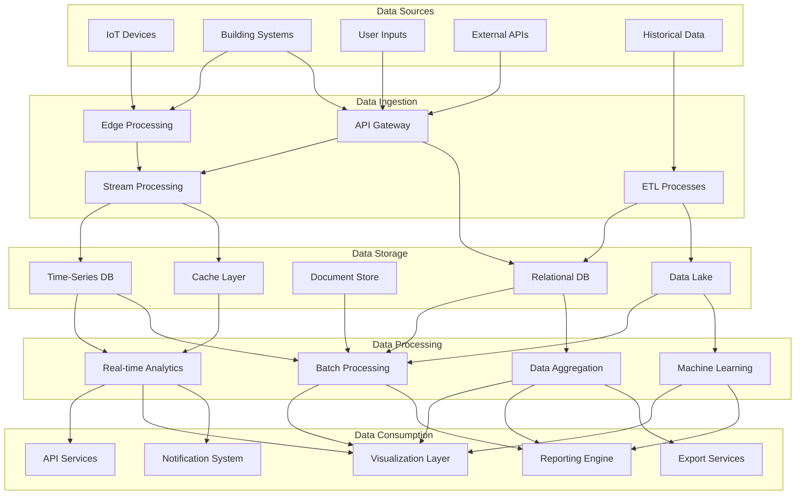
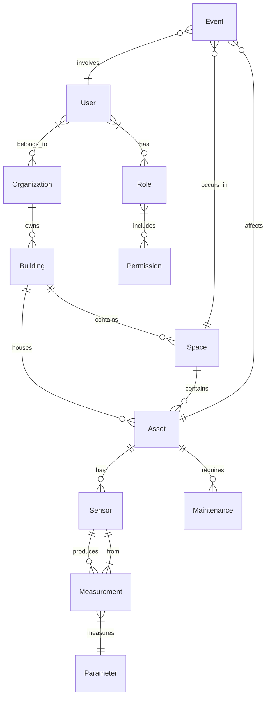
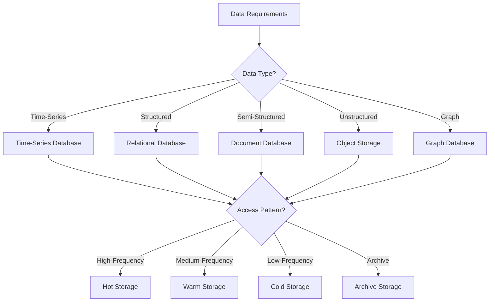
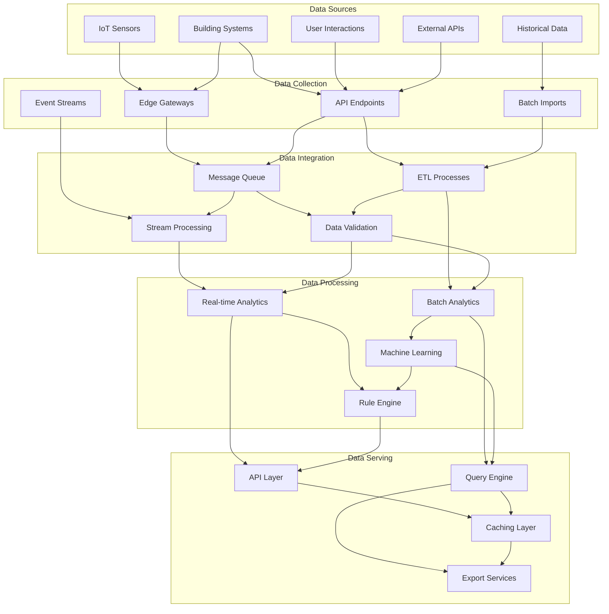
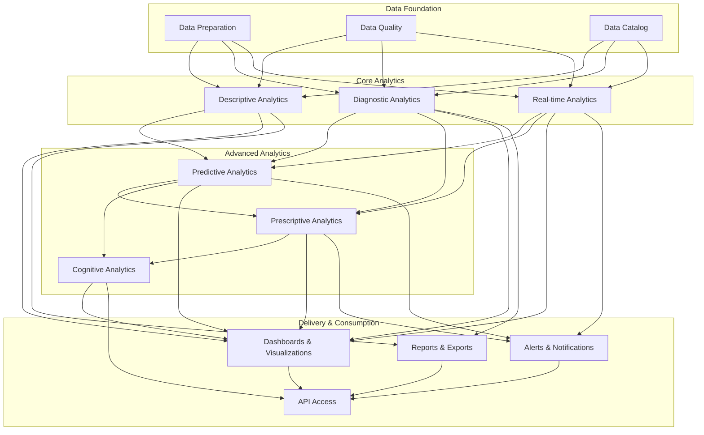

# 6. Data Management

## 6.1. Data Architecture

The HeyZack B2B Building Management Solution implements a comprehensive data architecture designed to handle the diverse data types, volumes, and processing requirements of modern building management systems. This architecture provides the foundation for all data-related operations, from collection to analysis to presentation.

### Data Architecture Overview

The data architecture follows a multi-layered approach that separates concerns while enabling efficient data flow:



### Data Domain Model

The data architecture is organized around key domain entities that represent the core concepts in building management:

#### Core Entities

- **Building**: Physical structures managed by the system
- **Space**: Defined areas within buildings (floors, rooms, zones)
- **Asset**: Equipment and systems within buildings
- **Sensor**: Devices that collect data from the environment
- **User**: Individuals who interact with the system
- **Organization**: Companies and departments that own or manage buildings
- **Event**: Occurrences of interest (alerts, maintenance activities, etc.)
- **Measurement**: Data points collected from sensors and systems

#### Entity Relationships

The relationships between these entities form the foundation of the data model:



### Data Classification

Data within the system is classified according to several dimensions:

#### By Type

- **Time-Series Data**: Regular measurements from sensors and systems
- **Transactional Data**: Records of activities and changes
- **Reference Data**: Relatively static information about buildings, assets, etc.
- **Master Data**: Core entities that are shared across the system
- **Metadata**: Information about the data itself
- **Analytical Data**: Derived insights and aggregations

#### By Sensitivity

- **Public Data**: Information that can be freely shared
- **Internal Data**: Information restricted to the organization
- **Confidential Data**: Sensitive information with limited access
- **Restricted Data**: Highly sensitive information with strict access controls
- **Personal Data**: Information related to identifiable individuals

#### By Lifecycle

- **Real-time Data**: Current information requiring immediate processing
- **Operational Data**: Information needed for day-to-day operations
- **Historical Data**: Past information used for analysis and reporting
- **Archived Data**: Information retained for compliance or reference

### Data Governance Framework

The data architecture incorporates a comprehensive governance framework:

#### Data Ownership

- **Data Owners**: Business stakeholders responsible for data domains
- **Data Stewards**: Individuals who manage data quality and metadata
- **Data Custodians**: Technical staff responsible for data storage and security
- **Data Users**: Consumers of data with defined access rights

#### Data Quality Management

- **Data Quality Dimensions**: Accuracy, completeness, consistency, timeliness, validity, uniqueness
- **Quality Metrics**: Measurable indicators of data quality
- **Quality Rules**: Automated checks to ensure data meets standards
- **Quality Monitoring**: Continuous assessment of data quality
- **Remediation Processes**: Procedures for addressing quality issues

#### Metadata Management

- **Business Metadata**: Information about business context and meaning
- **Technical Metadata**: Information about data structure and format
- **Operational Metadata**: Information about data processing and lineage
- **Governance Metadata**: Information about ownership and policies

### Data Integration Patterns

The architecture employs several integration patterns to ensure efficient data flow:

- **Extract-Transform-Load (ETL)**: Batch processing of data from source to target
- **Extract-Load-Transform (ELT)**: Loading data before transformation for scalability
- **Change Data Capture (CDC)**: Tracking and processing changes in source systems
- **Event-Driven Architecture**: Processing data based on events as they occur
- **API-Based Integration**: Standardized interfaces for data exchange
- **Streaming Integration**: Real-time processing of continuous data flows
- **Federated Queries**: Accessing data across multiple sources without movement

### Tuya IoT Data Integration

The solution leverages Tuya IoT Platform's data management capabilities:

#### Data Collection and Processing
- **Edge Data Processing**:
  * Local data aggregation at edge gateways
  * Protocol translation for diverse device types
  * Data filtering and compression
  * Local rule execution
  * Offline data buffering

- **Cloud Data Management**:
  * Centralized device data storage
  * Real-time data synchronization
  * Historical data archival
  * Data partitioning and sharding
  * Multi-region data replication

- **Data Access Patterns**:
  * Real-time device state queries
  * Historical data retrieval
  * Aggregated data views
  * Time-series analytics
  * Device event history

#### Integration Methods
- **API Integration**:
  * RESTful API endpoints
  * WebSocket connections
  * OAuth 2.0 authentication
  * Rate limiting and quotas
  * Response caching

- **Protocol Support**:
  * MQTT for device communication
  * CoAP for constrained devices
  * HTTP/2 for efficient data transfer
  * WebSocket for real-time updates
  * Custom protocols via gateway

- **Data Formats**:
  * JSON for API responses
  * Protocol Buffers for efficient serialization
  * Binary formats for device communication
  * CSV for bulk exports
  * Custom formats via transformation

#### Security and Privacy
- **Data Protection**:
  * End-to-end encryption
  * Data anonymization
  * Access control policies
  * Audit logging
  * Secure key management

- **Compliance Features**:
  * GDPR compliance tools
  * Data residency options
  * Privacy policy enforcement
  * Data retention controls
  * Export capabilities

### Data Security Architecture

Security is integrated throughout the data architecture:

- **Authentication**: Verification of user identity
- **Authorization**: Control of access to data based on roles and permissions
- **Encryption**: Protection of data at rest and in transit
- **Data Masking**: Obfuscation of sensitive data for non-production environments
- **Audit Logging**: Recording of data access and modifications
- **Data Loss Prevention**: Controls to prevent unauthorized data exfiltration
- **Privacy Controls**: Mechanisms to protect personal data

## 6.2. Storage Solutions

The HeyZack B2B Building Management Solution employs a multi-tiered storage strategy that leverages different storage technologies optimized for specific data types and access patterns. This approach ensures optimal performance, scalability, and cost-effectiveness across the diverse data requirements of building management.

### Storage Strategy Overview

The storage strategy is based on a polyglot persistence approach, using the right database technology for each data type and access pattern:



### Primary Storage Systems

#### Time-Series Database

Used for sensor data, measurements, and other time-stamped information:

- **Technology**: InfluxDB or TimescaleDB
- **Data Types**: Sensor readings, energy consumption, environmental conditions
- **Advantages**: Optimized for time-based queries, efficient compression, high write throughput
- **Retention Policies**: Automated data aging and downsampling
- **Query Capabilities**: Time-range queries, aggregations, interpolations

Example schema for sensor measurements:

```
Measurement: temperature
Tags:
  - building_id: string
  - floor_id: string
  - room_id: string
  - sensor_id: string
  - sensor_type: string
Fields:
  - value: float
  - battery_level: float
  - quality: integer
Timestamp: datetime
```

#### Relational Database

Used for structured data with complex relationships:

- **Technology**: PostgreSQL
- **Data Types**: Building information, asset data, user accounts, configuration
- **Advantages**: ACID compliance, complex query support, referential integrity
- **Optimization**: Indexing strategies, partitioning for large tables
- **Extensions**: PostGIS for spatial data, JSON support for flexibility

Example schema for asset management:

```sql
CREATE TABLE assets (
  asset_id UUID PRIMARY KEY,
  name VARCHAR(255) NOT NULL,
  type VARCHAR(100) NOT NULL,
  manufacturer VARCHAR(255),
  model VARCHAR(255),
  serial_number VARCHAR(255),
  installation_date DATE,
  warranty_expiration DATE,
  location_id UUID REFERENCES locations(location_id),
  parent_asset_id UUID REFERENCES assets(asset_id),
  status VARCHAR(50) NOT NULL,
  criticality INTEGER,
  last_maintenance_date TIMESTAMP,
  next_maintenance_date TIMESTAMP,
  metadata JSONB,
  created_at TIMESTAMP NOT NULL DEFAULT NOW(),
  updated_at TIMESTAMP NOT NULL DEFAULT NOW()
);
```

#### Document Database

Used for semi-structured data with flexible schemas:

- **Technology**: MongoDB
- **Data Types**: Configuration settings, user preferences, complex documents
- **Advantages**: Schema flexibility, horizontal scalability, JSON native format
- **Indexing**: Multi-field indexes, text search capabilities
- **Aggregation**: Pipeline-based data transformation and analysis

Example document for building configuration:

```json
{
  "_id": "building123",
  "name": "Corporate Headquarters",
  "address": {
    "street": "123 Main Street",
    "city": "Paris",
    "postalCode": "75001",
    "country": "France"
  },
  "contacts": [
    {
      "name": "Jean Dupont",
      "role": "Facility Manager",
      "email": "jean.dupont@example.com",
      "phone": "+33123456789"
    }
  ],
  "systems": {
    "hvac": {
      "type": "Central",
      "zones": 12,
      "controlSystem": "Johnson Controls"
    },
    "lighting": {
      "type": "Smart LED",
      "controlSystem": "Philips Hue"
    }
  },
  "operatingHours": {
    "weekdays": {"start": "08:00", "end": "18:00"},
    "weekends": {"start": "10:00", "end": "16:00"}
  },
  "certifications": ["HQE", "BREEAM"],
  "metadata": {
    "lastAudit": "2024-06-15",
    "energyClass": "A"
  }
}
```

#### Object Storage

Used for unstructured data and large binary objects:

- **Technology**: Amazon S3 or compatible storage
- **Data Types**: Documents, images, videos, backups, large exports
- **Advantages**: Virtually unlimited scalability, cost-effective, HTTP accessibility
- **Organization**: Bucket and folder structure for logical organization
- **Lifecycle Policies**: Automated transition between storage classes

Example object storage organization:

```
s3://heyzack-building-data/
  ├── buildings/
  │   ├── building123/
  │   │   ├── floor-plans/
  │   │   ├── equipment-manuals/
  │   │   └── inspection-reports/
  │   └── building456/
  ├── maintenance/
  │   ├── work-orders/
  │   └── photos/
  ├── exports/
  │   ├── reports/
  │   └── data-dumps/
  └── backups/
      ├── daily/
      ├── weekly/
      └── monthly/
```

#### Graph Database

Used for complex relationship analysis:

- **Technology**: Neo4j
- **Data Types**: Asset relationships, spatial connections, user hierarchies
- **Advantages**: Optimized for relationship queries, intuitive data model
- **Query Language**: Cypher for expressive graph queries
- **Applications**: Dependency analysis, impact assessment, network analysis

Example graph model for asset relationships:

```cypher
CREATE (b:Building {name: 'Headquarters'})
CREATE (f1:Floor {name: 'Floor 1'})
CREATE (f2:Floor {name: 'Floor 2'})
CREATE (r1:Room {name: 'Room 101'})
CREATE (r2:Room {name: 'Room 102'})
CREATE (a1:Asset {name: 'AHU-1', type: 'Air Handling Unit'})
CREATE (a2:Asset {name: 'VAV-101', type: 'VAV Box'})
CREATE (a3:Asset {name: 'VAV-102', type: 'VAV Box'})
CREATE (s1:Sensor {name: 'Temp-101', type: 'Temperature'})
CREATE (s2:Sensor {name: 'Temp-102', type: 'Temperature'})

CREATE (b)-[:CONTAINS]->(f1)
CREATE (b)-[:CONTAINS]->(f2)
CREATE (f1)-[:CONTAINS]->(r1)
CREATE (f1)-[:CONTAINS]->(r2)
CREATE (b)-[:HAS_EQUIPMENT]->(a1)
CREATE (r1)-[:HAS_EQUIPMENT]->(a2)
CREATE (r2)-[:HAS_EQUIPMENT]->(a3)
CREATE (a1)-[:SUPPLIES]->(a2)
CREATE (a1)-[:SUPPLIES]->(a3)
CREATE (a2)-[:HAS_SENSOR]->(s1)
CREATE (a3)-[:HAS_SENSOR]->(s2)
```

### Storage Tiering

The storage strategy implements tiering based on data access patterns and lifecycle:

#### Hot Storage

For frequently accessed, real-time data:

- **Characteristics**: High performance, low latency, higher cost
- **Technologies**: In-memory databases, SSD-backed storage
- **Data Types**: Current sensor readings, active alerts, operational data
- **Retention**: Typically hours to days
- **Access Pattern**: High-frequency reads and writes

#### Warm Storage

For regularly accessed, recent historical data:

- **Characteristics**: Balanced performance and cost
- **Technologies**: SSD/HDD hybrid storage
- **Data Types**: Recent historical data, trend analysis, reporting
- **Retention**: Typically days to months
- **Access Pattern**: Medium-frequency reads, occasional writes

#### Cold Storage

For infrequently accessed historical data:

- **Characteristics**: Lower performance, lower cost
- **Technologies**: HDD storage, object storage
- **Data Types**: Long-term historical data, compliance records
- **Retention**: Typically months to years
- **Access Pattern**: Low-frequency reads, rare writes

#### Archive Storage

For rarely accessed historical data:

- **Characteristics**: Lowest performance, lowest cost
- **Technologies**: Tape storage, cold object storage
- **Data Types**: Very old historical data, legal records
- **Retention**: Typically years to decades
- **Access Pattern**: Very infrequent reads, no writes

### Data Lifecycle Management

The storage solution includes automated lifecycle management:

- **Data Creation**: Initial storage in appropriate tier based on type
- **Data Aging**: Automatic movement between tiers based on age and access patterns
- **Data Archiving**: Transfer to archive storage for long-term retention
- **Data Purging**: Secure deletion of data that has exceeded retention requirements
- **Lifecycle Policies**: Configurable rules for each data type and classification

### Storage Optimization Techniques

Several techniques are employed to optimize storage efficiency:

- **Compression**: Reduction of data size through various algorithms
- **Deduplication**: Elimination of redundant data
- **Partitioning**: Division of large datasets into manageable chunks
- **Indexing**: Strategic indexing for query performance
- **Caching**: Temporary storage of frequently accessed data
- **Downsampling**: Reduction of time-series data resolution over time
- **Aggregation**: Pre-calculation of summary data for reporting

### Storage Capacity Planning

The storage solution includes proactive capacity management:

- **Baseline Measurement**: Establishment of current storage requirements
- **Growth Projection**: Forecasting of future storage needs
- **Monitoring**: Continuous tracking of storage utilization
- **Alerting**: Notifications for approaching capacity thresholds
- **Expansion Planning**: Scheduled increases in storage capacity
- **Optimization Reviews**: Regular assessment of storage efficiency

## 6.3. Backup Systems

The HeyZack B2B Building Management Solution implements a comprehensive backup system to ensure data resilience, business continuity, and compliance with data protection requirements. The backup strategy is designed to protect against various failure scenarios while minimizing impact on system performance.

### Backup Strategy Overview

The backup strategy follows a multi-layered approach to provide comprehensive data protection:

```mermaid
graph TD
    A[Backup Strategy] --> B[Backup Types]
    A --> C[Backup Schedule]
    A --> D[Retention Policy]
    A --> E[Storage Locations]
    A --> F[Verification Process]
    
    B --> B1[Full Backups]
    B --> B2[Incremental Backups]
    B --> B3[Differential Backups]
    B --> B4[Continuous Data Protection]
    
    C --> C1[Hourly]
    C --> C2[Daily]
    C --> C3[Weekly]
    C --> C4[Monthly]
    C --> C5[Quarterly]
    C --> C6[Annual]
    
    D --> D1[Short-term Retention]
    D --> D2[Medium-term Retention]
    D --> D3[Long-term Retention]
    D --> D4[Compliance Retention]
    
    E --> E1[Primary Data Center]
    E --> E2[Secondary Data Center]
    E --> E3[Cloud Storage]
    E --> E4[Offline Storage]
    
    F --> F1[Automated Verification]
    F --> F2[Periodic Restoration Tests]
    F --> F3[Integrity Checks]
    F --> F4[Recovery Drills]
```



### Backup Types and Methods

The system employs multiple backup types to balance completeness, efficiency, and performance impact:

#### Full Backups

- **Description**: Complete copy of all data
- **Frequency**: Weekly
- **Advantages**: Comprehensive, simplest to restore
- **Disadvantages**: Time-consuming, storage-intensive
- **Use Cases**: Base for recovery, compliance archives

#### Incremental Backups

- **Description**: Backup of changes since the last backup (any type)
- **Frequency**: Daily
- **Advantages**: Fast, storage-efficient
- **Disadvantages**: Requires previous backups for restoration
- **Use Cases**: Daily protection with minimal impact

#### Differential Backups

- **Description**: Backup of changes since the last full backup
- **Frequency**: Daily (alternative to incremental)
- **Advantages**: Faster restoration than incremental
- **Disadvantages**: Larger than incremental backups
- **Use Cases**: Balance between backup speed and restoration speed

#### Continuous Data Protection (CDP)

- **Description**: Real-time capture of data changes
- **Frequency**: Continuous
- **Advantages**: Minimal data loss, point-in-time recovery
- **Disadvantages**: Resource-intensive, complex
- **Use Cases**: Critical systems with zero RPO requirements

#### Database-Specific Backups

- **Description**: Native backup methods for database systems
- **Methods**:
  - PostgreSQL: pg_dump, WAL archiving
  - MongoDB: mongodump, oplog replication
  - InfluxDB: backup utility, continuous queries
- **Advantages**: Consistency, database-aware features
- **Use Cases**: Primary backup method for database systems

#### Snapshot-Based Backups

- **Description**: Point-in-time copies of storage volumes
- **Frequency**: Hourly
- **Advantages**: Fast creation, minimal performance impact
- **Disadvantages**: Storage overhead, potential consistency issues
- **Use Cases**: Frequent recovery points for critical systems

### Backup Schedule and Retention

The backup schedule and retention policies are tailored to different data types and importance:

#### Critical Operational Data

- **Examples**: Current building status, active alerts, user authentication
- **Schedule**:
  - Continuous Data Protection or hourly snapshots
  - Daily incremental backups
  - Weekly full backups
- **Retention**:
  - Hourly backups: 24 hours
  - Daily backups: 2 weeks
  - Weekly backups: 3 months
  - Monthly backups: 1 year

#### Historical Sensor Data

- **Examples**: Temperature readings, energy consumption, occupancy data
- **Schedule**:
  - Daily incremental backups
  - Weekly full backups
- **Retention**:
  - Daily backups: 1 week
  - Weekly backups: 1 month
  - Monthly backups: 1 year
  - Quarterly backups: 5 years

#### Configuration and Reference Data

- **Examples**: Building information, asset data, system configuration
- **Schedule**:
  - Daily incremental backups
  - Weekly full backups
- **Retention**:
  - Daily backups: 2 weeks
  - Weekly backups: 3 months
  - Monthly backups: 1 year
  - Change-triggered backups: 7 years

#### Compliance and Audit Data

- **Examples**: Energy compliance reports, security logs, access records
- **Schedule**:
  - Daily incremental backups
  - Weekly full backups
- **Retention**:
  - Weekly backups: 1 year
  - Monthly backups: 3 years
  - Annual backups: 10 years or as required by regulations

### Backup Storage Architecture

The backup system employs a multi-tier storage architecture for resilience and efficiency:

#### Primary Backup Storage

- **Location**: Primary data center
- **Technology**: High-performance disk storage
- **Purpose**: Recent backups for fast restoration
- **Retention**: Typically 30 days
- **Access Pattern**: Frequent read/write for backup and restoration

#### Secondary Backup Storage

- **Location**: Secondary data center or disaster recovery site
- **Technology**: Cost-optimized disk storage
- **Purpose**: Medium-term backups and geographic redundancy
- **Retention**: Typically 90 days
- **Access Pattern**: Occasional reads for restoration, regular writes for replication

#### Cloud Backup Storage

- **Location**: Public or private cloud
- **Technology**: Object storage (e.g., Amazon S3, Google Cloud Storage)
- **Purpose**: Long-term retention, off-site protection
- **Retention**: 1-10 years depending on data type
- **Access Pattern**: Infrequent reads, regular writes for archiving

#### Offline Backup Storage

- **Location**: Secure physical location
- **Technology**: Tape or removable media
- **Purpose**: Air-gapped protection against cyber threats
- **Retention**: 7-10 years for critical compliance data
- **Access Pattern**: Very infrequent reads, quarterly writes

### Backup Security and Encryption

The backup system implements comprehensive security measures:

- **In-Transit Encryption**: TLS/SSL for all backup data transfers
- **At-Rest Encryption**: AES-256 encryption for all backup storage
- **Key Management**: Secure management of encryption keys
- **Access Controls**: Role-based access to backup systems and data
- **Immutability**: Write-once-read-many (WORM) protection for compliance backups
- **Audit Logging**: Comprehensive logging of all backup operations
- **Malware Scanning**: Verification of backups for malware infection

### Backup Verification and Testing

The backup system includes rigorous verification processes:

- **Automated Verification**: Post-backup integrity checks
- **Restoration Testing**: Regular test restorations to verify recoverability
- **Synthetic Full Testing**: Verification of incremental backup chains
- **Recovery Time Objective (RTO) Testing**: Measurement of actual recovery times
- **Recovery Point Objective (RPO) Testing**: Verification of data currency
- **Disaster Recovery Drills**: Full-scale recovery exercises

### Backup Monitoring and Management

The backup system includes comprehensive monitoring and management capabilities:

- **Backup Status Dashboard**: Real-time visibility into backup operations
- **Success/Failure Alerting**: Immediate notification of backup issues
- **Capacity Monitoring**: Tracking of backup storage utilization
- **Performance Metrics**: Measurement of backup and restoration speeds
- **Compliance Reporting**: Documentation of backup status for regulatory purposes
- **Centralized Management**: Unified control of all backup operations

## 6.4. Data Processing Pipeline

The HeyZack B2B Building Management Solution implements a sophisticated data processing pipeline that transforms raw data from various sources into actionable insights and visualizations. This pipeline handles both real-time and batch processing needs, ensuring that data is processed efficiently and effectively for different use cases.

### Data Processing Architecture

The data processing architecture follows a modular, scalable approach:



### Data Collection and Ingestion

The first stage of the pipeline focuses on gathering data from various sources:

#### Edge Data Collection

- **Purpose**: Collect data from IoT devices and building systems
- **Components**:
  - Edge gateways for local data aggregation
  - Protocol adapters for different device types
  - Local buffering for network resilience
  - Edge filtering to reduce unnecessary data transmission
- **Protocols**: MQTT, BACnet, Modbus, KNX, OPC UA
- **Data Types**: Sensor readings, equipment status, energy measurements

#### API-Based Collection

- **Purpose**: Gather data from external systems and user interactions
- **Components**:
  - RESTful API endpoints
  - GraphQL interfaces
  - Webhook receivers
  - Authentication and rate limiting
- **Sources**: Weather services, energy markets, maintenance systems, user applications
- **Data Types**: External data feeds, user commands, system integrations

#### Batch Import Processes

- **Purpose**: Load historical or bulk data into the system
- **Components**:
  - File import services
  - Database migration tools
  - Scheduled import jobs
  - Data validation processes
- **Sources**: Legacy systems, compliance reports, bulk configuration updates
- **Data Types**: Historical records, reference data, large datasets

### Data Integration and Transformation

The second stage of the pipeline focuses on integrating and transforming the collected data:

#### Message Queue System

- **Purpose**: Decouple data producers from consumers
- **Technology**: Apache Kafka or RabbitMQ
- **Features**:
  - Topic-based message routing
  - Guaranteed message delivery
  - Scalable throughput
  - Message persistence
- **Benefits**: Resilience, scalability, backpressure handling

#### Stream Processing

- **Purpose**: Process data in real-time as it flows through the system
- **Technology**: Apache Kafka Streams or Apache Flink
- **Operations**:
  - Filtering: Removing irrelevant data
  - Transformation: Converting data formats
  - Enrichment: Adding context from other sources
  - Aggregation: Combining related data points
  - Windowing: Processing data in time windows
- **Use Cases**: Real-time monitoring, alerting, immediate control actions

#### ETL Processes

- **Purpose**: Transform batch data for analysis and reporting
- **Technology**: Apache Spark or custom ETL framework
- **Operations**:
  - Extraction: Retrieving data from source systems
  - Transformation: Cleaning, normalizing, and enriching data
  - Loading: Storing processed data in target systems
- **Scheduling**: Regular intervals or event-triggered
- **Use Cases**: Reporting, historical analysis, data warehousing

#### Data Validation and Quality

- **Purpose**: Ensure data accuracy and reliability
- **Components**:
  - Schema validation
  - Range checking
  - Consistency verification
  - Duplicate detection
  - Anomaly identification
- **Actions**:
  - Accept: Pass valid data to processing
  - Reject: Filter out invalid data
  - Correct: Apply automatic corrections
  - Flag: Mark suspicious data for review
- **Monitoring**: Data quality metrics and alerting

### Data Processing and Analysis

The third stage of the pipeline focuses on extracting value from the integrated data:

#### Real-time Analytics

- **Purpose**: Immediate analysis of streaming data
- **Operations**:
  - Pattern detection
  - Threshold monitoring
  - Trend analysis
  - Correlation identification
  - Simple predictions
- **Latency**: Milliseconds to seconds
- **Use Cases**: Operational monitoring, immediate alerts, control feedback

#### Batch Analytics

- **Purpose**: Comprehensive analysis of historical data
- **Operations**:
  - Aggregation and summarization
  - Complex calculations
  - Cross-domain analysis
  - Long-term trend identification
  - Report generation
- **Frequency**: Scheduled (hourly, daily, weekly)
- **Use Cases**: Performance reporting, compliance documentation, optimization analysis

#### Machine Learning Processing

- **Purpose**: Apply AI/ML models to extract insights
- **Components**:
  - Feature engineering pipeline
  - Model training framework
  - Inference engine
  - Model performance monitoring
- **Model Types**:
  - Predictive maintenance models
  - Energy optimization models
  - Anomaly detection models
  - Occupancy prediction models
  - Comfort optimization models
- **Deployment**: Both batch prediction and real-time inference

#### Rule Engine

- **Purpose**: Apply business rules to processed data
- **Components**:
  - Rule definition framework
  - Rule execution engine
  - Action dispatcher
  - Rule performance monitoring
- **Rule Types**:
  - Alert generation rules
  - Automated control rules
  - Compliance verification rules
  - Notification rules
  - Escalation rules
- **Configuration**: User-definable rules with GUI editor

### Data Serving and Delivery

The final stage of the pipeline focuses on making processed data available to users and systems:

#### API Layer

- **Purpose**: Provide programmatic access to processed data
- **Interfaces**:
  - RESTful APIs
  - GraphQL endpoints
  - WebSocket connections for real-time data
  - MQTT topics for IoT integration
- **Features**:
  - Authentication and authorization
  - Rate limiting and quotas
  - Versioning
  - Documentation
- **Consumers**: User interfaces, third-party integrations, mobile apps

#### Query Engine

- **Purpose**: Enable flexible data exploration and retrieval
- **Capabilities**:
  - SQL-based querying
  - Time-series specific queries
  - Geospatial queries
  - Full-text search
  - Aggregation queries
- **Optimization**: Query planning, caching, indexing
- **Interfaces**: Direct query tools, visualization integrations, reporting systems

#### Caching Layer

- **Purpose**: Improve performance for frequently accessed data
- **Technology**: Redis or similar in-memory data store
- **Caching Strategies**:
  - Time-based expiration
  - LRU (Least Recently Used) eviction
  - Write-through and write-behind patterns
  - Cache invalidation on data changes
- **Cache Levels**:
  - API response caching
  - Query result caching
  - Computed value caching
  - UI component data caching

#### Export Services

- **Purpose**: Generate formatted outputs for external use
- **Export Formats**:
  - CSV and Excel for tabular data
  - PDF for reports and documentation
  - JSON and XML for system integration
  - Custom formats for specific integrations
- **Delivery Methods**:
  - Direct download
  - Email delivery
  - Scheduled distribution
  - API-based access
  - Integration with document management systems

### Data Processing Patterns

The pipeline implements several key processing patterns:

#### Lambda Architecture

- **Purpose**: Combine real-time and batch processing
- **Components**:
  - Speed layer for real-time processing
  - Batch layer for comprehensive processing
  - Serving layer for query access
- **Benefits**: Balance between timeliness and completeness

#### Kappa Architecture

- **Purpose**: Streamline processing through a single path
- **Approach**: Treat all data as streams, including historical data
- **Benefits**: Simplified maintenance, consistent processing logic

#### Event Sourcing

- **Purpose**: Capture all changes as a sequence of events
- **Implementation**: Immutable log of all system events
- **Benefits**: Complete audit trail, ability to reconstruct state at any point

#### CQRS (Command Query Responsibility Segregation)

- **Purpose**: Separate write and read operations
- **Implementation**: Different models for updating and querying data
- **Benefits**: Optimized performance for different access patterns

### Data Processing Use Cases

The pipeline supports several key building management use cases:

#### Real-time Monitoring

- **Data Flow**: Sensors → Edge Gateways → Stream Processing → Real-time Analytics → Dashboards
- **Latency**: Seconds or less
- **Examples**: Current temperature monitoring, occupancy tracking, energy consumption

#### Predictive Maintenance

- **Data Flow**: Sensors → Data Integration → Machine Learning → Maintenance Recommendations
- **Processing**: Combination of real-time anomaly detection and batch model training
- **Examples**: Equipment failure prediction, maintenance scheduling optimization

#### Energy Optimization

- **Data Flow**: Energy Meters → Data Integration → Analytics → Optimization Models → Control Systems
- **Processing**: Both real-time adjustments and long-term optimization
- **Examples**: HVAC optimization, lighting control, demand response participation

#### Compliance Reporting

- **Data Flow**: Multiple Sources → Data Integration → Batch Processing → Report Generation
- **Processing**: Scheduled batch processing with data validation
- **Examples**: Energy efficiency reports, environmental compliance documentation

## 6.5. Analytics Framework

The HeyZack B2B Building Management Solution includes a comprehensive analytics framework that transforms raw data into actionable insights. This framework enables users to understand building performance, identify optimization opportunities, and make data-driven decisions.

### Analytics Framework Architecture

The analytics framework is structured in layers, from data preparation to advanced insights:



### Data Foundation Layer

The foundation layer prepares and organizes data for analysis:

#### Data Preparation

- **Purpose**: Transform raw data into analysis-ready formats
- **Processes**:
  - Cleaning: Removing errors and inconsistencies
  - Normalization: Standardizing data formats and units
  - Enrichment: Adding context and metadata
  - Aggregation: Combining data at appropriate levels
  - Feature Engineering: Creating derived variables for analysis

#### Data Quality Framework

- **Purpose**: Ensure analytics are based on reliable data
- **Components**:
  - Quality Rules: Automated checks for data validity
  - Quality Metrics: Measurements of data quality dimensions
  - Quality Monitoring: Continuous assessment of data quality
  - Quality Remediation: Processes for addressing quality issues
  - Quality Reporting: Documentation of data quality status

#### Data Catalog

- **Purpose**: Organize and document available data assets
- **Components**:
  - Data Dictionary: Definitions of data elements
  - Metadata Repository: Information about data sources and transformations
  - Data Lineage: Tracking of data origins and transformations
  - Usage Metrics: Information about data utilization
  - Search Capabilities: Tools for finding relevant data

### Core Analytics Layer

The core analytics layer provides fundamental analytical capabilities:

#### Descriptive Analytics

- **Purpose**: Understand what has happened
- **Techniques**:
  - Historical Trend Analysis: Patterns over time
  - Comparative Analysis: Benchmarking against standards or peers
  - Distribution Analysis: Understanding data patterns
  - Correlation Analysis: Relationships between variables
  - Segmentation: Grouping similar data points

#### Diagnostic Analytics

- **Purpose**: Understand why things happened
- **Techniques**:
  - Root Cause Analysis: Identifying underlying causes
  - Variance Analysis: Understanding deviations from expected values
  - Contribution Analysis: Determining factors that contribute to outcomes
  - Anomaly Investigation: Exploring unusual patterns
  - Drill-down Analysis: Examining details behind summary data

#### Real-time Analytics

- **Purpose**: Understand what is happening now
- **Techniques**:
  - Current State Monitoring: Real-time status visualization
  - Threshold Monitoring: Checking against defined limits
  - Trend Monitoring: Short-term pattern identification
  - Anomaly Detection: Identification of unusual current conditions
  - Operational Dashboards: Live visualization of key metrics

### Advanced Analytics Layer

The advanced analytics layer provides sophisticated analytical capabilities:

#### Predictive Analytics

- **Purpose**: Forecast what will happen
- **Techniques**:
  - Time Series Forecasting: Projecting future values based on historical patterns
  - Regression Analysis: Modeling relationships between variables
  - Classification Models: Predicting categories or states
  - Machine Learning: Advanced pattern recognition
  - Simulation: Modeling potential future scenarios

#### Prescriptive Analytics

- **Purpose**: Determine what should be done
- **Techniques**:
  - Optimization Models: Finding optimal solutions
  - Decision Trees: Structured decision-making frameworks
  - Recommendation Engines: Suggesting actions based on data
  - Scenario Analysis: Evaluating potential outcomes of different actions
  - Action Planning: Developing specific steps based on insights

#### Cognitive Analytics

- **Purpose**: Enable human-like reasoning and learning
- **Techniques**:
  - Natural Language Processing: Understanding and generating text
  - Computer Vision: Interpreting visual information
  - Pattern Recognition: Identifying complex patterns
  - Knowledge Graphs: Representing relationships between entities
  - Reinforcement Learning: Improving through experience

### Analytics Use Cases

The analytics framework supports several key building management use cases:

#### Energy Performance Analytics

- **Purpose**: Optimize energy usage and costs
- **Key Metrics**:
  - Energy Use Intensity (EUI): kWh/m²/year
  - Peak Demand: kW
  - Load Factor: Ratio of average to peak demand
  - Energy Cost: €/kWh
  - Carbon Intensity: kgCO₂e/kWh
- **Analytical Techniques**:
  - Consumption pattern analysis
  - Anomaly detection for unusual usage
  - Weather normalization
  - Predictive models for usage forecasting
  - Optimization models for energy reduction

#### Maintenance Analytics

- **Purpose**: Optimize maintenance activities and costs
- **Key Metrics**:
  - Mean Time Between Failures (MTBF)
  - Mean Time To Repair (MTTR)
  - Maintenance Cost: €/m²/year
  - Preventive vs. Reactive Maintenance Ratio
  - Asset Reliability: Uptime percentage
- **Analytical Techniques**:
  - Failure pattern analysis
  - Predictive maintenance modeling
  - Maintenance optimization
  - Asset lifecycle analysis
  - Resource allocation optimization

#### Occupancy Analytics

- **Purpose**: Understand and optimize space utilization
- **Key Metrics**:
  - Occupancy Rate: Percentage of capacity
  - Space Utilization: m²/person
  - Peak Occupancy Times
  - Circulation Patterns
  - Dwell Time: Duration in specific areas
- **Analytical Techniques**:
  - Occupancy pattern analysis
  - Predictive occupancy modeling
  - Space optimization
  - Correlation with environmental conditions
  - Traffic flow analysis

#### Comfort and Wellbeing Analytics

- **Purpose**: Optimize indoor environmental quality
- **Key Metrics**:
  - Temperature Satisfaction Index
  - Air Quality Index
  - Lighting Quality Metrics
  - Acoustic Comfort Metrics
  - Thermal Comfort PMV (Predicted Mean Vote)
- **Analytical Techniques**:
  - Comfort pattern analysis
  - Correlation with productivity metrics
  - Optimization models for comfort parameters
  - Predictive models for comfort conditions
  - Anomaly detection for comfort issues

### Analytics Delivery Methods

The analytics framework includes multiple methods for delivering insights:

#### Interactive Dashboards

- **Purpose**: Provide visual, interactive access to analytics
- **Features**:
  - Role-based dashboard configuration
  - Interactive filtering and drill-down
  - Real-time data updates
  - Customizable layouts and visualizations
  - Mobile-responsive design
- **Examples**:
  - Executive overview dashboards
  - Energy management dashboards
  - Maintenance operations dashboards
  - Sustainability performance dashboards

#### Automated Reports

- **Purpose**: Deliver scheduled, formatted analytics
- **Types**:
  - Operational reports: Daily/weekly performance
  - Management reports: Monthly/quarterly summaries
  - Compliance reports: Regulatory documentation
  - Custom reports: User-defined content
- **Delivery Methods**:
  - Email distribution
  - Document management system integration
  - Secure portal access
  - Print-optimized formats

#### Alerts and Notifications

- **Purpose**: Proactively deliver critical insights
- **Types**:
  - Threshold-based alerts: Metrics exceeding defined limits
  - Anomaly-based alerts: Unusual patterns or behaviors
  - Predictive alerts: Forecasted issues or opportunities
  - Action-required notifications: Insights requiring response
- **Delivery Channels**:
  - In-app notifications
  - Email alerts
  - SMS messages
  - Mobile push notifications
  - Integration with notification systems

#### Self-Service Analytics

- **Purpose**: Enable users to create their own analytics
- **Capabilities**:
  - Ad-hoc query tools
  - Custom dashboard creation
  - Report builders
  - Data exploration interfaces
  - Export and sharing options
- **User Support**:
  - Guided analytics creation
  - Templates and examples
  - Training materials
  - Data dictionary access

### Analytics Governance

The analytics framework includes governance processes to ensure quality and consistency:

- **Analytics Catalog**: Documentation of available analytics assets
- **Metadata Management**: Information about analytics definitions and sources
- **Version Control**: Tracking of changes to analytics assets
- **Quality Assurance**: Validation of analytics accuracy and reliability
- **Access Control**: Management of permissions for analytics assets
- **Usage Monitoring**: Tracking of analytics utilization
- **Feedback Mechanisms**: Collection of user input on analytics value
