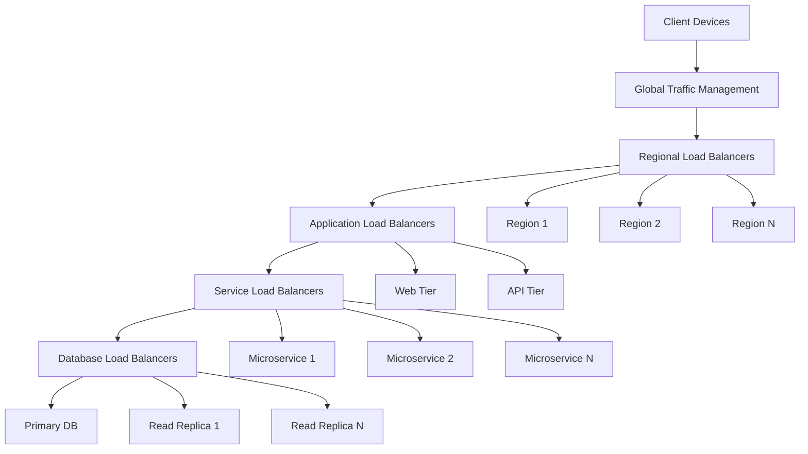

# 8. Performance & Scalability

## 8.1. Performance Metrics

The HeyZack B2B Building Management Solution is designed to meet stringent performance requirements to ensure a responsive, reliable user experience and efficient system operation. This section defines the key performance metrics, measurement methodologies, and targets that guide the system's design and operation.

### Key Performance Indicators

The system's performance is evaluated using the following key performance indicators (KPIs):

#### Response Time

- **Definition**: The time elapsed between a user request and the system's response
- **Measurement Points**:
  - API endpoint response time
  - UI rendering time
  - Database query execution time
  - Third-party integration response time
- **Target Values**:
  - API responses: < 200ms for 95% of requests
  - Dashboard loading: < 1.5s for initial load, < 300ms for subsequent interactions
  - Data visualization rendering: < 500ms
  - Search operations: < 300ms for typical queries
- **Measurement Methodology**:
  - Server-side timing for API requests
  - Client-side performance API for UI operations
  - Database query execution plans and timing
  - Synthetic monitoring for end-to-end measurements

#### Throughput

- **Definition**: The number of operations the system can process per unit of time
- **Measurement Points**:
  - API requests per second
  - Database transactions per second
  - IoT data points ingested per second
  - Events processed per second
- **Target Values**:
  - API gateway: > 1,000 requests per second
  - Database: > 5,000 transactions per second
  - IoT data ingestion: > 10,000 data points per second
  - Event processing: > 5,000 events per second
- **Measurement Methodology**:
  - Load testing with simulated traffic
  - Production monitoring with real-time metrics
  - Capacity planning calculations
  - Benchmark testing against baseline configurations

#### Latency

- **Definition**: The time delay between an action and its effect
- **Measurement Points**:
  - Network latency between system components
  - Processing latency within components
  - End-to-end latency for critical operations
- **Target Values**:
  - Network latency: < 50ms between components
  - Processing latency: < 100ms for critical operations
  - End-to-end latency: < 500ms for control operations
- **Measurement Methodology**:
  - Network performance monitoring
  - Distributed tracing across components
  - Synthetic transactions for end-to-end measurement
  - Real user monitoring for actual experience

#### Resource Utilization

- **Definition**: The consumption of computing resources by the system
- **Measurement Points**:
  - CPU utilization
  - Memory usage
  - Disk I/O
  - Network bandwidth
  - Database connections
- **Target Values**:
  - CPU utilization: < 70% average, < 90% peak
  - Memory usage: < 80% of allocated memory
  - Disk I/O: < 70% of available IOPS
  - Network bandwidth: < 60% of available capacity
  - Database connections: < 80% of connection pool
- **Measurement Methodology**:
  - Infrastructure monitoring tools
  - Application performance monitoring
  - Resource utilization dashboards
  - Capacity planning models

#### Availability

- **Definition**: The percentage of time the system is operational and accessible
- **Measurement Points**:
  - System uptime
  - Service availability
  - API endpoint availability
  - Feature availability
- **Target Values**:
  - Overall system: 99.9% uptime (< 8.76 hours downtime per year)
  - Critical services: 99.99% uptime (< 52.6 minutes downtime per year)
  - Planned maintenance: < 4 hours per month, during off-peak hours
- **Measurement Methodology**:
  - Continuous availability monitoring
  - Synthetic transactions
  - Health check endpoints
  - Incident tracking and analysis

#### Error Rates

- **Definition**: The frequency of errors or failures in system operations
- **Measurement Points**:
  - API error rates
  - Failed transactions
  - System exceptions
  - Integration failures
- **Target Values**:
  - API errors: < 0.1% of requests
  - Failed transactions: < 0.01% of transactions
  - System exceptions: < 0.001% of operations
  - Integration failures: < 0.5% of integration calls
- **Measurement Methodology**:
  - Error logging and analysis
  - Exception tracking
  - Failed request monitoring
  - Integration health checks

### Performance Testing Methodology

The system undergoes rigorous performance testing to ensure it meets the defined metrics:

#### Load Testing

- **Purpose**: Verify system behavior under expected load conditions
- **Methodology**:
  - Simulated user loads based on expected usage patterns
  - Gradual increase in load to identify performance trends
  - Sustained load testing for stability verification
  - Measurement of all key performance indicators
- **Scenarios**:
  - Normal business hours load
  - Peak usage periods
  - Seasonal variations
  - Geographic distribution of users

#### Stress Testing

- **Purpose**: Identify system breaking points and failure modes
- **Methodology**:
  - Load beyond expected maximum until performance degradation
  - Component-specific stress testing
  - Resource constraint simulation
  - Recovery testing after stress conditions
- **Scenarios**:
  - Extreme user concurrency
  - Data volume spikes
  - Resource exhaustion
  - Component failure under load

#### Endurance Testing

- **Purpose**: Verify system stability over extended periods
- **Methodology**:
  - Sustained load at expected levels for extended durations
  - Monitoring for resource leaks or degradation
  - Performance trend analysis over time
  - Periodic variation in load patterns
- **Scenarios**:
  - 24-hour operational cycles
  - Weekly usage patterns
  - Monthly processing cycles
  - Seasonal variations

#### Spike Testing

- **Purpose**: Verify system response to sudden load increases
- **Methodology**:
  - Rapid increase in user load or transaction volume
  - Measurement of response time degradation
  - Recovery time assessment
  - Resource utilization during spikes
- **Scenarios**:
  - Emergency situations
  - Marketing campaign launches
  - Scheduled mass operations
  - Integration batch processing

#### Scalability Testing

- **Purpose**: Verify system's ability to scale with increasing load
- **Methodology**:
  - Incremental resource allocation
  - Horizontal and vertical scaling tests
  - Performance measurement at each scale level
  - Cost-efficiency analysis
- **Scenarios**:
  - User base growth
  - Data volume expansion
  - Feature addition
  - Geographic expansion

### Performance Monitoring

The system includes comprehensive performance monitoring to ensure ongoing adherence to performance targets:

#### Real-time Monitoring

- **Purpose**: Provide immediate visibility into system performance
- **Components**:
  - Dashboard with key performance indicators
  - Real-time alerts for threshold violations
  - Service health status visualization
  - Resource utilization displays
- **Implementation**:
  - Prometheus for metrics collection
  - Grafana for visualization
  - AlertManager for alerting
  - Custom dashboards for different user roles

#### Historical Analysis

- **Purpose**: Enable trend analysis and capacity planning
- **Components**:
  - Long-term metrics storage
  - Performance trend visualization
  - Anomaly detection
  - Correlation analysis
- **Implementation**:
  - Time-series database for metrics storage
  - Analytics tools for trend analysis
  - Machine learning for anomaly detection
  - Reporting tools for stakeholder communication

#### User Experience Monitoring

- **Purpose**: Measure actual user experience and satisfaction
- **Components**:
  - Real User Monitoring (RUM)
  - User journey tracking
  - Error impact analysis
  - Satisfaction surveys
- **Implementation**:
  - Client-side performance monitoring
  - Session recording for issue reproduction
  - User feedback collection
  - Experience score calculation

#### Synthetic Monitoring

- **Purpose**: Proactively detect performance issues
- **Components**:
  - Scheduled synthetic transactions
  - Global performance measurement
  - Availability checking
  - Baseline comparison
- **Implementation**:
  - Automated test scripts
  - Distributed execution from multiple locations
  - Regular execution schedule
  - Alerting on deviation from baselines

## 8.2. Scaling Strategy

The HeyZack B2B Building Management Solution implements a comprehensive scaling strategy to accommodate growth in users, data volume, and functionality while maintaining performance targets. This strategy ensures the system can scale efficiently across multiple dimensions.

### Scaling Dimensions

The system is designed to scale across several key dimensions:

#### User Scaling

- **Definition**: Ability to support increasing numbers of concurrent users
- **Challenges**:
  - Session management
  - Authentication load
  - Concurrent request handling
  - User data storage
- **Approach**:
  - Stateless architecture for session management
  - Distributed authentication services
  - Connection pooling and request queuing
  - User data partitioning

#### Data Volume Scaling

- **Definition**: Ability to store and process growing volumes of data
- **Challenges**:
  - Storage capacity
  - Query performance
  - Backup and recovery
  - Data retention policies
- **Approach**:
  - Horizontal database scaling
  - Data partitioning and sharding
  - Tiered storage architecture
  - Automated archiving and purging

#### Functional Scaling

- **Definition**: Ability to add new features and capabilities
- **Challenges**:
  - Code complexity
  - Integration points
  - Testing coverage
  - Deployment coordination
- **Approach**:
  - Microservices architecture
  - API versioning
  - Feature toggles
  - Incremental deployment

#### Geographic Scaling

- **Definition**: Ability to serve users across different geographic regions
- **Challenges**:
  - Data sovereignty
  - Latency
  - Consistency
  - Regulatory compliance
- **Approach**:
  - Multi-region deployment
  - Content delivery networks
  - Regional data stores
  - Compliance-aware data routing

### Scaling Approaches

The system employs multiple scaling approaches to address different requirements:

#### Horizontal Scaling

- **Definition**: Adding more instances of components to distribute load
- **Implementation**:
  - Auto-scaling groups for application servers
  - Database read replicas
  - Distributed caching clusters
  - Load-balanced API gateways
- **Benefits**:
  - Linear capacity increase
  - Improved fault tolerance
  - Cost-effective growth
  - No single point of failure
- **Challenges**:
  - Distributed state management
  - Consistency across instances
  - Deployment complexity
  - Networking overhead

#### Vertical Scaling

- **Definition**: Increasing resources (CPU, memory, etc.) for existing components
- **Implementation**:
  - Resizable virtual machines
  - Memory-optimized database instances
  - Compute-optimized processing nodes
  - Storage-optimized data nodes
- **Benefits**:
  - Simplicity of implementation
  - Reduced coordination overhead
  - Better for some workloads (e.g., in-memory processing)
  - Easier management for some components
- **Challenges**:
  - Hardware limits
  - Potential downtime during scaling
  - Cost efficiency at large scale
  - Single point of failure risk

#### Functional Decomposition

- **Definition**: Breaking the system into specialized services
- **Implementation**:
  - Microservices architecture
  - Domain-driven design
  - Service-oriented architecture
  - Function-as-a-Service for specific workloads
- **Benefits**:
  - Independent scaling of components
  - Technology diversity for optimal solutions
  - Team autonomy and parallel development
  - Focused optimization for specific functions
- **Challenges**:
  - Service coordination
  - Distributed transactions
  - Operational complexity
  - Monitoring and troubleshooting

#### Data Partitioning

- **Definition**: Dividing data across multiple storage instances
- **Implementation**:
  - Horizontal sharding by tenant or building
  - Vertical partitioning by data type
  - Time-based partitioning for historical data
  - Functional partitioning by use case
- **Benefits**:
  - Improved query performance
  - Reduced contention
  - Parallel processing capability
  - Targeted optimization by data type
- **Challenges**:
  - Cross-partition queries
  - Rebalancing operations
  - Schema evolution
  - Consistent backup and recovery

### Auto-scaling Mechanisms

The system implements automated scaling to respond dynamically to changing demands:

#### Reactive Auto-scaling

- **Triggers**:
  - CPU utilization thresholds
  - Memory consumption
  - Request queue length
  - Response time degradation
- **Implementation**:
  - Monitoring-based triggers
  - Scaling policies with cooldown periods
  - Gradual scaling to prevent oscillation
  - Different policies for scaling up vs. scaling down
- **Components**:
  - Application servers
  - API gateways
  - Processing workers
  - Caching layers

#### Predictive Auto-scaling

- **Approach**:
  - Historical pattern analysis
  - Machine learning models
  - Scheduled scaling based on known patterns
  - Proactive capacity adjustment
- **Implementation**:
  - Time-series analysis of usage patterns
  - Correlation with external factors (time, weather, events)
  - Confidence-based scaling decisions
  - Continuous model refinement
- **Benefits**:
  - Reduced reaction time
  - Smoother capacity adjustments
  - Better user experience
  - Potential cost optimization

#### Manual Scaling Controls

- **Purpose**:
  - Override automatic scaling
  - Prepare for known events
  - Implement cost controls
  - Handle exceptional situations
- **Implementation**:
  - Administrative interface for scaling controls
  - Scheduled scaling operations
  - Minimum and maximum capacity constraints
  - Emergency scaling procedures

### Scaling Limits and Constraints

The system acknowledges and addresses various scaling limits:

#### Technical Constraints

- **Database Scaling Limits**:
  - Connection limits
  - Transaction throughput
  - Storage capacity
  - Query complexity
- **Network Constraints**:
  - Bandwidth limitations
  - Latency between components
  - Connection limits
  - Protocol overhead
- **Computational Constraints**:
  - CPU scaling limits
  - Memory address space
  - Thread management
  - I/O bottlenecks

#### Economic Constraints

- **Cost Efficiency**:
  - Diminishing returns at scale
  - License cost considerations
  - Operational overhead
  - Infrastructure costs
- **Resource Optimization**:
  - Right-sizing instances
  - Reserved capacity planning
  - Spot instance usage where appropriate
  - Multi-tenancy efficiency

#### Operational Constraints

- **Management Complexity**:
  - Monitoring overhead
  - Configuration management
  - Deployment coordination
  - Troubleshooting difficulty
- **Reliability Considerations**:
  - Failure domain isolation
  - Cascading failure prevention
  - Recovery time objectives
  - Backup and restore at scale

## 8.3. Load Balancing

The HeyZack B2B Building Management Solution implements comprehensive load balancing strategies to distribute workloads efficiently across system resources, ensuring optimal performance, high availability, and fault tolerance.

### Load Balancing Architecture

The load balancing architecture spans multiple layers of the system:

#### Global Traffic Management

- **Purpose**: Direct users to the optimal regional deployment
- **Implementation**:
  - DNS-based global load balancing
  - Geographic routing policies
  - Health check integration
  - Failover configuration
- **Benefits**:
  - Reduced latency for users
  - Regional isolation for compliance
  - Disaster recovery capability
  - Traffic management during incidents

#### Application Load Balancing

- **Purpose**: Distribute requests across application instances
- **Implementation**:
  - Layer 7 (HTTP/HTTPS) load balancing
  - SSL termination
  - Content-based routing
  - Session affinity options
- **Benefits**:
  - Intelligent request routing
  - Application health monitoring
  - Traffic shaping capabilities
  - Security features (WAF integration)

#### Service Load Balancing

- **Purpose**: Distribute traffic across microservice instances
- **Implementation**:
  - Service discovery integration
  - Protocol-aware load balancing
  - Circuit breaking capabilities
  - Retry and timeout management
- **Benefits**:
  - Service isolation
  - Independent scaling
  - Resilience patterns
  - Targeted routing policies

#### Database Load Balancing

- **Purpose**: Optimize database access patterns
- **Implementation**:
  - Read/write splitting
  - Connection pooling
  - Query routing based on workload
  - Replica selection strategies
- **Benefits**:
  - Optimized resource utilization
  - Improved read performance
  - Write consolidation
  - Query isolation

### Load Balancing Algorithms

The system employs various load balancing algorithms based on workload characteristics:

#### Round Robin

- **Description**: Requests are distributed sequentially across available instances
- **Use Cases**:
  - Homogeneous instance capabilities
  - Similar request processing requirements
  - Stateless services
- **Implementation**:
  - Simple sequential distribution
  - Optional weighting for different instance sizes
  - Instance health checking
- **Benefits**:
  - Simplicity of implementation
  - Even distribution for similar workloads
  - Predictable behavior

#### Least Connections

- **Description**: Requests are sent to the instance with the fewest active connections
- **Use Cases**:
  - Variable request processing times
  - Connection-oriented services
  - Stateful sessions
- **Implementation**:
  - Connection counting per instance
  - Dynamic adjustment based on current state
  - Health and capacity awareness
- **Benefits**:
  - Better handling of varying request durations
  - Automatic adjustment to instance capacity
  - Prevention of instance overloading

#### Weighted Response Time

- **Description**: Routing based on instance response time performance
- **Use Cases**:
  - Mixed instance types
  - Performance-sensitive services
  - Variable workload processing
- **Implementation**:
  - Response time monitoring
  - Dynamic weight adjustment
  - Performance trend analysis
- **Benefits**:
  - Adaptation to actual performance
  - Compensation for instance variability
  - Improved overall response time

#### Consistent Hashing

- **Description**: Requests are mapped to instances based on request attributes
- **Use Cases**:
  - Cache servers
  - Sharded databases
  - Session-aware services
- **Implementation**:
  - Hash-based mapping of requests to instances
  - Virtual node distribution for balance
  - Minimal redistribution during scaling
- **Benefits**:
  - Cache locality
  - Reduced redistribution during scaling
  - Predictable routing

#### Adaptive Load Balancing

- **Description**: Algorithm adjusts based on multiple factors and historical performance
- **Use Cases**:
  - Complex, variable workloads
  - Mixed instance types
  - Performance-critical services
- **Implementation**:
  - Machine learning models for prediction
  - Multi-factor decision making
  - Continuous optimization
- **Benefits**:
  - Optimal resource utilization
  - Adaptation to changing conditions
  - Performance optimization

### Health Checking and Failover

The load balancing system includes robust health checking and failover mechanisms:

#### Health Check Types

- **TCP Health Checks**:
  - Verify service port availability
  - Basic connectivity testing
  - Low overhead monitoring
- **HTTP/HTTPS Health Checks**:
  - Application-level health verification
  - Status code validation
  - Response content checking
- **Custom Health Checks**:
  - Application-specific health criteria
  - Deep health inspection
  - Dependency status inclusion

#### Health Check Configuration

- **Frequency**: 5-30 seconds depending on criticality
- **Thresholds**:
  - Healthy threshold: 2-3 consecutive successes
  - Unhealthy threshold: 2-3 consecutive failures
- **Timeout**: 2-5 seconds for health check response
- **Intervals**: Adjusted based on service stability

#### Failover Mechanisms

- **Instance Failover**:
  - Automatic removal of unhealthy instances
  - Traffic redistribution to healthy instances
  - Automatic reintroduction after recovery
- **Zone Failover**:
  - Isolation of problematic availability zones
  - Cross-zone load balancing
  - Gradual recovery procedures
- **Regional Failover**:
  - Disaster recovery activation
  - Traffic redirection to alternate regions
  - Data synchronization management

#### Graceful Degradation

- **Circuit Breaking**:
  - Isolation of failing components
  - Prevention of cascading failures
  - Controlled retry mechanisms
- **Feature Toggles**:
  - Selective disabling of non-critical features
  - Reduced functionality modes
  - Progressive recovery

### Traffic Management

The load balancing system provides advanced traffic management capabilities:

#### Rate Limiting

- **Purpose**: Prevent system overload and ensure fair resource allocation
- **Implementation**:
  - Per-client rate limits
  - Service-level throttling
  - Graduated response to limit violations
- **Policies**:
  - Fixed window limiting
  - Sliding window limiting
  - Token bucket algorithm
  - Concurrency limits

#### Traffic Shaping

- **Purpose**: Optimize traffic flow and resource utilization
- **Implementation**:
  - Request prioritization
  - Traffic categorization
  - Bandwidth allocation
  - Queue management
- **Techniques**:
  - Request buffering
  - Controlled request admission
  - Scheduled processing
  - Priority queuing

#### Blue-Green Deployment

- **Purpose**: Enable zero-downtime deployments
- **Implementation**:
  - Parallel environments (blue and green)
  - Traffic switching between versions
  - Gradual transition options
  - Rollback capability
- **Process**:
  - New version deployment to inactive environment
  - Testing and verification
  - Traffic migration
  - Old version decommissioning

#### Canary Releases

- **Purpose**: Reduce risk of new deployments
- **Implementation**:
  - Percentage-based traffic routing
  - User segment targeting
  - Incremental rollout
  - Automated rollback triggers
- **Monitoring**:
  - Error rate comparison
  - Performance differential
  - User experience metrics
  - Business impact indicators

## 8.4. Resource Management

The HeyZack B2B Building Management Solution implements comprehensive resource management strategies to ensure optimal allocation, utilization, and efficiency of computing resources across the system.

### Resource Types

The system manages various types of resources:

#### Compute Resources

- **CPU Allocation**:
  - Core allocation strategies
  - Thread management
  - Processing priority
  - CPU affinity
- **Memory Management**:
  - Heap size configuration
  - Memory limits per component
  - Garbage collection tuning
  - Memory usage monitoring
- **GPU Resources** (for AI/ML workloads):
  - Allocation for specific workloads
  - Sharing mechanisms
  - Processing prioritization
  - Specialized instance types

#### Storage Resources

- **Database Storage**:
  - Capacity planning
  - Storage type selection (SSD, HDD)
  - IOPS allocation
  - Scaling triggers
- **Object Storage**:
  - Tiered storage policies
  - Lifecycle management
  - Retention policies
  - Access patterns optimization
- **Ephemeral Storage**:
  - Temporary processing space
  - Cache storage allocation
  - Log storage management
  - Cleanup policies

#### Network Resources

- **Bandwidth Allocation**:
  - Service-level allocation
  - Traffic prioritization
  - Burst capacity management
  - Quality of Service (QoS) policies
- **Connection Management**:
  - Connection pooling
  - Keep-alive optimization
  - Timeout configuration
  - Retry policies

#### Specialized Resources

- **Database Connections**:
  - Connection pool sizing
  - Timeout configuration
  - Transaction management
  - Query optimization
- **Thread Pools**:
  - Pool sizing strategies
  - Work queue management
  - Thread priority
  - Task scheduling
- **Cache Resources**:
  - Memory allocation
  - Eviction policies
  - TTL configuration
  - Invalidation strategies

### Resource Allocation Strategies

The system employs various strategies for efficient resource allocation:

#### Static Allocation

- **Description**: Pre-defined resource allocation based on expected needs
- **Use Cases**:
  - Predictable workloads
  - Critical system components
  - Performance-sensitive services
- **Implementation**:
  - Reserved capacity
  - Dedicated instances
  - Fixed resource quotas
- **Benefits**:
  - Predictable performance
  - Simplified capacity planning
  - Guaranteed resource availability

#### Dynamic Allocation

- **Description**: Resources allocated based on current demand
- **Use Cases**:
  - Variable workloads
  - Cost-sensitive operations
  - Non-critical services
- **Implementation**:
  - Auto-scaling groups
  - Elastic services
  - On-demand provisioning
- **Benefits**:
  - Cost efficiency
  - Adaptation to demand
  - Resource utilization optimization

#### Prioritized Allocation

- **Description**: Resources allocated based on workload priority
- **Use Cases**:
  - Mixed criticality workloads
  - Multi-tenant environments
  - Shared resource pools
- **Implementation**:
  - Priority-based scheduling
  - Resource quotas by priority
  - Preemption policies
- **Benefits**:
  - Critical workload protection
  - Fair sharing among tenants
  - Efficient resource utilization

#### Predictive Allocation

- **Description**: Resources allocated based on anticipated future needs
- **Use Cases**:
  - Predictable usage patterns
  - Scheduled batch processing
  - Known event preparation
- **Implementation**:
  - Usage pattern analysis
  - Scheduled scaling actions
  - Proactive resource provisioning
- **Benefits**:
  - Reduced reaction time
  - Smoother scaling operations
  - Improved user experience

### Resource Isolation

The system implements resource isolation to ensure performance predictability and security:

#### Tenant Isolation

- **Purpose**: Separate resources between different customers
- **Implementation**:
  - Multi-tenant architecture with isolation
  - Tenant-specific resource pools
  - Noisy neighbor prevention
  - Performance guarantees
- **Levels**:
  - Logical isolation (shared infrastructure)
  - Container-based isolation
  - VM-based isolation
  - Physical isolation for premium tiers

#### Workload Isolation

- **Purpose**: Separate different types of workloads
- **Implementation**:
  - Workload classification
  - Dedicated processing environments
  - Resource pool separation
  - Interference prevention
- **Categories**:
  - Real-time processing
  - Batch processing
  - Analytics workloads
  - Background tasks

#### Failure Domain Isolation

- **Purpose**: Prevent cascading failures across resources
- **Implementation**:
  - Bulkhead pattern implementation
  - Circuit breaker patterns
  - Timeout and retry policies
  - Graceful degradation mechanisms
- **Boundaries**:
  - Service boundaries
  - Availability zone boundaries
  - Regional boundaries
  - Resource type boundaries

### Resource Monitoring and Optimization

The system includes comprehensive monitoring and optimization of resources:

#### Resource Utilization Monitoring

- **Metrics Collected**:
  - CPU utilization (average, peak, per core)
  - Memory usage (total, heap, non-heap)
  - Disk I/O (read/write operations, throughput)
  - Network traffic (ingress/egress, packets)
  - Database metrics (connections, query performance)
- **Visualization**:
  - Real-time dashboards
  - Historical trend analysis
  - Anomaly highlighting
  - Correlation views
- **Alerting**:
  - Threshold-based alerts
  - Trend-based alerts
  - Predictive alerts
  - Composite condition alerts

#### Resource Optimization

- **Rightsizing**:
  - Instance type optimization
  - Scaling threshold adjustment
  - Resource allocation tuning
  - Workload distribution optimization
- **Cost Optimization**:
  - Reserved capacity planning
  - Spot instance usage
  - Auto-scaling refinement
  - Idle resource identification
- **Performance Optimization**:
  - Resource contention resolution
  - Bottleneck identification
  - Caching strategy refinement
  - Query and transaction optimization

#### Capacity Planning

- **Forecasting Methods**:
  - Historical trend analysis
  - Growth modeling
  - Seasonal pattern identification
  - Business driver correlation
- **Planning Horizons**:
  - Short-term (1-3 months)
  - Medium-term (3-12 months)
  - Long-term (1-3 years)
- **Scenario Planning**:
  - Best case, expected case, worst case
  - New feature impact
  - Customer growth scenarios
  - Geographic expansion planning

## 8.5. Optimization Guidelines

The HeyZack B2B Building Management Solution includes comprehensive optimization guidelines to ensure the system operates at peak efficiency, performance, and cost-effectiveness. These guidelines provide a framework for continuous improvement across all system aspects.

### Application Optimization

Guidelines for optimizing application code and functionality:

#### Code Efficiency

- **Algorithmic Optimization**:
  - Use appropriate data structures for operations
  - Implement efficient algorithms for common tasks
  - Minimize computational complexity
  - Optimize loops and recursion
- **Memory Management**:
  - Minimize object creation and garbage collection
  - Use appropriate data structures for memory efficiency
  - Implement object pooling for frequently used objects
  - Avoid memory leaks through proper resource cleanup
- **Asynchronous Processing**:
  - Use non-blocking I/O for external interactions
  - Implement asynchronous processing for long-running tasks
  - Apply parallel processing for independent operations
  - Use appropriate threading models

#### Database Interaction

- **Query Optimization**:
  - Design efficient database schemas
  - Use appropriate indexes for query patterns
  - Optimize query structure and join operations
  - Implement query caching where appropriate
- **Connection Management**:
  - Use connection pooling
  - Implement appropriate transaction boundaries
  - Minimize connection creation/destruction
  - Monitor and tune connection pool parameters
- **Data Access Patterns**:
  - Batch operations where possible
  - Implement pagination for large result sets
  - Use lazy loading for related data
  - Apply eager loading for known access patterns

#### Caching Strategy

- **Cache Levels**:
  - Application-level caching
  - Database query caching
  - HTTP response caching
  - CDN caching for static assets
- **Cache Policies**:
  - Time-based expiration
  - Event-based invalidation
  - LRU/LFU eviction policies
  - Cache warming strategies
- **Distributed Caching**:
  - Consistent hashing for distribution
  - Replication for availability
  - Partition tolerance
  - Failure handling

### Infrastructure Optimization

Guidelines for optimizing the underlying infrastructure:

#### Compute Optimization

- **Instance Selection**:
  - Right-size instances for workloads
  - Use specialized instances for specific workloads
  - Implement auto-scaling for variable demands
  - Balance cost and performance requirements
- **Container Optimization**:
  - Minimize container image size
  - Optimize container resource limits
  - Implement efficient orchestration
  - Use appropriate scheduling policies
- **Serverless Optimization**:
  - Optimize function size and memory allocation
  - Minimize cold start impact
  - Implement efficient state management
  - Control execution duration

#### Storage Optimization

- **Storage Type Selection**:
  - Match storage type to access patterns
  - Use tiered storage for cost optimization
  - Implement appropriate redundancy levels
  - Select optimal performance characteristics
- **Data Lifecycle Management**:
  - Implement automated archiving
  - Apply compression for stored data
  - Define and enforce retention policies
  - Automate cleanup of temporary data
- **I/O Optimization**:
  - Batch read/write operations
  - Implement appropriate caching
  - Use read replicas for read-heavy workloads
  - Optimize for sequential vs. random access

#### Network Optimization

- **Traffic Management**:
  - Implement content delivery networks
  - Use connection pooling and keep-alive
  - Apply compression for transmitted data
  - Optimize request/response sizes
- **Protocol Selection**:
  - Use HTTP/2 or HTTP/3 where supported
  - Implement WebSockets for real-time communication
  - Select appropriate messaging protocols
  - Optimize TCP/IP parameters
- **Latency Reduction**:
  - Geographic distribution of resources
  - Edge computing for latency-sensitive operations
  - Route optimization
  - Connection pre-warming

### Data Optimization

Guidelines for optimizing data storage, processing, and analysis:

#### Data Storage

- **Schema Optimization**:
  - Normalize/denormalize based on access patterns
  - Implement appropriate indexing
  - Use efficient data types
  - Apply partitioning for large datasets
- **NoSQL Optimization**:
  - Select appropriate NoSQL database type for data model
  - Optimize key design for distributed databases
  - Implement efficient document structures
  - Use appropriate consistency models
- **Time-Series Optimization**:
  - Implement efficient time-based partitioning
  - Use appropriate downsampling strategies
  - Optimize retention policies
  - Implement efficient compression

#### Data Processing

- **ETL Optimization**:
  - Parallelize data processing
  - Implement incremental processing
  - Optimize transformation logic
  - Schedule processing during off-peak hours
- **Stream Processing**:
  - Implement efficient windowing strategies
  - Optimize state management
  - Use appropriate checkpoint intervals
  - Implement backpressure handling
- **Batch Processing**:
  - Optimize job partitioning
  - Implement efficient resource allocation
  - Use appropriate processing frameworks
  - Optimize data locality

#### Analytics Optimization

- **Query Optimization**:
  - Pre-aggregate common metrics
  - Implement materialized views
  - Optimize analytical queries
  - Use appropriate indexing for analytics
- **Visualization Optimization**:
  - Implement data sampling for large datasets
  - Use progressive loading for visualizations
  - Optimize rendering performance
  - Implement client-side caching

### IoT Data Optimization

Guidelines specific to IoT data management, leveraging Tuya IoT Platform capabilities:

#### Data Collection

- **Edge Processing with Tuya Gateway**:
  * Smart Filtering:
    - Configurable data filtering rules
    - Dynamic sampling rate adjustment
    - Local data aggregation
    - Change-based transmission
    - Offline data buffering

  * Protocol Optimization:
    - Native Tuya protocol support
    - MQTT protocol optimization
    - CoAP for constrained devices
    - Efficient binary protocols
    - Automatic protocol selection

  * Edge Intelligence:
    - Local rule execution
    - Real-time data validation
    - Edge analytics processing
    - Local decision making
    - Bandwidth optimization

#### Data Transmission

- **Tuya Cloud Communication**:
  * Network Optimization:
    - Global CDN integration
    - Multi-region deployment
    - Automatic region selection
    - Connection pooling
    - Keep-alive optimization

  * Data Efficiency:
    - Smart compression algorithms
    - Delta encoding for updates
    - Batch transmission support
    - Priority-based delivery
    - QoS level management

  * Security Features:
    - End-to-end encryption
    - Secure key exchange
    - Certificate management
    - Data integrity checks
    - Access control enforcement

#### Data Processing and Storage

- **Tuya Cloud Platform**:
  * Real-time Processing:
    - Stream processing engine
    - Complex event processing
    - Rule engine execution
    - Alert generation
    - Action triggering

  * Data Storage:
    - Time-series optimization
    - Automatic data tiering
    - Retention policy management
    - Data lifecycle automation
    - Multi-region replication

  * Analytics Capabilities:
    - Real-time analytics
    - Historical data analysis
    - Trend detection
    - Pattern recognition
    - Predictive analytics

#### Performance Optimization

- **Tuya Platform Optimization**:
  * Device Management:
    - Efficient device discovery
    - Bulk device operations
    - Group command optimization
    - Device state caching
    - Status synchronization

  * Resource Management:
    - Dynamic resource allocation
    - Load balancing
    - Auto-scaling support
    - Resource usage monitoring
    - Cost optimization

  * API Performance:
    - API request batching
    - Response caching
    - Rate limiting
    - Request prioritization
    - Error handling optimization

#### Data Transmission

- **Bandwidth Optimization**:
  - Implement data compression
  - Use binary formats instead of text
  - Batch transmissions where appropriate
  - Implement delta encoding
- **Energy Efficiency**:
  - Optimize transmission frequency
  - Implement sleep modes
  - Use low-power communication protocols
  - Optimize payload size

#### Data Storage and Processing

- **Time-Series Optimization**:
  - Implement efficient storage for time-series data
  - Use appropriate retention policies
  - Implement downsampling strategies
  - Optimize for time-range queries
- **Real-time Processing**:
  - Implement stream processing for real-time analytics
  - Use appropriate window functions
  - Optimize state management
  - Implement efficient alerting mechanisms

### Cost Optimization

Guidelines for optimizing system costs while maintaining performance:

#### Infrastructure Cost Optimization

- **Resource Right-sizing**:
  - Match instance types to workload requirements
  - Implement auto-scaling to match demand
  - Use spot/preemptible instances where appropriate
  - Implement scheduled scaling for predictable workloads
- **Storage Tiering**:
  - Move infrequently accessed data to lower-cost storage
  - Implement lifecycle policies
  - Use appropriate compression
  - Optimize retention periods

#### Operational Cost Optimization

- **Automation**:
  - Automate routine operational tasks
  - Implement infrastructure as code
  - Use automated scaling and optimization
  - Implement self-healing mechanisms
- **Monitoring Optimization**:
  - Implement targeted monitoring
  - Optimize metric collection frequency
  - Use appropriate retention for monitoring data
  - Implement cost allocation tagging

#### Development Cost Optimization

- **Reusable Components**:
  - Implement component libraries
  - Use microservices for reusability
  - Standardize development patterns
  - Implement shared services
- **Testing Efficiency**:
  - Implement automated testing
  - Use test environment optimization
  - Implement targeted testing strategies
  - Optimize CI/CD pipelines

### Continuous Optimization Process

The system implements a continuous optimization process:

#### Performance Monitoring

- **Baseline Establishment**:
  - Define key performance metrics
  - Establish performance baselines
  - Document acceptable performance ranges
  - Implement continuous monitoring
- **Anomaly Detection**:
  - Implement automated anomaly detection
  - Set appropriate alerting thresholds
  - Use machine learning for pattern recognition
  - Implement trend analysis

#### Optimization Identification

- **Performance Analysis**:
  - Regular performance reviews
  - Bottleneck identification
  - Root cause analysis
  - Performance trend analysis
- **Cost Analysis**:
  - Regular cost reviews
  - Cost allocation analysis
  - Efficiency metrics tracking
  - Cost trend analysis

#### Optimization Implementation

- **Prioritization**:
  - Impact assessment
  - Effort estimation
  - Risk evaluation
  - Return on investment calculation
- **Implementation Process**:
  - Controlled implementation
  - A/B testing where appropriate
  - Phased rollout
  - Performance validation

#### Continuous Improvement

- **Knowledge Management**:
  - Document optimization lessons
  - Share best practices
  - Build optimization patterns
  - Maintain optimization history
- **Proactive Optimization**:
  - Regular architecture reviews
  - Technology refresh evaluation
  - Capacity planning
  - Performance forecasting
