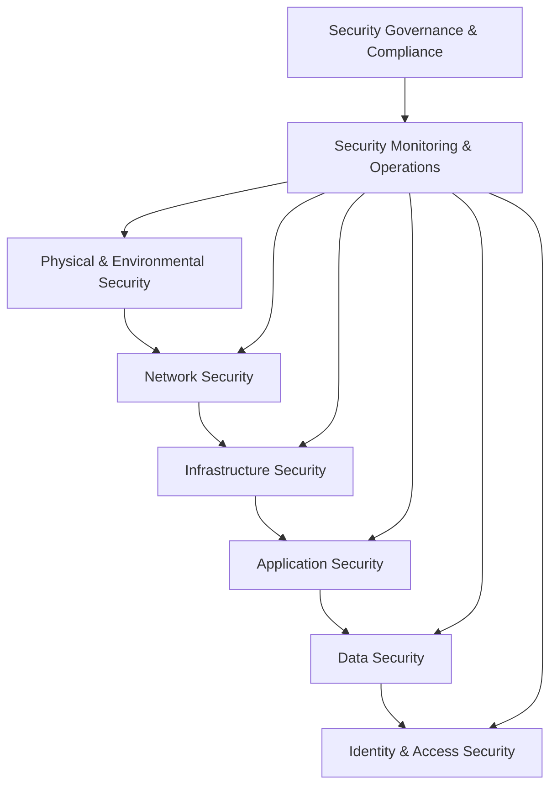

# 9. Security & Privacy

## 9.1. Security Architecture

The HeyZack B2B Building Management Solution implements a comprehensive security architecture designed to protect all aspects of the system from threats while ensuring availability and performance. This architecture follows a defense-in-depth approach with multiple layers of security controls.

### Security Design Principles

The security architecture is built on the following core principles:

#### Defense in Depth

- **Multiple Security Layers**:
  - Network security controls
  - Application security measures
  - Data protection mechanisms
  - Identity and access management
  - Physical and environmental security
- **Overlapping Controls**:
  - Complementary security mechanisms
  - Redundant protection for critical assets
  - No single point of security failure
  - Layered detection capabilities

#### Least Privilege

- **Access Control Philosophy**:
  - Minimal permissions required for functionality
  - Default deny posture
  - Just-in-time access provisioning
  - Regular privilege review and adjustment
- **Implementation**:
  - Role-based access control
  - Attribute-based access control
  - Context-aware authorization
  - Temporary privilege elevation

#### Secure by Design

- **Security Requirements**:
  - Security integrated into requirements phase
  - Threat modeling during design
  - Security architecture review
  - Privacy by design principles
- **Secure Development**:
  - Secure coding standards
  - Security testing throughout SDLC
  - Automated security scanning
  - Regular security training for developers

#### Zero Trust Architecture

- **Core Principles**:
  - Never trust, always verify
  - Assume breach mentality
  - Explicit verification for all access
  - Least privilege access
- **Implementation**:
  - Identity-based security perimeter
  - Micro-segmentation
  - Continuous validation
  - Real-time access decisions

#### Resilience and Recovery

- **Fault Tolerance**:
  - Redundant security components
  - Graceful degradation
  - Security control failover
  - Anomaly detection and response
- **Incident Recovery**:
  - Backup and restoration procedures
  - Disaster recovery planning
  - Business continuity measures
  - Incident response automation

### Security Architecture Layers

The security architecture is organized into distinct layers:

#### Physical and Environmental Security

- **Data Center Security**:
  - Physical access controls
  - Environmental monitoring
  - Fire suppression systems
  - Redundant power and cooling
- **Edge Device Security**:
  - Tamper-evident enclosures
  - Physical port protection
  - Secure boot mechanisms
  - Hardware security modules

#### Network Security

- **Perimeter Protection**:
  - Next-generation firewalls
  - DDoS protection
  - Web application firewalls
  - API gateways with security controls
- **Network Segmentation**:
  - Micro-segmentation
  - Virtual network isolation
  - Network security groups
  - Internal firewalls and access control lists
- **Secure Communication**:
  - TLS for all communications
  - VPN for administrative access
  - Encrypted IoT device communication
  - Secure remote access solutions

#### Infrastructure Security

- **Cloud Security**:
  - Secure cloud configuration
  - Infrastructure as Code security
  - Cloud security posture management
  - Container and orchestration security
- **Endpoint Security**:
  - Server hardening
  - Endpoint protection platforms
  - Host-based intrusion detection
  - Vulnerability management

#### Application Security

- **Secure Development**:
  - Secure SDLC integration
  - Code security scanning
  - Dependency vulnerability checking
  - Security unit testing
- **Application Controls**:
  - Input validation
  - Output encoding
  - Session management
  - Error handling
  - API security

#### Data Security

- **Data Protection**:
  - Encryption at rest
  - Encryption in transit
  - Database security controls
  - Data loss prevention
- **Data Governance**:
  - Data classification
  - Data access controls
  - Data retention policies
  - Secure data disposal

#### Identity and Access Security

- **Identity Management**:
  - Centralized identity services
  - Multi-factor authentication
  - Single sign-on
  - Directory services
- **Access Management**:
  - Role-based access control
  - Attribute-based access control
  - Just-in-time access
  - Privileged access management

### Threat Mitigation

The security architecture addresses specific threats to building management systems:

#### IoT Device Security with Tuya Platform

- **Device Security Architecture**:
  * Secure Boot Chain:
    - Hardware-based root of trust
    - Secure bootloader verification
    - Firmware integrity validation
    - Runtime attestation
    - Secure debug protection

  * Secure Communication:
    - End-to-end encryption (TLS 1.3)
    - Mutual device authentication
    - Dynamic key rotation
    - Secure key storage
    - Certificate-based identity

  * Access Control:
    - Device-level authorization
    - Fine-grained permission model
    - Role-based access control
    - Multi-factor device authentication
    - Session management

- **Tuya Security Features**:
  * Device Identity Management:
    - Unique device identification
    - Secure device registration
    - Device authentication tokens
    - Device binding validation
    - Lifecycle management

  * Firmware Security:
    - Signed firmware updates
    - Secure OTA delivery
    - Version control
    - Rollback protection
    - Update verification

  * Data Protection:
    - Local data encryption
    - Secure storage implementation
    - Data transmission security
    - Privacy-preserving analytics
    - Secure data erasure

- **Security Monitoring**:
  * Device Health Monitoring:
    - Real-time status tracking
    - Anomaly detection
    - Security event logging
    - Performance monitoring
    - Threat detection

  * Incident Response:
    - Automated threat response
    - Remote device quarantine
    - Security patch deployment
    - Incident investigation
    - Recovery procedures

  * Compliance Management:
    - Security standard compliance
    - Regulatory requirement tracking
    - Audit logging
    - Compliance reporting
    - Policy enforcement

#### Unauthorized Access

- **Account Compromise**:
  - Multi-factor authentication
  - Brute force protection
  - Account lockout policies
  - Suspicious activity detection
- **Privilege Escalation**:
  - Least privilege enforcement
  - Privilege separation
  - Just-in-time access
  - Activity monitoring

#### Data Breach

- **Data Exfiltration**:
  - Data loss prevention
  - Egress filtering
  - Anomalous access detection
  - Encryption of sensitive data
- **Insider Threats**:
  - Separation of duties
  - Privileged access monitoring
  - Behavioral analytics
  - Data access auditing

#### Service Disruption

- **Denial of Service**:
  - DDoS protection
  - Rate limiting
  - Resource isolation
  - Redundant infrastructure
- **System Failure**:
  - High availability design
  - Fault tolerance
  - Graceful degradation
  - Disaster recovery

### Security Integration

The security architecture integrates with the overall system architecture:

#### Secure DevOps Integration

- **CI/CD Security**:
  - Automated security testing
  - Infrastructure as Code scanning
  - Container image scanning
  - Deployment approval gates
- **Security Automation**:
  - Automated security monitoring
  - Security orchestration
  - Automated remediation
  - Security as Code

#### Third-Party Integration Security

- **Vendor Security Assessment**:
  - Security questionnaires
  - Penetration testing requirements
  - Compliance verification
  - Ongoing security monitoring
- **Integration Controls**:
  - API security
  - Data validation
  - Rate limiting
  - Authentication and authorization

#### Security Architecture Governance

- **Security Review Process**:
  - Architecture security reviews
  - Threat modeling
  - Security design patterns
  - Security technical debt management
- **Security Standards**:
  - Security architecture principles
  - Technology security standards
  - Security patterns and anti-patterns
  - Reference security architectures

## 9.2. Authentication & Authorization

The HeyZack B2B Building Management Solution implements a comprehensive authentication and authorization framework to ensure secure access to the system while providing a seamless user experience.

### Authentication Framework

The authentication framework provides multiple mechanisms for verifying user identity:

#### Authentication Methods

- **Username and Password**:
  - Strong password policies
  - Password complexity requirements
  - Account lockout after failed attempts
  - Password expiration and history
- **Multi-Factor Authentication**:
  - Time-based one-time passwords (TOTP)
  - Push notifications to mobile devices
  - Hardware security keys (FIDO2/WebAuthn)
  - Biometric authentication integration
- **Single Sign-On (SSO)**:
  - SAML 2.0 integration
  - OpenID Connect support
  - Enterprise identity provider integration
  - Social identity provider support
- **Certificate-Based Authentication**:
  - Client certificate authentication
  - Smart card integration
  - Certificate validation and revocation checking
  - Certificate lifecycle management

#### Authentication Flows

- **Interactive User Authentication**:
  - Web-based authentication flow
  - Mobile application authentication
  - Kiosk and shared device authentication
  - Step-up authentication for sensitive operations
- **Service Authentication**:
  - API key authentication
  - OAuth 2.0 client credentials flow
  - Mutual TLS authentication
  - Service account management
- **Device Authentication**:
  - IoT device certificate authentication
  - Device registration and provisioning
  - Secure boot attestation
  - Device identity management

#### Authentication Security Features

- **Brute Force Protection**:
  - Progressive delays between attempts
  - Account lockout policies
  - IP-based rate limiting
  - CAPTCHA integration
- **Session Management**:
  - Secure session handling
  - Session timeout policies
  - Concurrent session controls
  - Session revocation capabilities
- **Credential Security**:
  - Secure credential storage (bcrypt/Argon2)
  - Secure credential transmission
  - Credential rotation policies
  - Secure credential recovery

### Authorization Framework

The authorization framework controls access to system resources based on authenticated identity:

#### Authorization Models

- **Role-Based Access Control (RBAC)**:
  - Role definition and management
  - Role assignment to users
  - Role hierarchy
  - Role-based permission mapping
- **Attribute-Based Access Control (ABAC)**:
  - User attribute evaluation
  - Resource attribute evaluation
  - Environmental attribute consideration
  - Policy-based access decisions
- **Relationship-Based Access Control (ReBAC)**:
  - Access based on relationships between entities
  - Graph-based permission modeling
  - Dynamic relationship evaluation
  - Hierarchical relationship support

#### Permission Management

- **Permission Definition**:
  - Granular permission design
  - Permission grouping
  - Permission dependencies
  - Permission documentation
- **Permission Assignment**:
  - Direct permission assignment
  - Role-based permission inheritance
  - Dynamic permission calculation
  - Temporary permission elevation
- **Permission Evaluation**:
  - Real-time permission checking
  - Caching for performance
  - Hierarchical evaluation
  - Context-aware evaluation

#### Access Control Implementation

- **API Authorization**:
  - JWT-based authorization
  - Scope-based API access
  - API permission enforcement
  - API gateway integration
- **UI Authorization**:
  - Component-level access control
  - Feature toggles based on permissions
  - Dynamic UI adaptation
  - Client-side permission caching
- **Data Authorization**:
  - Row-level security
  - Column-level security
  - Multi-tenant data isolation
  - Data classification-based access

### Identity Management

The system includes comprehensive identity management capabilities:

#### User Lifecycle Management

- **User Provisioning**:
  - Self-registration workflows
  - Administrative user creation
  - Bulk user import
  - Just-in-time provisioning
- **User Profile Management**:
  - Self-service profile updates
  - Administrative profile management
  - Profile completeness enforcement
  - Profile verification
- **User Deprovisioning**:
  - Account deactivation
  - Access revocation
  - Data retention handling
  - Reactivation capabilities

#### Identity Governance

- **Access Certification**:
  - Periodic access reviews
  - Manager approval workflows
  - Automated certification
  - Compliance reporting
- **Segregation of Duties**:
  - Conflicting permission identification
  - SoD policy enforcement
  - SoD violation alerting
  - Compensating control documentation
- **Privileged Access Management**:
  - Privileged account inventory
  - Just-in-time privileged access
  - Privileged session recording
  - Privileged access approval workflows

#### Directory Services

- **User Directory**:
  - Centralized user repository
  - User attribute management
  - Group management
  - Directory synchronization
- **External Directory Integration**:
  - Active Directory integration
  - LDAP integration
  - Cloud directory services
  - Directory federation

### Authentication and Authorization for IoT Devices

The system implements specialized authentication and authorization for IoT devices:

#### Device Identity

- **Device Registration**:
  - Secure device onboarding
  - Device identity creation
  - Device attestation
  - Device metadata management
- **Device Credentials**:
  - Device certificates
  - Pre-shared keys
  - Secure credential storage
  - Credential rotation

#### Device Authentication with Tuya

- **Authentication Infrastructure**:
  * Identity Verification:
    - Multi-layer authentication
    - Hardware-based identity
    - Secure element integration
    - Device fingerprinting
    - Anti-spoofing measures

  * Protocol Security:
    - Tuya secure protocol suite
    - MQTT over TLS
    - CoAP security
    - Custom protocol hardening
    - Protocol version control

  * Credential Management:
    - Secure credential storage
    - Dynamic credential rotation
    - Revocation management
    - Recovery mechanisms
    - Audit trail maintenance

- **Authentication Mechanisms**:
  * Primary Authentication:
    - Certificate-based auth
    - Token-based auth
    - Biometric integration
    - Multi-factor options
    - Context-aware auth

  * Secondary Verification:
    - Behavioral analysis
    - Location validation
    - Network verification
    - Time-based validation
    - Risk-based authentication

  * Session Security:
    - Secure session establishment
    - Session monitoring
    - Timeout management
    - Session termination
    - Session recovery

#### Device Authorization

- **Authorization Models**:
  - Device type-based permissions
  - Location-based permissions
  - Owner-based permissions
  - Function-based permissions
- **Authorization Enforcement**:
  - Gateway-level enforcement
  - Cloud-level enforcement
  - Local enforcement
  - Distributed policy evaluation

### Authentication and Authorization Monitoring

The system includes comprehensive monitoring of authentication and authorization activities:

#### Authentication Monitoring

- **Login Activity Monitoring**:
  - Successful login tracking
  - Failed login detection
  - Authentication method usage
  - Geographic login patterns
- **Anomaly Detection**:
  - Unusual login locations
  - Unusual login times
  - Impossible travel detection
  - Credential stuffing detection

#### Authorization Monitoring

- **Access Attempt Logging**:
  - Successful access tracking
  - Access denial logging
  - Permission evaluation tracing
  - Privileged operation logging
- **Authorization Anomalies**:
  - Unusual access patterns
  - Permission escalation attempts
  - Excessive access attempts
  - After-hours access

#### Reporting and Alerting

- **Security Dashboards**:
  - Authentication activity visualization
  - Authorization activity visualization
  - Anomaly highlighting
  - Trend analysis
- **Security Alerts**:
  - Real-time security alerting
  - Alert prioritization
  - Alert correlation
  - Response workflow integration

## 9.3. Data Protection

The HeyZack B2B Building Management Solution implements comprehensive data protection measures to ensure the confidentiality, integrity, and availability of all data within the system.

### Data Classification

The system implements a structured approach to data classification:

#### Classification Framework

- **Classification Levels**:
  - Public: Information that can be freely shared
  - Internal: Information for internal use only
  - Confidential: Sensitive information requiring protection
  - Restricted: Highly sensitive information with strict controls
- **Classification Criteria**:
  - Sensitivity of information
  - Regulatory requirements
  - Business impact of disclosure
  - Contractual obligations

#### Data Types and Classification

- **Personal Data**:
  - User identity information (Confidential)
  - Contact information (Internal)
  - User preferences (Internal)
  - Biometric data (Restricted)
- **Building Data**:
  - Building location and address (Internal)
  - Floor plans and layouts (Confidential)
  - Access control configurations (Restricted)
  - Occupancy information (Confidential)
- **Operational Data**:
  - Energy consumption metrics (Internal)
  - Environmental conditions (Internal)
  - Equipment status (Internal)
  - Maintenance records (Internal)
- **Business Data**:
  - Customer contracts (Confidential)
  - Pricing information (Confidential)
  - Financial records (Restricted)
  - Strategic plans (Restricted)

#### Classification Implementation

- **Data Tagging**:
  - Metadata-based classification
  - Automated classification tools
  - Manual classification processes
  - Classification inheritance
- **Classification Governance**:
  - Classification policy
  - Classification reviews
  - Classification change management
  - Classification training

### Encryption Strategy

The system implements encryption throughout the data lifecycle:

#### Encryption at Rest

- **Database Encryption**:
  - Transparent database encryption
  - Column-level encryption for sensitive data
  - Tablespace encryption
  - Backup encryption
- **File Encryption**:
  - Document encryption
  - Media file encryption
  - Configuration file encryption
  - Log file protection
- **Storage Encryption**:
  - Full disk encryption
  - Volume encryption
  - Object storage encryption
  - Secure element storage for keys

#### Encryption in Transit

- **Network Encryption**:
  - TLS 1.3 for all HTTP traffic
  - TLS for database connections
  - VPN for administrative access
  - Secure protocols for IoT communication
- **End-to-End Encryption**:
  - Encrypted messaging
  - Secure file transfer
  - Encrypted API payloads
  - Secure remote access

#### Encryption Key Management

- **Key Hierarchy**:
  - Master key management
  - Key encryption keys
  - Data encryption keys
  - Session keys
- **Key Lifecycle Management**:
  - Key generation
  - Key distribution
  - Key rotation
  - Key revocation
- **Key Storage**:
  - Hardware Security Modules (HSMs)
  - Key management services
  - Secure key stores
  - Secure key backup

### Data Integrity

The system ensures data integrity throughout processing and storage:

#### Integrity Controls

- **Hash Verification**:
  - Data integrity hashing
  - Digital signatures
  - Checksum validation
  - Secure hash algorithms
- **Input Validation**:
  - Schema validation
  - Type checking
  - Range validation
  - Format validation
- **Output Validation**:
  - Response validation
  - Data consistency checks
  - Expected value verification
  - Error detection

#### Audit Trails

- **Data Modification Logging**:
  - Create, update, delete tracking
  - Before/after values
  - Modification timestamps
  - Modifier identification
- **System Change Logging**:
  - Configuration changes
  - Permission changes
  - System state changes
  - Administrative actions

#### Data Quality

- **Data Validation**:
  - Business rule validation
  - Referential integrity
  - Consistency checks
  - Completeness verification
- **Error Handling**:
  - Data correction workflows
  - Error notification
  - Validation failure handling
  - Recovery procedures

### Data Loss Prevention

The system implements controls to prevent unauthorized data disclosure:

#### DLP Controls

- **Content Inspection**:
  - Pattern matching
  - Regular expression scanning
  - Structured data recognition
  - Machine learning classification
- **Context Analysis**:
  - User behavior analysis
  - Data access patterns
  - Unusual activity detection
  - Time and location awareness

#### DLP Policies

- **Data Transfer Controls**:
  - Email DLP policies
  - Web upload/download controls
  - API data transfer monitoring
  - File transfer restrictions
- **Endpoint Controls**:
  - Device data protection
  - Removable media controls
  - Screen capture prevention
  - Printing restrictions

#### DLP Response Actions

- **Preventive Actions**:
  - Block unauthorized transfers
  - Require encryption
  - Enforce additional authentication
  - Apply digital rights management
- **Detective Actions**:
  - Alert on policy violations
  - Log suspicious activities
  - Capture forensic information
  - Trigger investigation workflows

### Data Retention and Disposal

The system manages data throughout its lifecycle:

#### Retention Policies

- **Retention Requirements**:
  - Regulatory retention periods
  - Business need retention
  - Legal hold processes
  - Minimum necessary principle
- **Retention Implementation**:
  - Time-based retention
  - Event-based retention
  - Retention metadata
  - Retention enforcement

#### Data Archiving

- **Archiving Process**:
  - Automated archiving
  - Archive storage management
  - Archive metadata
  - Archive access controls
- **Archive Security**:
  - Archive encryption
  - Immutable archives
  - Archive integrity verification
  - Secure archive access

#### Secure Data Disposal

- **Disposal Methods**:
  - Secure deletion
  - Cryptographic erasure
  - Physical destruction
  - Third-party disposal verification
- **Disposal Verification**:
  - Disposal certification
  - Disposal logging
  - Disposal auditing
  - Media sanitization validation

### Data Protection for Special Cases

The system implements specialized protection for specific scenarios:

#### IoT Data Protection

- **Edge Security**:
  - Local data encryption
  - Secure local storage
  - Edge processing security
  - Secure data transmission
- **Device Data Protection**:
  - Secure element storage
  - Protected memory
  - Secure boot for data protection
  - Anti-tampering measures

#### Analytics Data Protection

- **De-identification**:
  - Data anonymization
  - Data pseudonymization
  - Aggregation techniques
  - Differential privacy
- **Analytics Controls**:
  - Purpose limitation
  - Access controls for analytics
  - Minimum necessary data use
  - Results protection

#### Backup Data Protection

- **Backup Security**:
  - Encrypted backups
  - Secure backup storage
  - Backup access controls
  - Backup integrity verification
- **Recovery Security**:
  - Secure recovery processes
  - Recovery authentication
  - Recovery logging
  - Partial recovery capabilities

## 9.4. Privacy Compliance

The HeyZack B2B Building Management Solution is designed with privacy as a fundamental principle, ensuring compliance with global privacy regulations while protecting individual privacy rights.

### Privacy by Design

The system implements privacy by design principles throughout its lifecycle:

#### Privacy Design Principles

- **Proactive not Reactive**:
  - Privacy integrated into requirements
  - Privacy impact assessments
  - Privacy threat modeling
  - Privacy-enhancing technologies
- **Privacy as Default**:
  - Minimal data collection by default
  - Privacy-preserving default settings
  - Opt-in for enhanced data collection
  - Automatic privacy protections
- **Privacy Embedded into Design**:
  - Privacy controls in architecture
  - Privacy-aware data flows
  - Privacy-respecting interfaces
  - Privacy-conscious algorithms
- **Full Functionality**:
  - Positive-sum approach to privacy
  - Balance functionality and privacy
  - Privacy-preserving alternatives
  - Privacy-respecting innovation

#### Privacy Engineering

- **Privacy Requirements**:
  - Explicit privacy requirements
  - Privacy acceptance criteria
  - Privacy user stories
  - Privacy non-functional requirements
- **Privacy Controls**:
  - Technical privacy measures
  - Procedural privacy safeguards
  - Physical privacy protections
  - Administrative privacy controls
- **Privacy Testing**:
  - Privacy control validation
  - Privacy vulnerability testing
  - Privacy compliance verification
  - Privacy user experience testing

### Regulatory Compliance

The system is designed to comply with major privacy regulations:

#### GDPR Compliance

- **Lawful Basis for Processing**:
  - Consent management
  - Legitimate interest assessment
  - Contractual necessity documentation
  - Legal obligation tracking
- **Data Subject Rights**:
  - Right to access implementation
  - Right to rectification processes
  - Right to erasure capabilities
  - Right to restriction mechanisms
  - Data portability support
- **Accountability Measures**:
  - Records of processing activities
  - Data protection impact assessments
  - Data protection officer support
  - Processor management

#### CCPA/CPRA Compliance

- **Consumer Rights**:
  - Right to know implementation
  - Right to delete processes
  - Right to opt-out mechanisms
  - Right to non-discrimination controls
- **Business Obligations**:
  - Notice at collection
  - Privacy policy requirements
  - Service provider management
  - Financial incentive disclosures

#### Sector-Specific Regulations

- **Health Information Privacy**:
  - HIPAA compliance for health data
  - Health data segregation
  - Special category data protection
  - Health information safeguards
- **Financial Privacy**:
  - Financial data protection
  - Payment information security
  - Financial privacy notices
  - Financial data access controls

#### International Compliance

- **Cross-Border Data Transfers**:
  - Standard contractual clauses
  - Binding corporate rules
  - Adequacy decisions
  - Transfer impact assessments
- **Regional Privacy Laws**:
  - Canadian PIPEDA compliance
  - Brazilian LGPD compliance
  - Australian Privacy Act compliance
  - Regional privacy requirement mapping

### Consent Management

The system implements comprehensive consent management:

#### Consent Collection

- **Consent Mechanisms**:
  - Clear consent interfaces
  - Granular consent options
  - Consent language simplification
  - Accessible consent processes
- **Consent Records**:
  - Consent timestamp capture
  - Consent version tracking
  - Consent evidence preservation
  - Consent context documentation

#### Consent Management

- **Consent Dashboard**:
  - User consent visualization
  - Consent modification interface
  - Consent history view
  - Consent impact explanation
- **Consent Lifecycle**:
  - Consent expiration handling
  - Consent refresh processes
  - Consent withdrawal mechanisms
  - Consent update notifications

#### Preference Management

- **Privacy Preferences**:
  - Communication preferences
  - Data usage preferences
  - Data sharing preferences
  - Analytics participation options
- **Preference Enforcement**:
  - Automated preference application
  - Preference verification
  - Preference inheritance
  - Preference conflict resolution

### Data Minimization

The system implements data minimization principles:

#### Collection Limitation

- **Minimal Data Collection**:
  - Purpose-driven data collection
  - Collection limitation by default
  - Optional field identification
  - Collection justification
- **Data Field Review**:
  - Regular field necessity review
  - Field usage analysis
  - Field retirement processes
  - New field justification

#### Data Use Limitation

- **Purpose Limitation**:
  - Defined data use purposes
  - Purpose binding in processing
  - Purpose extension controls
  - Purpose documentation
- **Processing Restrictions**:
  - Processing boundary enforcement
  - Secondary use limitations
  - Processing authorization checks
  - Processing purpose verification

#### Retention Minimization

- **Retention Limitation**:
  - Minimum necessary retention periods
  - Purpose-based retention
  - Retention period justification
  - Automated deletion after retention
- **Storage Limitation**:
  - Data archiving after active use
  - Reduced accessibility over time
  - Storage reduction techniques
  - Storage optimization

### Privacy Transparency

The system provides transparency about privacy practices:

#### Privacy Notices

- **Layered Notices**:
  - Short-form privacy notices
  - Detailed privacy policies
  - Just-in-time privacy notifications
  - Context-specific privacy information
- **Notice Content**:
  - Data collection disclosure
  - Processing purpose explanation
  - Sharing practices transparency
  - Rights and choices information

#### Privacy Information

- **Privacy Documentation**:
  - Data maps and inventories
  - Processing activity records
  - Third-party sharing documentation
  - Security measure descriptions
- **Privacy Metrics**:
  - Privacy request volumes
  - Response time tracking
  - Compliance status indicators
  - Privacy incident metrics

#### Algorithmic Transparency

- **Algorithm Explanation**:
  - Decision-making logic disclosure
  - Algorithm input factor documentation
  - Impact explanation
  - Human oversight information
- **Profiling Transparency**:
  - Profiling activity disclosure
  - Profile category explanation
  - Profiling purpose documentation
  - Profiling opt-out mechanisms

### Privacy Impact Assessment

The system undergoes privacy impact assessment:

#### PIA Process

- **Assessment Triggers**:
  - New processing activities
  - Technology changes
  - Data use changes
  - Risk threshold triggers
- **Assessment Methodology**:
  - Systematic privacy analysis
  - Risk identification
  - Control evaluation
  - Residual risk assessment

#### PIA Components

- **Data Flow Analysis**:
  - Data collection points
  - Data processing activities
  - Data storage locations
  - Data sharing recipients
- **Privacy Risk Assessment**:
  - Identification of privacy risks
  - Risk likelihood evaluation
  - Impact severity assessment
  - Risk prioritization

#### PIA Outcomes

- **Risk Mitigation**:
  - Privacy control recommendations
  - Implementation requirements
  - Verification criteria
  - Residual risk acceptance
- **Documentation**:
  - Assessment reports
  - Mitigation plans
  - Implementation evidence
  - Ongoing monitoring requirements

## 9.5. Security Operations

The HeyZack B2B Building Management Solution implements comprehensive security operations to maintain the security posture of the system throughout its lifecycle.

### Security Monitoring

The system includes continuous security monitoring:

#### Monitoring Infrastructure

- **Security Information and Event Management (SIEM)**:
  - Log collection and aggregation
  - Real-time event correlation
  - Security alert generation
  - Incident investigation support
- **Security Monitoring Tools**:
  - Network monitoring
  - Host-based monitoring
  - Application monitoring
  - Cloud security monitoring
  - IoT security monitoring

#### Monitoring Activities

- **Authentication Monitoring**:
  - Failed login attempts
  - Brute force detection
  - Unusual authentication patterns
  - Privilege escalation attempts
- **Network Monitoring**:
  - Unusual traffic patterns
  - Protocol anomalies
  - Network scanning detection
  - Data exfiltration attempts
- **System Monitoring**:
  - Configuration changes
  - Patch status
  - System resource usage
  - Service availability
- **Application Monitoring**:
  - API abuse detection
  - Input validation failures
  - Business logic violations
  - Error rate anomalies

#### Threat Detection

- **Signature-Based Detection**:
  - Known threat patterns
  - Vulnerability exploitation signatures
  - Malware signatures
  - Attack technique indicators
- **Behavior-Based Detection**:
  - User behavior analytics
  - Entity behavior analytics
  - Baseline deviation detection
  - Anomaly detection
- **Threat Intelligence Integration**:
  - Indicator of compromise matching
  - Threat actor technique correlation
  - Emerging threat awareness
  - Industry-specific intelligence

### Vulnerability Management

The system implements a comprehensive vulnerability management program:

#### Vulnerability Identification

- **Vulnerability Scanning**:
  - Network vulnerability scanning
  - Web application scanning
  - Container security scanning
  - Cloud configuration scanning
  - IoT vulnerability scanning
- **Penetration Testing**:
  - External penetration testing
  - Internal penetration testing
  - Web application penetration testing
  - API security testing
  - IoT security testing
- **Security Research**:
  - Vulnerability disclosure program
  - Bug bounty program
  - Security researcher engagement
  - Threat hunting

#### Vulnerability Assessment

- **Risk Assessment**:
  - Vulnerability severity evaluation
  - Exploitability assessment
  - Business impact analysis
  - Risk scoring and prioritization
- **Contextual Analysis**:
  - Affected system criticality
  - Data sensitivity consideration
  - Compensating control evaluation
  - Threat landscape alignment

#### Vulnerability Remediation

- **Remediation Planning**:
  - Remediation prioritization
  - Remediation approach selection
  - Resource allocation
  - Timeline establishment
- **Remediation Activities**:
  - Patch management
  - Configuration hardening
  - Compensating control implementation
  - Vulnerable component replacement
- **Verification**:
  - Remediation verification testing
  - Regression testing
  - Security control validation
  - Continuous monitoring

### Incident Response

The system includes a structured incident response capability:

#### Incident Response Preparation

- **Incident Response Plan**:
  - Incident classification framework
  - Response team roles and responsibilities
  - Escalation procedures
  - Communication templates
- **Response Capabilities**:
  - Forensic investigation tools
  - Containment mechanisms
  - Eradication capabilities
  - Recovery procedures
- **Response Training**:
  - Tabletop exercises
  - Simulated incident drills
  - Technical response training
  - Cross-functional coordination

#### Incident Handling Process

- **Incident Detection and Analysis**:
  - Alert triage
  - Initial investigation
  - Scope determination
  - Impact assessment
- **Containment and Eradication**:
  - Threat isolation
  - Attack vector closure
  - Malicious activity termination
  - System restoration preparation
- **Recovery and Post-Incident Activity**:
  - Service restoration
  - Data recovery
  - Security posture verification
  - Normal operation confirmation

#### Incident Response Metrics

- **Response Effectiveness**:
  - Mean time to detect (MTTD)
  - Mean time to respond (MTTR)
  - Mean time to contain (MTTC)
  - Mean time to recover (MTTR)
- **Incident Tracking**:
  - Incident type distribution
  - Incident severity metrics
  - Incident root cause analysis
  - Incident trend analysis

### Security Compliance

The system maintains ongoing security compliance:

#### Compliance Management

- **Compliance Framework Mapping**:
  - Regulatory requirement mapping
  - Control framework alignment
  - Industry standard adoption
  - Best practice implementation
- **Compliance Monitoring**:
  - Control effectiveness assessment
  - Compliance status tracking
  - Gap identification
  - Remediation management

#### Security Assessments

- **Internal Assessments**:
  - Security control reviews
  - Self-assessment activities
  - Internal audit support
  - Pre-compliance evaluations
- **External Assessments**:
  - Third-party security assessments
  - Certification audits
  - Customer security reviews
  - Regulatory examinations

#### Continuous Compliance

- **Automated Compliance Checking**:
  - Configuration compliance scanning
  - Policy compliance verification
  - Continuous control monitoring
  - Compliance drift detection
- **Compliance Reporting**:
  - Executive compliance dashboards
  - Control effectiveness reporting
  - Compliance trend analysis
