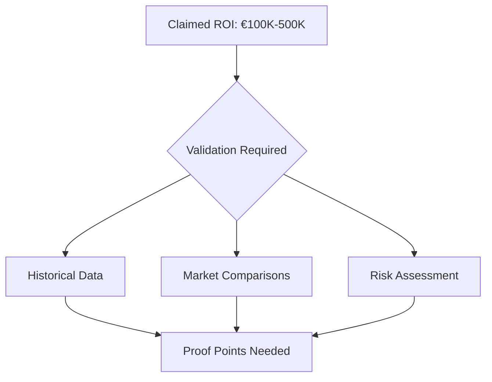
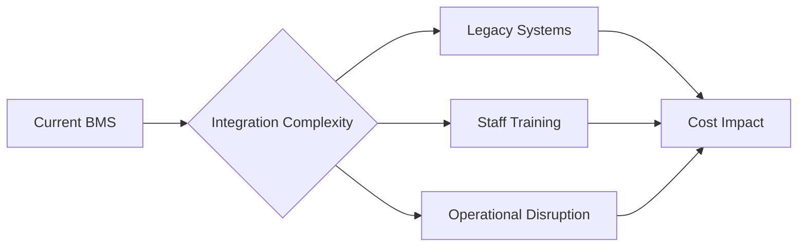
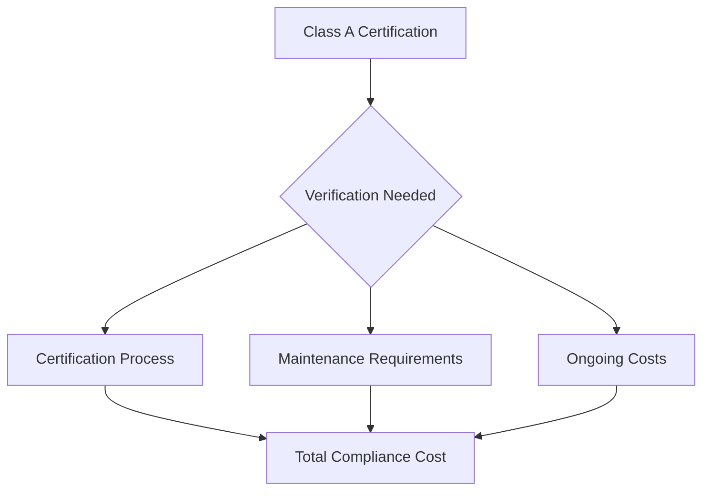
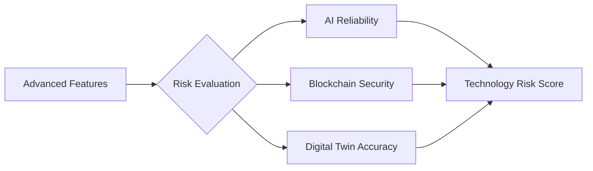
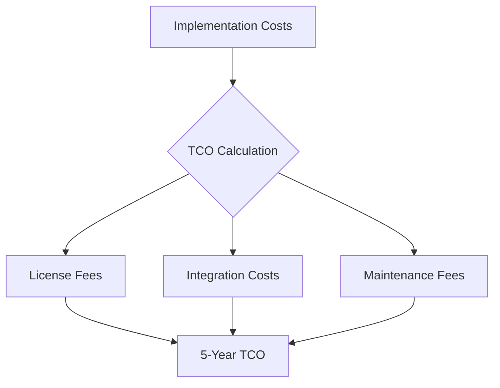
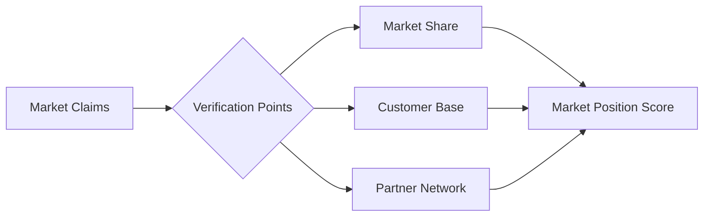

# Commercial Building Owner's Critical Analysis
## Sequential Decision-Making Framework

### 1. Initial Investment Concerns

#### ROI Claims Analysis

**Critical Questions:**
1. How is the €100K-500K ROI calculated?
   - Need: Detailed breakdown of cost savings
   - Validation: Case studies from similar properties
   - Risk: Market fluctuations impact

2. Implementation Timeline Reality
   - Claimed: 6-month initial phase
   - Industry Average: 12-18 months
   - Gap Analysis Required

### 2. Operational Impact Assessment

#### Integration with Existing Systems

**Required Validation:**
1. System Compatibility
   - Current: Existing BMS investments
   - Claimed: Seamless integration
   - Need: Technical audit reports

2. Staff Adaptation
   - Training requirements
   - Operational transition period
   - Resource allocation

### 3. Compliance & Certification Claims

#### Regulatory Alignment

**Documentation Required:**
1. NF EN ISO 52120-1:2022 Compliance
   - Current certification examples
   - Maintenance requirements
   - Cost of compliance

2. BAT TH 116 Implementation
   - Process documentation
   - Resource requirements
   - Timeline verification

### 4. Technology Risk Assessment

#### Innovation vs. Stability

**Validation Points:**
1. AI & Predictive Maintenance
   - Success rate metrics
   - False positive rates
   - Cost impact analysis

2. Digital Twin Technology
   - Accuracy metrics
   - Update frequency
   - Maintenance costs

### 5. Cost Structure Analysis

#### Total Cost of Ownership

**Required Breakdowns:**
1. Initial Investment
   - Hardware costs
   - Software licenses
   - Integration services
   - Training programs

2. Ongoing Costs
   - Maintenance fees
   - Update costs
   - Support services
   - Training refreshers

### 6. Market Position Verification

#### Competitive Analysis

**Required Evidence:**
1. Market Presence
   - Current installations
   - Client testimonials
   - Industry recognition

2. Support Infrastructure
   - Service locations
   - Response times
   - Support levels

### 7. Required Supporting Documentation

#### Essential Collateral for Decision-Making

1. **Technical Validation Package**
   - Independent audit reports
   - Performance benchmarks
   - Integration case studies
   - Security certifications

2. **Financial Analysis Package**
   - Detailed ROI calculator
   - TCO comparison tool
   - Energy savings projections
   - Maintenance cost analysis

3. **Risk Management Package**
   - Implementation risk assessment
   - Mitigation strategies
   - Insurance coverage
   - SLA guarantees

4. **Compliance Package**
   - Certification roadmap
   - Compliance timeline
   - Audit preparation guide
   - Regulatory updates process

### 8. Decision Matrix Requirements

#### Evaluation Framework

| Criterion | Weight | Required Evidence | Validation Method |
|-----------|--------|------------------|-------------------|
| ROI | 25% | Historical data, projections | Financial audit |
| Integration | 20% | Technical specifications | System audit |
| Compliance | 20% | Certification proof | Regulatory review |
| Support | 15% | SLA details | Reference checks |
| Innovation | 10% | Feature roadmap | Tech assessment |
| Risk | 10% | Risk analysis | Independent review |

### 9. Implementation Verification

#### Pilot Program Requirements

1. **Scope Definition**
   - Limited floor/zone implementation
   - Key feature testing
   - Performance benchmarking
   - ROI validation

2. **Success Metrics**
   - Energy reduction targets
   - Cost saving thresholds
   - User adoption rates
   - System reliability scores

### 10. Board Presentation Requirements

#### Decision Support Package

1. **Executive Summary**
   - Key benefits
   - Financial impact
   - Risk assessment
   - Strategic alignment

2. **Validation Evidence**
   - Market research
   - Technical audits
   - Financial analysis
   - Reference cases

3. **Implementation Plan**
   - Timeline
   - Resource requirements
   - Risk mitigation
   - Success metrics

### Conclusion: Critical Validation Points

1. **ROI Validation**
   - Independent financial analysis
   - Market comparison studies
   - Risk-adjusted projections

2. **Technical Validation**
   - System integration assessment
   - Performance benchmarks
   - Security audits

3. **Compliance Validation**
   - Regulatory certification proof
   - Compliance maintenance plan
   - Update management process

4. **Support Validation**
   - Service level agreements
   - Support infrastructure
   - Training programs
   - Maintenance plans
