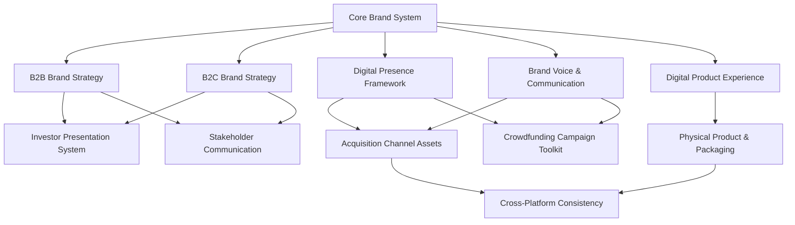

# HeyZack Branding Strategy Roadmap

This document outlines the strategic branding approach for HeyZack, structured to support rapid growth, market differentiation, and investor confidence. Based on patterns from companies that have successfully raised $10M+.

## 1. Core Brand System (Sprint 1-2)

- [x] **Brand Story & Market Positioning**
  - Core narrative and value proposition
  - Market fit analysis and competitive differentiation
  - Brand values and mission alignment
  - Growth vision and scalability narrative

- [ ] **Strategic Identity System**
  - Flexible, responsive logo system (primary, secondary, icon, dynamic variants)
  - Adaptable color system with digital-first application
  - Typography hierarchy optimized for digital and print
  - Visual language that scales across platforms
  - Design system foundations for rapid deployment

- [ ] **Brand Measurement Framework**
  - Brand awareness and sentiment KPIs
  - Conversion impact metrics
  - Competitive positioning tracking
  - Brand equity valuation methodology
  - Regular testing and optimization cycles

## 2. Audience-Specific Frameworks (Parallel to Core Brand)

- [ ] **B2B Brand Strategy**
  - Enterprise positioning and messaging matrix
  - Technical credibility framework
  - Decision-maker personas and journey mapping
  - Industry-specific value propositions
  - ROI and implementation narratives

- [ ] **B2C Brand Strategy**
  - Consumer positioning and messaging matrix
  - Emotional benefit framework
  - User personas and journey mapping
  - Lifestyle integration narratives
  - Community building strategy

- [ ] **Brand Voice & Communication System**
  - Audience-specific messaging guidelines
  - Technical-to-simple translation frameworks
  - Channel-specific tone adaptations
  - Content strategy templates
  - Communication hierarchy for complex features

## 3. Growth & Acquisition Assets (Sprint 2-3)

- [ ] **Digital Presence Framework**
  - Website/landing page design system
  - Conversion optimization guidelines
  - SEO and discoverability strategy
  - Mobile-first experience principles
  - Performance metrics and testing protocols

- [ ] **Acquisition Channel Assets**
  - Digital advertising design system
  - Social media content frameworks
  - Email marketing templates
  - Content marketing visual system
  - Campaign measurement and optimization tools

- [ ] **Crowdfunding Campaign Toolkit**
  - Campaign page structure and hierarchy
  - Backer journey optimization
  - Reward tier visualization system
  - Update and communication templates
  - Community engagement frameworks

## 4. Investor & Stakeholder Materials (Ongoing)

- [ ] **Investor Presentation System**
  - Pitch deck design framework
  - Financial narrative visualization
  - Market opportunity illustrations
  - Growth metrics dashboard
  - Technical differentiation visuals

- [ ] **Data Room Design**
  - Due diligence document templates
  - Financial projection visualizations
  - Market analysis frameworks
  - Competitive landscape mapping
  - Team and capability presentation

- [ ] **Stakeholder Communication**
  - Advisor and partner briefing materials
  - Progress reporting templates
  - Milestone visualization system
  - Strategic roadmap illustrations
  - Risk and mitigation frameworks

## 5. Product Experience (Sprint 3-4)

- [ ] **Digital Product Experience**
  - UI/UX design system
  - In-app messaging and guidance
  - Feature introduction frameworks
  - User onboarding experience
  - Feedback and iteration systems

- [ ] **Physical Product & Packaging**
  - Product design language
  - Unboxing experience design
  - Instruction and support materials
  - Packaging system for different SKUs
  - Retail presence guidelines

- [ ] **Cross-Platform Consistency**
  - Brand application across touchpoints
  - Digital-to-physical translation
  - Experience consistency guidelines
  - Quality control frameworks
  - Brand evolution management

## Implementation Approach

### Agile Brand Development

- **2-Week Sprints:** Focus on MVP elements first, then iterate
- **Cross-Functional Teams:** Brand, product, marketing, and sales working in parallel
- **Regular Testing:** User and market testing after each sprint
- **Measurement-Driven:** Clear KPIs for each brand element
- **Adaptable Timeline:** Adjust priorities based on market feedback and business needs

### Workstream Dependencies

### Team Structure

- **Brand Core Team:** Oversees brand strategy and system integrity
- **Growth Team:** Focuses on acquisition assets and measurement
- **Audience Teams:** Dedicated to B2B and B2C applications
- **Product Experience Team:** Ensures brand-product alignment
- **Investor Relations:** Manages stakeholder and investor materials

### Optimization Cycles

- **Weekly:** Growth metrics review and optimization
- **Bi-weekly:** Sprint reviews and adaptation
- **Monthly:** Comprehensive brand performance analysis
- **Quarterly:** Strategic brand evolution planning

This roadmap is designed to be a living document, evolving with market feedback, business priorities, and growth opportunities. All brand elements should be developed with scalability, consistency, and measurable impact as guiding principles.
